# イベント駆動アーキテクチャ（Event-Driven Architecture）

## 一言で言うと

**「何かが起きた」という出来事（イベント）を非同期に発行・受信することで、コンポーネント間を疎結合に連携させるアーキテクチャ。** 送信側は受信側を知らず、受信側は送信側を知らない。

---

## 目次

1. [何を解決するのか](#何を解決するのか)
2. [リクエストベース vs イベントベース](#リクエストベース-vs-イベントベース)
3. [アーキテクチャの構造](#アーキテクチャの構造)
4. [イベントチャネル：キューとトピック](#イベントチャネルキューとトピック)
5. [ブローカートポロジー](#ブローカートポロジー)
6. [メディエータートポロジー](#メディエータートポロジー)
7. [2つのトポロジーの使い分け](#2つのトポロジーの使い分け)
8. [リクエストの流れ](#リクエストの流れ)
9. [メリット・デメリット](#メリットデメリット)
10. [実際のシステム例](#実際のシステム例)
11. [エラーハンドリングと注意点](#エラーハンドリングと注意点)
12. [他のアーキテクチャとの比較](#他のアーキテクチャとの比較)
13. [どういうときに選ぶべきか](#どういうときに選ぶべきか)
14. [まとめ](#まとめ)

---

## 何を解決するのか

### 課題：同期的な呼び出しの連鎖が引き起こす問題

ECサイトで「注文確定」の処理を考える。注文が確定したら、在庫の更新・メール送信・ポイント付与・配送手配・分析システムへの記録を行う必要がある。これを同期的に実装すると次のようになる。

```go
// 同期的な実装（問題がある）
func (s *OrderService) ConfirmOrder(orderID string) error {
    // 1. 注文を確定
    if err := s.orderRepo.Confirm(orderID); err != nil {
        return err
    }
    // 2. 在庫を更新（もし在庫サービスが落ちていたら？）
    if err := s.inventoryService.Reduce(orderID); err != nil {
        return err
    }
    // 3. メールを送信（SMTPサーバーが遅くても待つ）
    if err := s.emailService.SendConfirmation(orderID); err != nil {
        return err
    }
    // 4. ポイントを付与
    if err := s.pointService.Grant(orderID); err != nil {
        return err
    }
    // 5. 配送を手配
    if err := s.shippingService.Arrange(orderID); err != nil {
        return err
    }
    // 6. 分析システムに記録
    if err := s.analyticsService.Record(orderID); err != nil {
        return err
    }
    return nil
}
```

このコードには複数の深刻な問題がある。

| 問題 | 具体的な症状 |
|------|------------|
| **応答が遅い** | メール送信やポイント付与が完了するまでユーザーが待たされる。6つの処理を直列に実行するため、合計時間が積み重なる |
| **障害が伝播する** | メールサービスが落ちると注文確定全体が失敗する。配送サービスのタイムアウトがユーザー体験を壊す |
| **結合度が高い** | 注文サービスが在庫・メール・ポイント・配送・分析のすべてを知っている。新しいサービスを追加するたびにこの関数を変更しなければならない |
| **スケーリングが難しい** | メール送信だけが遅い場合でも、注文サービス全体をスケールアウトするしかない |

### 解決方法：「何かが起きた」を発行し、受け取る側が自律的に動く

イベント駆動アーキテクチャでは、注文サービスは「注文が確定した」というイベントを発行するだけ。後続処理は各サービスが自律的に受け取り、非同期で処理する。

```go
// イベント駆動的な実装
func (s *OrderService) ConfirmOrder(orderID string) error {
    // 1. 注文を確定
    if err := s.orderRepo.Confirm(orderID); err != nil {
        return err
    }
    // 2. イベントを発行してすぐに返る
    event := OrderConfirmedEvent{
        OrderID:   orderID,
        Timestamp: time.Now(),
    }
    return s.eventBus.Publish("order.confirmed", event)
    // ← ここで終わり。メール送信もポイント付与も知らない
}
```

在庫サービス・メールサービス・ポイントサービスはそれぞれ `order.confirmed` イベントを購読し、自律的に動作する。注文サービスはこれらの存在を知らなくてよい。

---

## リクエストベース vs イベントベース

この違いを理解することが、イベント駆動アーキテクチャを理解する第一歩である。

### リクエストベースモデル

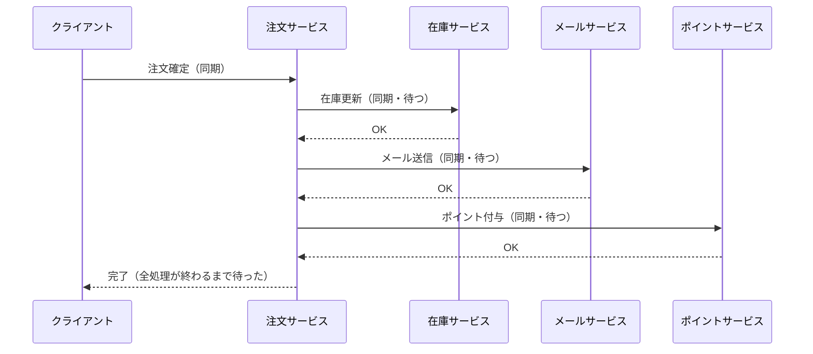

**特徴**: 送信側が受信側の完了を待つ。処理時間が直列に積み重なる。受信側の障害が送信側に伝播する。

### イベントベースモデル

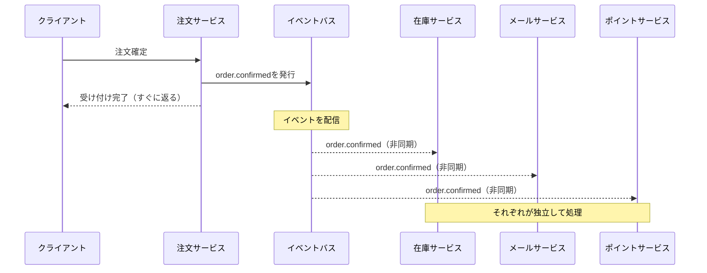

**特徴**: 送信側は発行したらすぐに返る。各受信側が並列に動作する。受信側の障害が送信側に影響しない。

| 観点 | リクエストベース | イベントベース |
|------|--------------|-------------|
| **通信方式** | 同期（送信側が完了を待つ） | 非同期（送信側は発行したら終わり） |
| **結合度** | 強い（送信側が受信側を知っている） | 弱い（お互いを知らない） |
| **応答時間** | 全処理の合計時間 | 発行するだけなので最小 |
| **障害の影響** | 受信側の障害が送信側に波及 | 受信側の障害が送信側に影響しない |
| **処理の順序** | 制御しやすい | 保証が難しい（後述） |
| **トレーサビリティ** | 追いやすい | 複雑になりやすい |

---

## アーキテクチャの構造

イベント駆動アーキテクチャの基本要素は4つ。

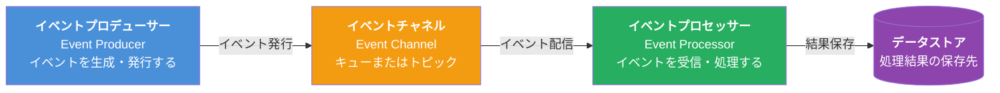

### イベントプロデューサー（Event Producer）

イベントを生成して発行するコンポーネント。プロデューサーは「誰がそのイベントを受け取るか」を知らない。

```go
// イベントの定義
type OrderConfirmedEvent struct {
    OrderID    string    `json:"order_id"`
    CustomerID string    `json:"customer_id"`
    TotalPrice int64     `json:"total_price"`
    Items      []Item    `json:"items"`
    Timestamp  time.Time `json:"timestamp"`
}

// プロデューサー（注文サービス）
type OrderService struct {
    repo     OrderRepository
    producer EventProducer
}

func (s *OrderService) ConfirmOrder(ctx context.Context, orderID string) error {
    order, err := s.repo.FindByID(ctx, orderID)
    if err != nil {
        return fmt.Errorf("注文の取得に失敗: %w", err)
    }

    order.Status = "confirmed"
    if err := s.repo.Save(ctx, order); err != nil {
        return fmt.Errorf("注文の保存に失敗: %w", err)
    }

    // イベントを発行（誰が受け取るかは関知しない）
    event := OrderConfirmedEvent{
        OrderID:    order.ID,
        CustomerID: order.CustomerID,
        TotalPrice: order.TotalPrice,
        Items:      order.Items,
        Timestamp:  time.Now(),
    }
    return s.producer.Publish(ctx, "order.confirmed", event)
}
```

### イベントチャネル（Event Channel）

プロデューサーとプロセッサーの間に位置する中間層。「キュー」と「トピック」の2種類がある（詳細は次節）。

### イベントプロセッサー（Event Processor）

イベントを受信して処理するコンポーネント。複数のプロセッサーが同じイベントを受け取ることができる。

```go
// プロセッサー（在庫サービス）
type InventoryProcessor struct {
    repo InventoryRepository
}

func (p *InventoryProcessor) HandleOrderConfirmed(ctx context.Context, event OrderConfirmedEvent) error {
    for _, item := range event.Items {
        if err := p.repo.Reduce(ctx, item.ProductID, item.Quantity); err != nil {
            return fmt.Errorf("在庫の更新に失敗 (product: %s): %w", item.ProductID, err)
        }
    }
    log.Printf("在庫を更新しました: order_id=%s", event.OrderID)
    return nil
}

// プロセッサー（メールサービス）
type EmailProcessor struct {
    emailClient EmailClient
}

func (p *EmailProcessor) HandleOrderConfirmed(ctx context.Context, event OrderConfirmedEvent) error {
    return p.emailClient.SendOrderConfirmation(ctx, event.CustomerID, event.OrderID)
}
```

---

## イベントチャネル：キューとトピック

イベントの配信方法には「キュー」と「トピック」の2種類があり、用途が異なる。

### キュー（Queue）：1対1配信

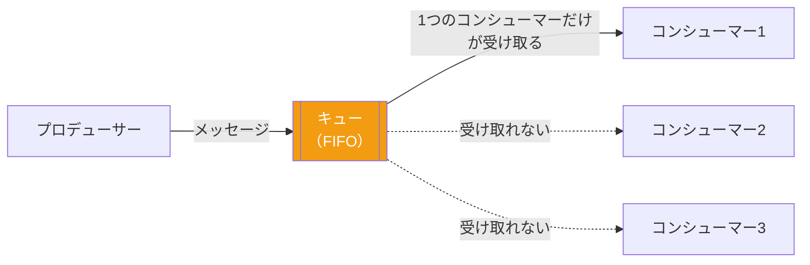

**特徴**:
- 1つのメッセージを1つのコンシューマーだけが受け取る（競合コンシューマーパターン）
- 処理が完了したらキューからメッセージが削除される
- 同じ処理を複数ワーカーで並列処理することで**スループットを上げるために使う**
- 例: RabbitMQ のQueue、Amazon SQS

**典型的な用途**: 注文処理ワーカーを3台で並列処理する、バッチジョブの分散処理

### トピック（Topic）：1対多配信

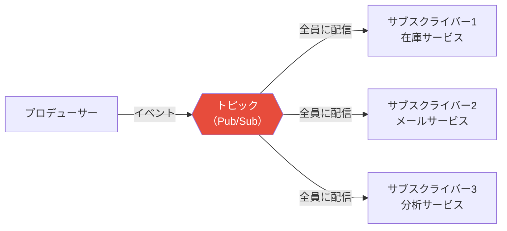

**特徴**:
- 1つのイベントを購読しているすべてのコンシューマーが受け取る（Pub/Sub）
- 送信側はどれだけのサービスが受け取るかを知らない
- 新しいサービスがサブスクライブするだけで既存コードの変更不要
- 例: Apache Kafka のTopic、Google Cloud Pub/Sub、Amazon SNS

**典型的な用途**: `order.confirmed` を在庫・メール・ポイントの各サービスに同時配信する

| 観点 | キュー | トピック |
|------|-------|---------|
| **配信先** | 1つのコンシューマー | 全サブスクライバー |
| **用途** | タスクの分散処理 | イベントのブロードキャスト |
| **代表的なMW** | RabbitMQ Queue、SQS | Kafka Topic、SNS、Pub/Sub |
| **スケーリング** | ワーカーを増やすとスループット向上 | サブスクライバーを増やしても元の処理は不変 |

---

## ブローカートポロジー

イベント駆動アーキテクチャには2つの主要なトポロジーがある。まずは「ブローカートポロジー」を説明する。

### 概念

**ブローカートポロジーには中央の指揮者がいない。** イベントブローカー（KafkaやRabbitMQ）がメッセージの中継をするだけで、各コンポーネントが自律的に動作する。

「出来事が連鎖していく」イメージ。注文確定 → 在庫サービスが反応して在庫更新イベントを発行 → 配送サービスがそのイベントに反応して配送手配イベントを発行 → ...

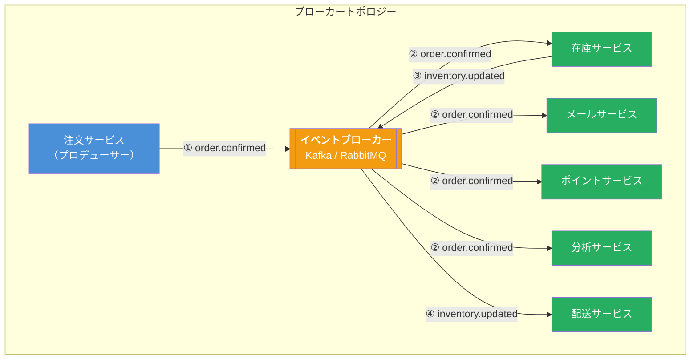

### ブローカートポロジーの特徴

| 特徴 | 詳細 |
|------|------|
| **中央制御なし** | ブローカーはメッセージを中継するだけ。誰かが全体の流れを管理しているわけではない |
| **高い疎結合** | 各サービスは「自分が関心を持つイベント」だけを購読する。他のサービスの存在を知らない |
| **イベントの連鎖** | あるサービスの処理結果が新しいイベントとなり、次のサービスをトリガーする |
| **拡張が容易** | 新しいサービスを追加する場合、既存のコードを変更せずにサブスクライブするだけ |
| **全体把握が困難** | 処理の流れが暗黙的で、「どこで何が起きているか」を一目で把握しにくい |

### Goでのブローカートポロジー実装例

```go
// イベントブローカーのインターフェース
type EventBroker interface {
    Publish(ctx context.Context, topic string, event interface{}) error
    Subscribe(topic string, handler EventHandler) error
}

type EventHandler func(ctx context.Context, payload []byte) error

// 在庫サービス：order.confirmed を受け取り、inventory.updated を発行する
type InventoryService struct {
    repo   InventoryRepository
    broker EventBroker
}

func (s *InventoryService) Start(ctx context.Context) error {
    return s.broker.Subscribe("order.confirmed", func(ctx context.Context, payload []byte) error {
        var event OrderConfirmedEvent
        if err := json.Unmarshal(payload, &event); err != nil {
            return fmt.Errorf("イベントのデシリアライズに失敗: %w", err)
        }

        // 在庫を更新
        for _, item := range event.Items {
            if err := s.repo.Reduce(ctx, item.ProductID, item.Quantity); err != nil {
                return err
            }
        }

        // 次のイベントを発行（配送サービスがこれを受け取る）
        updatedEvent := InventoryUpdatedEvent{
            OrderID:   event.OrderID,
            Timestamp: time.Now(),
        }
        return s.broker.Publish(ctx, "inventory.updated", updatedEvent)
    })
}

// 配送サービス：inventory.updated を受け取る
type ShippingService struct {
    repo ShippingRepository
}

func (s *ShippingService) Start(ctx context.Context, broker EventBroker) error {
    return broker.Subscribe("inventory.updated", func(ctx context.Context, payload []byte) error {
        var event InventoryUpdatedEvent
        if err := json.Unmarshal(payload, &event); err != nil {
            return err
        }
        return s.repo.ArrangeShipping(ctx, event.OrderID)
    })
}
```

---

## メディエータートポロジー

### 概念

**メディエータートポロジーには中央の指揮者（メディエーター）がいる。** メディエーターはイベントのフロー全体を知っており、各ステップの実行順序・並列化・エラー処理などを統括する。

「オーケストラの指揮者」のイメージ。メディエーターが「次は在庫サービス」「その次はメールとポイントを並列で」「最後に配送」という処理の流れを制御する。

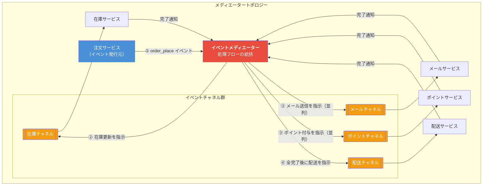

### メディエーターの役割

メディエーターは以下を管理する:
- **処理の順序**: 「在庫更新が終わったら配送手配」のような依存関係
- **並列実行**: 「メール送信とポイント付与は同時に実行」
- **条件分岐**: 「在庫が足りなかった場合はキャンセル処理へ」
- **エラー処理**: 「ステップ3が失敗したらステップ1・2を補償する」

```go
// メディエーターの実装例
type OrderEventMediator struct {
    invChannel   EventChannel
    emailChannel EventChannel
    pointChannel EventChannel
    shipChannel  EventChannel
}

// InitialEvent: メディエーターが受け取る最初のイベント
type OrderPlacedInitialEvent struct {
    OrderID    string
    CustomerID string
    Items      []Item
    TotalPrice int64
}

func (m *OrderEventMediator) Handle(ctx context.Context, event OrderPlacedInitialEvent) error {
    // ステップ1: 在庫更新（必須、先に完了する必要がある）
    if err := m.invChannel.Send(ctx, InventoryReduceCommand{
        OrderID: event.OrderID,
        Items:   event.Items,
    }); err != nil {
        return fmt.Errorf("在庫更新の指示に失敗: %w", err)
    }

    // ステップ2: メール送信とポイント付与は並列実行
    var wg sync.WaitGroup
    errCh := make(chan error, 2)

    wg.Add(2)
    go func() {
        defer wg.Done()
        if err := m.emailChannel.Send(ctx, SendEmailCommand{
            CustomerID: event.CustomerID,
            OrderID:    event.OrderID,
        }); err != nil {
            errCh <- err
        }
    }()
    go func() {
        defer wg.Done()
        if err := m.pointChannel.Send(ctx, GrantPointCommand{
            CustomerID: event.CustomerID,
            Amount:     event.TotalPrice / 100, // 1%ポイント
        }); err != nil {
            errCh <- err
        }
    }()
    wg.Wait()
    close(errCh)

    for err := range errCh {
        if err != nil {
            return fmt.Errorf("並列処理でエラー: %w", err)
        }
    }

    // ステップ3: 配送手配（上記がすべて完了してから）
    return m.shipChannel.Send(ctx, ArrangeShippingCommand{
        OrderID: event.OrderID,
    })
}
```

### メディエータートポロジーの特徴

| 特徴 | 詳細 |
|------|------|
| **処理フローが明示的** | メディエーターに全体のフローが集約されているため、「何がどの順番で起きるか」が一目でわかる |
| **ステップ間の依存を管理できる** | 「AとBが完了してからC」のような依存関係を正確に制御できる |
| **エラー処理が制御しやすい** | 補償トランザクション（失敗時のロールバック処理）を一箇所に集約できる |
| **中央集権的な結合** | メディエーターが各サービスの存在を知っているため、ブローカートポロジーより結合度が高い |
| **メディエーターがボトルネックになりうる** | すべてのイベントがメディエーターを通るため、スケーリングが難しい |

---

## 2つのトポロジーの使い分け

この区別は書籍『ソフトウェアアーキテクチャの基礎』で特に重要視されているポイント。

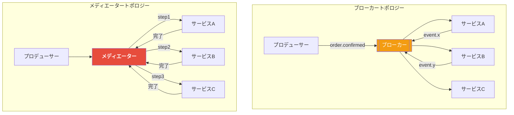

| 観点 | ブローカー | メディエーター |
|------|-----------|-------------|
| **制御方式** | 分散・自律（各サービスが自己判断） | 集中・統括（メディエーターが指示） |
| **処理フローの可視性** | 暗黙的（追いにくい） | 明示的（追いやすい） |
| **サービス間の結合度** | 低い（互いを知らない） | 中程度（メディエーターは全員を知る） |
| **エラーハンドリング** | 困難（各サービスが個別対応） | 統括しやすい |
| **ステップ間の依存** | 管理が難しい | 正確に制御できる |
| **スケーラビリティ** | 高い（ブローカーが軽量） | 中程度（メディエーターがボトルネック） |
| **向いているケース** | 独立したイベントの並列処理 | ステップに依存関係があるワークフロー |

### 選択の指針

**ブローカーを選ぶ場合**:
- 各サービスが完全に独立して動作できる
- 処理の順序が重要でない（または各サービスが適切にべき等処理できる）
- 最大のスケーラビリティが求められる
- 新しいサービスを頻繁に追加する見込みがある

**メディエーターを選ぶ場合**:
- 処理のステップに明確な依存関係がある（「在庫確認が終わってから決済」）
- 全体のワークフローを一箇所で把握・管理したい
- 補償トランザクション（失敗時のロールバック）が必要
- 処理の完了を確認してから次のステップに進む必要がある

---

## リクエストの流れ

### ブローカートポロジーでの注文処理

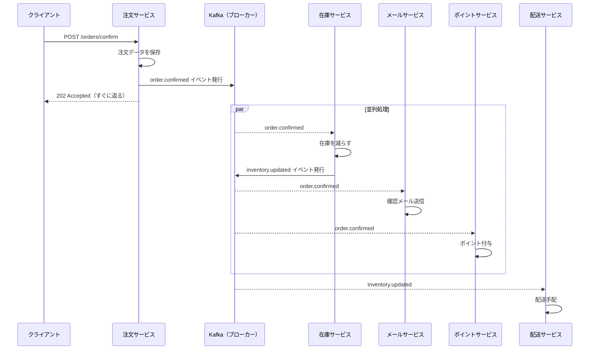

### メディエータートポロジーでの注文処理

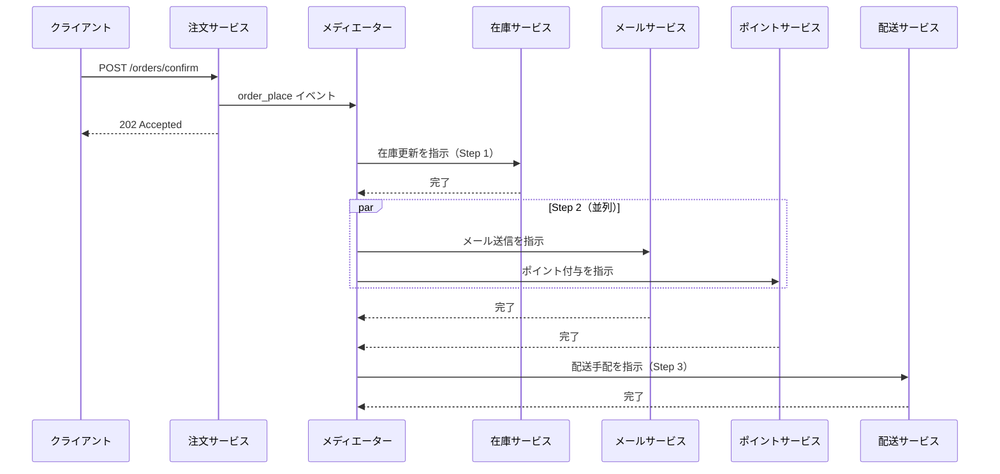

---

## メリット・デメリット

### メリット

| メリット | 説明 |
|---------|------|
| **高い疎結合** | プロデューサーとコンシューマーが互いの実装を知らない。新しいサービスの追加がゼロコード変更で可能（ブローカートポロジーの場合） |
| **高スループット・低レイテンシ** | プロデューサーはイベントを発行したらすぐに返れるため、ユーザーへの応答が速い |
| **弾力性と障害耐性** | コンシューマーがダウンしてもイベントはキューに残る。復旧後に処理を再開できる |
| **スケーラビリティ** | コンシューマーのインスタンス数を増やすだけでスループットを向上させられる |
| **時間的分離** | プロデューサーとコンシューマーが同時に稼働している必要がない |
| **進化しやすい** | 新機能追加 = 新しいコンシューマーを追加するだけ（既存コードに触れない） |

### デメリット

| デメリット | 説明 |
|-----------|------|
| **最終的整合性のみ** | 全サービスが「今この瞬間」に一致した状態になることを保証できない。在庫は更新されたがポイントはまだという状態が一時的に生じる |
| **処理の追跡が困難** | 同期的な呼び出しと違い、ログやトレーシングを整備しないと「どこで何が起きているか」が見えない |
| **イベントの順序保証が難しい** | 複数のイベントが到着する順番が発行順と異なる場合がある。Kafkaのパーティション設計などで対処が必要 |
| **重複処理への対策が必要** | ネットワーク障害などで同じイベントが2回配信される場合がある。コンシューマーがべき等（何度実行しても結果が同じ）である必要がある |
| **デバッグの難しさ** | エラーが発生した場合に、どのサービスのどの処理が失敗したか追跡するのに分散トレーシングが必要 |
| **契約管理** | イベントのスキーマ（フォーマット）を変更すると、すべてのコンシューマーに影響する。スキーマレジストリが必要になる |

---

## 実際のシステム例

### 1. ECサイトの注文イベント

最も代表的なユースケース。注文確定という1つのイベントが複数のドメインにまたがる処理をトリガーする。

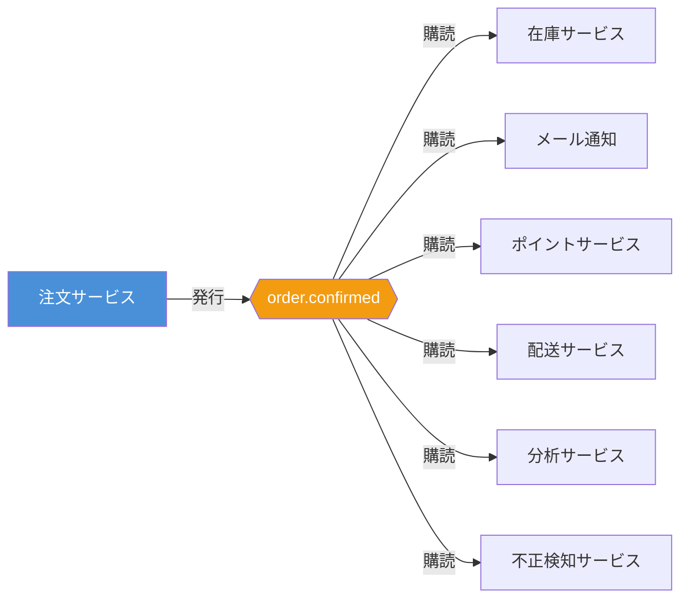

**特徴**: 注文サービスを変更せずに「不正検知サービス」を追加できた。

### 2. IoTセンサーデータ処理

工場の機械センサーから大量のデータが流れ込む。

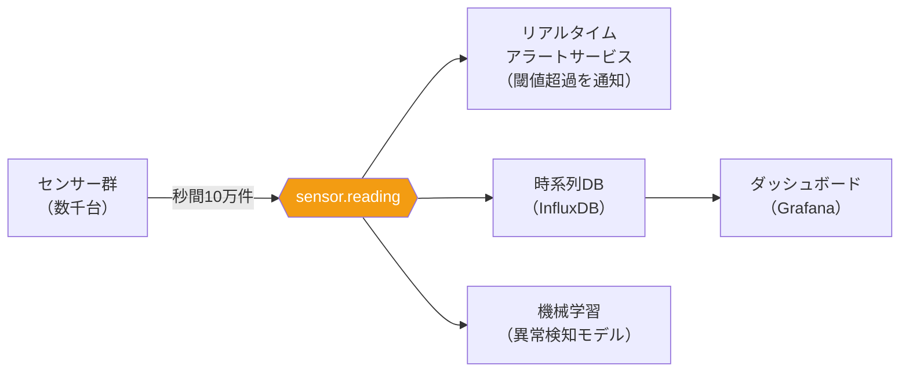

**なぜイベント駆動が適しているか**:
- センサーが秒間10万件のデータを送信しても、各コンシューマーが自分のペースで処理できる
- 機械学習パイプラインが遅くても、リアルタイムアラートには影響しない
- センサーデータのストリーム処理には Apache Kafka + Kafka Streams が多く使われる

### 3. 株式取引システム

超低レイテンシが求められる金融システム。

```go
// 取引イベントの定義
type TradeExecutedEvent struct {
    TradeID    string    `json:"trade_id"`
    Symbol     string    `json:"symbol"`     // 銘柄コード
    Price      float64   `json:"price"`
    Volume     int64     `json:"volume"`
    Side       string    `json:"side"`       // "buy" or "sell"
    ExecutedAt time.Time `json:"executed_at"`
}

// リスク管理サービス：取引イベントをリアルタイムで監視
type RiskManagementService struct {
    positionTracker *PositionTracker
    riskLimitDB     *RiskLimitDB
    alertService    AlertService
}

func (s *RiskManagementService) HandleTrade(ctx context.Context, event TradeExecutedEvent) error {
    // ポジションを更新
    position := s.positionTracker.Update(event.Symbol, event.Volume, event.Side)

    // リスク限度額チェック
    limit, err := s.riskLimitDB.GetLimit(event.Symbol)
    if err != nil {
        return err
    }

    if position.AbsoluteValue > limit.MaxPosition {
        return s.alertService.SendRiskAlert(ctx, RiskAlert{
            Symbol:   event.Symbol,
            Position: position,
            Limit:    limit,
        })
    }
    return nil
}
```

**特徴**: 取引執行、リスク計算、ポートフォリオ更新、コンプライアンスチェックを並列で実行。

### 4. 通知システム

ユーザーアクションに応じた多チャネル通知。

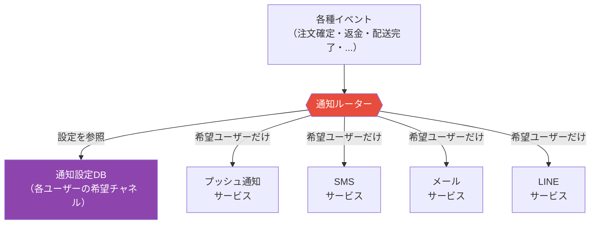

**特徴**: 通知の送信先チャネルがユーザー設定によって変わる。ルーターが設定を参照してどのサービスにイベントを送るかを判断する。メディエータートポロジーの一例。

---

## エラーハンドリングと注意点

イベント駆動アーキテクチャで最も難しいのはエラーハンドリングである。同期的なシステムと異なり、失敗した処理を即座に検知しにくい。

### べき等処理（Idempotency）

同じイベントが複数回配信されても、結果が変わらないようにする必要がある。

```go
// べき等でない実装（危険）
func (s *PointService) HandleOrderConfirmed(ctx context.Context, event OrderConfirmedEvent) error {
    // 同じorder_idで2回呼ばれると、ポイントが2倍付与されてしまう
    return s.repo.AddPoints(ctx, event.CustomerID, event.TotalPrice/100)
}

// べき等な実装（安全）
func (s *PointService) HandleOrderConfirmed(ctx context.Context, event OrderConfirmedEvent) error {
    // すでに処理済みか確認
    processed, err := s.repo.IsEventProcessed(ctx, event.OrderID, "point_grant")
    if err != nil {
        return err
    }
    if processed {
        // 重複配信なのでスキップ
        log.Printf("重複イベントをスキップ: order_id=%s", event.OrderID)
        return nil
    }

    // 処理を実行
    if err := s.repo.AddPoints(ctx, event.CustomerID, event.TotalPrice/100); err != nil {
        return err
    }

    // 処理済みとしてマーク
    return s.repo.MarkEventProcessed(ctx, event.OrderID, "point_grant")
}
```

### デッドレターキュー（DLQ）

処理に失敗したイベントを「失敗キュー」に退避させ、後で調査・再処理できるようにする。

```go
// デッドレターキューを使ったエラーハンドリング
type ResilientConsumer struct {
    handler EventHandler
    dlq     EventQueue   // デッドレターキュー
    maxRetry int
}

func (c *ResilientConsumer) Process(ctx context.Context, event Event) error {
    var lastErr error
    for attempt := 1; attempt <= c.maxRetry; attempt++ {
        if err := c.handler(ctx, event); err != nil {
            lastErr = err
            log.Printf("処理失敗 (attempt %d/%d): %v", attempt, c.maxRetry, err)
            time.Sleep(time.Duration(attempt) * time.Second) // 指数バックオフ
            continue
        }
        return nil // 成功
    }

    // 最大リトライ回数を超えたらDLQに送る
    log.Printf("DLQに送信: event_id=%s, error=%v", event.ID, lastErr)
    return c.dlq.Send(ctx, DeadLetter{
        OriginalEvent: event,
        Error:         lastErr.Error(),
        FailedAt:      time.Now(),
    })
}
```

### イベントの順序と最終的整合性

イベント駆動システムでは、「今この瞬間すべてのサービスが一致した状態」にはならない。

```
時刻T1: 注文確定イベント発行
時刻T2: 在庫サービスが処理完了 → 在庫が更新された状態
時刻T3: メールサービスが処理完了 → メールが送られた状態
時刻T4: ポイントサービスが処理完了 → ポイントが付与された状態

T2からT4の間は「在庫は更新されたがポイントはまだ」という一時的な不整合状態がある
これが「最終的整合性（Eventual Consistency）」
```

**設計上の考慮点**:
- ユーザーにポイント付与の完了をリアルタイムで見せる必要があるか？
- 一時的な不整合をUIでどう表現するか（「まもなく反映されます」など）
- 補償トランザクション（Saga パターン）の実装が必要か

---

## 他のアーキテクチャとの比較

| 観点 | レイヤード | サービスベース | パイプライン | イベント駆動 |
|------|-----------|-------------|------------|------------|
| **通信方式** | 同期・直接呼び出し | 同期・API呼び出し | 一方向データフロー | 非同期・イベント |
| **結合度** | 高い（层ごと） | 中程度 | 低い（フィルター間） | 低い（プロデューサー/コンシューマー） |
| **スケーラビリティ** | 低い | 中程度 | 低い | 高い |
| **処理の可視性** | 高い（追いやすい） | 高い | 高い | 低い（分散トレーシングが必要） |
| **一貫性** | 強い整合性（ACID） | 強い整合性 | 該当なし | 最終的整合性 |
| **典型的な用途** | 業務アプリ全般 | 中規模分散システム | データ処理バッチ | リアルタイム・高スループット |
| **デバッグの容易さ** | 高い | 中程度 | 中程度 | 低い |

### イベント駆動とパイプラインの違い

この2つはどちらも「データを流す」ため混同されやすい。

| 観点 | パイプライン | イベント駆動 |
|------|------------|------------|
| **流れる方向** | 線形・一方向 | 多方向（ファンアウト・ファンイン） |
| **処理のトリガー** | 前ステップの完了 | 外部イベントの発生 |
| **コンポーネントの関係** | 前後のフィルターが協調 | 完全に独立したプロデューサー/コンシューマー |
| **用途** | データ変換・バッチ処理 | リアルタイムの業務イベント処理 |

---

## どういうときに選ぶべきか

### 向いているケース

- **複数のサービスが1つのイベントに反応する必要がある** → 注文確定で在庫・メール・ポイント・配送を動かす
- **高スループットが求められる** → IoTデータ、ログ収集、株価ストリーム
- **サービス間の疎結合を最大化したい** → 新機能追加をゼロコード変更で行いたい
- **応答速度が最優先** → ユーザーを待たせたくない（非同期で受け付けてすぐ返す）
- **コンポーネントの可用性が異なる** → メールサービスがダウンしても注文処理を継続したい

### 向いていないケース

- **即時の処理結果が必要** → 「在庫が確保できたか今すぐ知りたい」→ 同期呼び出しの方が適切
- **強い整合性が必要** → 「在庫更新と注文確定が必ず同時に反映されなければならない」→ ACIDトランザクションを使うべき
- **シンプルなCRUDアプリ** → 過度に複雑になる。レイヤードアーキテクチャで十分
- **処理フローが複雑な依存関係を持つ** → ブローカートポロジーでは管理困難。メディエーターかSagaパターンを検討
- **小規模チームで運用コストを抑えたい** → Kafkaなどのメッセージングインフラの構築・運用が必要

### アンチパターン：「なんでもイベント化」

```go
// これはアンチパターン
// 単純なCRUD操作をイベント化する必要はない

// やりすぎの例
type UserCreatedEvent struct { UserID string }
type UserUpdatedEvent struct { UserID string }
type UserPasswordChangedEvent struct { UserID string }
// ... 変更のたびにイベントが増殖する

// 本当にこのイベントに「別のサービスが反応する必要があるか」を問う
// ない場合は、ただの同期的なDBへの保存で十分
```

イベント駆動を採用する基準は「複数の異なるサービスがそのイベントに反応する必要があるか」。単一のサービス内で完結する処理にイベントは不要である。

---

## まとめ

以下は『ソフトウェアアーキテクチャの基礎』の評価をもとにした星評価。

```
イベント駆動アーキテクチャの特性評価（★5段階）

デプロイ容易性:   ★★★☆☆  （プロセッサー単位でのデプロイが可能だが、ブローカーの管理が必要）
弾力性:          ★★★★★  （コンシューマーのダウン時もイベントはキューに保持される）
進化性:          ★★★★★  （新しいコンシューマーの追加が既存コードに影響しない）
障害耐性:        ★★★★★  （障害がコンシューマー内に局所化される）
モジュール性:     ★★★★★  （プロデューサーとコンシューマーが完全に独立）
全体コスト:       ★★★☆☆  （メッセージングインフラの構築・運用コストが発生する）
パフォーマンス:   ★★★★★  （非同期処理・並列実行によるスループットの向上）
信頼性:          ★★★☆☆  （最終的整合性の管理、べき等処理の実装が必要）
スケーラビリティ: ★★★★★  （コンシューマーのインスタンスを増やすだけでスループット向上）
シンプルさ:       ★☆☆☆☆  （非同期・分散システムの複雑さがある）
テスタビリティ:   ★★★☆☆  （非同期処理のテストはモックやテスト用ブローカーが必要）
```

イベント駆動アーキテクチャは「高スループット・高弾力性・高進化性」を実現できる強力なスタイルである。しかし、その代償として「シンプルさ」と「デバッグのしやすさ」を失う。

**最も重要なポイントを3つ挙げると**:

1. **ブローカー vs メディエーター**: 独立したイベントの並列処理にはブローカー、ステップに依存関係があるワークフローにはメディエーター。この使い分けがシステム設計の核心となる。

2. **最終的整合性の受け入れ**: イベント駆動を採用するということは、「今この瞬間の完全な一貫性」を諦め、「時間をかけて整合する」モデルを受け入れることを意味する。この判断はビジネス要件と照らし合わせて行う必要がある。

3. **べき等処理の徹底**: どのコンシューマーも「同じイベントが2回来ても大丈夫」であるように設計する。これを怠ると、ネットワーク障害時に重複処理が発生して深刻なデータ不整合を引き起こす。

「すべてを非同期にすれば速くなる」という誤解は禁物である。適切な場面でのみ採用し、同期的な処理が適切な部分には無理にイベントを持ち込まないことが、健全なシステム設計の鍵となる。
