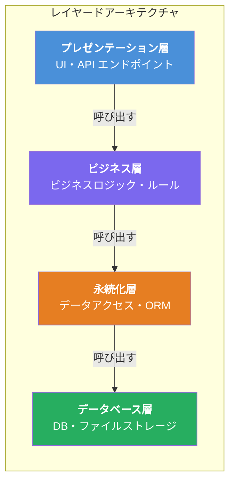
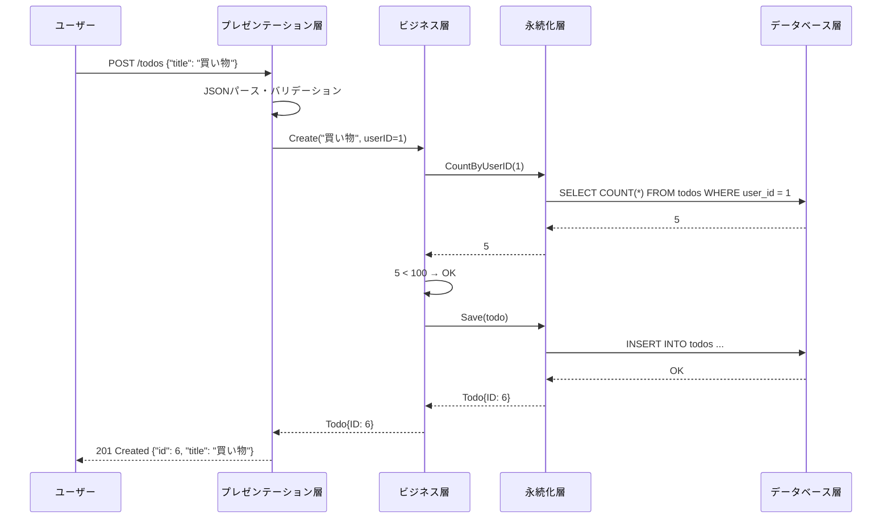
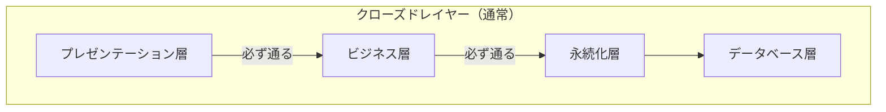
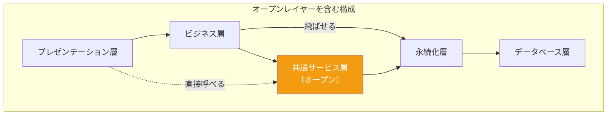
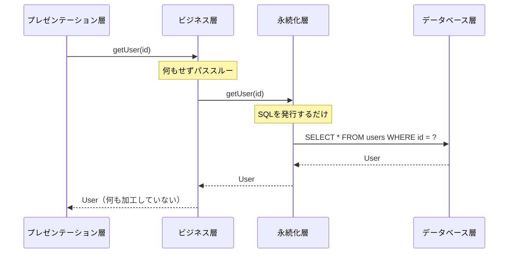

# レイヤードアーキテクチャ（Layered Architecture）

## 一言で言うと

**アプリケーションを「層（レイヤー）」に分け、各層が特定の役割を担う最も基本的なアーキテクチャスタイル。** 上の層が下の層を呼び出し、下の層は上の層を知らない。

---

## 目次

1. [何を解決するのか](#何を解決するのか)
2. [アーキテクチャの構造](#アーキテクチャの構造)
3. [各レイヤーの役割](#各レイヤーの役割)
4. [リクエストの流れ](#リクエストの流れ)
5. [オープンレイヤーとクローズドレイヤー](#オープンレイヤーとクローズドレイヤー)
6. [メリット](#メリット)
7. [デメリット](#デメリット)
8. [実際のシステム例](#実際のシステム例)
9. [アンチパターン：シンクホール](#アンチパターンシンクホール)
10. [どういうときに選ぶべきか](#どういうときに選ぶべきか)
11. [まとめ](#まとめ)

---

## 何を解決するのか

### 課題：コードがスパゲッティになる

小規模なアプリケーションでは、画面表示のコード・ビジネスロジック・データベースアクセスが混在しても何とかなる。しかし、アプリケーションが成長すると以下の問題が発生する。

| 問題 | 具体例 | レイヤードで分けると？ |
|------|--------|----------------------|
| **変更の影響範囲が読めない** | DBのカラム名を変えたら、画面表示のコードまで壊れた | 永続化層だけの修正で完結する。ビジネス層・プレゼンテーション層には影響しない |
| **テストが困難** | ビジネスロジックをテストしたいだけなのに、DBとWebサーバーが必要 | ビジネス層を単独でテスト可能。永続化層はモックに差し替えられる |
| **再利用ができない** | 同じ計算ロジックがAPIとバッチ処理で重複している | ビジネス層を共通化し、プレゼンテーション層（API / バッチ）が同じロジックを呼ぶ |
| **チーム開発が非効率** | フロントエンド担当がDB処理のコードを触ってしまう | 層ごとに担当を分けられる。各自が責務の範囲内で作業する |

### 解決方法：関心事の分離

レイヤードアーキテクチャは **「関心事の分離（Separation of Concerns）」** によってこれらの問題を解決する。各レイヤーに明確な責務を割り当て、層をまたいだ依存を制限することで、変更の影響を局所化する。

上の表の「レイヤードで分けると？」列が示すように、層を分けることで**変更が伝播する範囲を物理的に制限**できる。これがレイヤードアーキテクチャの最大の価値である。

---

## アーキテクチャの構造

レイヤードアーキテクチャは通常4つの標準レイヤーで構成される。



**重要なルール**: 各層は**直下の層のみ**を呼び出すことができる。プレゼンテーション層から直接データベース層を呼ぶことはできない。

---

## 各レイヤーの役割

### プレゼンテーション層（Presentation Layer）

ユーザーからのリクエストを受け取り、レスポンスを返す層。

**担当すること**:
- HTTPリクエストの受信・レスポンスの返却
- 入力値のフォーマットチェック（バリデーション）
- 画面表示用のデータ整形

**担当しないこと**:
- ビジネスルールの判定
- データベースへのアクセス

```go
// handler/todo_handler.go（プレゼンテーション層）
func (h *TodoHandler) CreateTodo(w http.ResponseWriter, r *http.Request) {
    var req CreateTodoRequest
    if err := json.NewDecoder(r.Body).Decode(&req); err != nil {
        http.Error(w, "不正なリクエスト", http.StatusBadRequest)
        return
    }
    // ビジネス層に処理を委譲
    todo, err := h.todoService.Create(req.Title, req.UserID)
    if err != nil {
        http.Error(w, err.Error(), http.StatusInternalServerError)
        return
    }
    json.NewEncoder(w).Encode(todo)
}
```

### ビジネス層（Business Layer）

アプリケーション固有のビジネスルールを実装する層。**アーキテクチャの中核**。

**担当すること**:
- ビジネスルールの適用（「Todoは1ユーザーあたり100件まで」など）
- ワークフローの制御
- トランザクション管理

```go
// service/todo_service.go（ビジネス層）
func (s *TodoService) Create(title string, userID int) (*Todo, error) {
    // ビジネスルール: 1ユーザーあたり100件まで
    count, err := s.todoRepo.CountByUserID(userID)
    if err != nil {
        return nil, err
    }
    if count >= 100 {
        return nil, errors.New("Todoの上限に達しています")
    }
    // 永続化層に保存を委譲
    return s.todoRepo.Save(&Todo{Title: title, UserID: userID})
}
```

### 永続化層（Persistence Layer）

データベースやファイルへの読み書きを抽象化する層。

**担当すること**:
- SQLの構築・実行
- ORMの操作
- データのCRUD操作

```go
// repository/todo_repository.go（永続化層）
func (r *TodoRepository) CountByUserID(userID int) (int, error) {
    var count int64
    err := r.db.Model(&Todo{}).Where("user_id = ?", userID).Count(&count).Error
    return int(count), err
}

func (r *TodoRepository) Save(todo *Todo) (*Todo, error) {
    err := r.db.Create(todo).Error
    return todo, err
}
```

### データベース層（Database Layer）

PostgreSQL、MySQL、MongoDBなどの実際のデータストア。アプリケーションコードとしては存在せず、インフラとして提供される。

この層はDDL（CREATE TABLE文など）やスキーマ定義として管理される。アプリケーションからはDSN（接続文字列）やORMの設定を通じて接続し、永続化層がSQLの詳細を隠蔽する。開発者がこの層を意識するのは、スキーマ変更やマイグレーションを行うときである。

---

## リクエストの流れ

「ユーザーがTodoを作成する」場合の具体的な流れ。



---

## オープンレイヤーとクローズドレイヤー

レイヤードアーキテクチャには2つのレイヤータイプがある。

### クローズドレイヤー（Closed Layer）

リクエストは**必ずそのレイヤーを通過しなければならない**。上位レイヤーがそのレイヤーを飛び越えて下位レイヤーにアクセスすることはできない。

### オープンレイヤー（Open Layer）

リクエストは**そのレイヤーを飛ばして下位レイヤーに直接アクセスできる**。





### なぜクローズドがデフォルトなのか

クローズドにすることで**レイヤー間の依存を制限し、変更の影響を予測しやすく**する。例えば、永続化層の実装を変更しても、ビジネス層が必ず中間に入るため、プレゼンテーション層への影響はない。

### オープンにする場面と注意点

共通ユーティリティ（ログ出力、日付変換、文字列操作など）を含むレイヤーは、各層から直接アクセスできるようオープンにすることがある。

ただし、**オープンレイヤーを安易に増やすと「なし崩し的な依存」が生まれる**。プレゼンテーション層から永続化層を直接呼べてしまうと、レイヤードにした意味がなくなる。オープンにするのは本当に横断的な関心事（ロギング、共通ユーティリティ）に限定すべきである。

---

## メリット

| メリット | 説明 |
|---------|------|
| **シンプルで理解しやすい** | 最も広く知られたパターン。新しいメンバーが参加してもすぐに理解できる |
| **関心事の分離** | 各層の責務が明確で、変更の影響範囲を限定できる |
| **テスタビリティ** | 各層を独立してテスト可能。ビジネス層のテストにDBは不要（モックで代替） |
| **開発のしやすさ** | 層ごとにチームを分けて並行開発が可能 |
| **技術選定の独立性** | DB層をPostgreSQLからMySQLに変えても、永続化層の修正だけで済む |

---

## デメリット

| デメリット | 説明 |
|-----------|------|
| **パフォーマンスへの影響** | すべてのリクエストが全層を通過するため、単純な処理でもオーバーヘッドが発生する |
| **モノリスになりがち** | すべてが1つのデプロイ単位になるため、大規模になるとデプロイが困難 |
| **スケーラビリティの限界** | 特定の層だけスケールさせることが難しい。全体を一緒にスケールする必要がある |
| **変更の連鎖** | DB側の変更が永続化層→ビジネス層→プレゼンテーション層と伝播する場合がある |
| **過度な抽象化** | 単純なCRUDでも全層を通過するため、冗長なコードが増える（シンクホール・アンチパターン） |

---

## 実際のシステム例

### 1. 社内の業務管理システム

```
プレゼンテーション層: React / Vue.js で構築された管理画面
ビジネス層:           勤怠計算、承認ワークフロー、権限チェック
永続化層:             GORM / MyBatis などのORM
データベース層:        PostgreSQL
```

**なぜレイヤードが適しているか**: ユーザー数が社内に限定、要件が明確、ビジネスロジックが複雑で層ごとの分離が有効。

### 2. Spring Boot / Ruby on Rails のWebアプリケーション

これらのフレームワーク自体がレイヤードアーキテクチャを前提に設計されている。

```
Controller（プレゼンテーション層）→ Service（ビジネス層）→ Repository（永続化層）→ DB
```

### 3. 小〜中規模のECサイト

```
プレゼンテーション層: 商品一覧画面、カート画面、決済画面
ビジネス層:           在庫チェック、価格計算（税込・割引）、ポイント付与
永続化層:             商品テーブル、注文テーブルへのアクセス
データベース層:        MySQL
```

---

## アンチパターン：シンクホール

### シンクホールとは

リクエストが各層を**何のロジックも実行せずに通過**してしまうパターン。



### 何が問題なのか

- ビジネス層が単なるパススルーになり、存在意義がない
- 層を通過するたびに無駄なオブジェクト変換が発生する
- コードの行数が増えるだけで価値がない

### 目安

**リクエストの80%以上がシンクホールなら、そのアーキテクチャは適切ではない可能性がある。** 20%程度なら許容範囲。

シンクホールが多い場合は、そもそもビジネスロジックが薄いCRUDアプリケーションである可能性が高い。その場合は、レイヤーを減らしたシンプルな構成や、モジュラーモノリスなどの別のアプローチが適している。

---

## どういうときに選ぶべきか

### 向いているケース

- 小〜中規模のアプリケーション
- チームがアーキテクチャに不慣れで、シンプルさを重視したい
- ビジネスロジックが中心のアプリケーション（計算、バリデーション、ワークフロー）
- 短期間でのプロトタイプ開発
- スケーラビリティの要件が高くない

### 向いていないケース

- 高いスケーラビリティが求められるシステム → マイクロサービスアーキテクチャ等を検討
- 部分的な独立デプロイが必要なシステム → サービスベースアーキテクチャ等を検討
- 大規模で複数チームが並行開発するシステム → マイクロサービスアーキテクチャ等を検討
- リアルタイム処理や高スループットが求められるシステム → イベント駆動アーキテクチャ等を検討

---

## まとめ

以下は『ソフトウェアアーキテクチャの基礎』の評価をもとにした星評価。

```
レイヤードアーキテクチャの特性評価（★5段階）

デプロイ容易性:   ★☆☆☆☆  （全体を一括でデプロイする必要がある）
弾力性:          ★☆☆☆☆  （一部の障害が全体に波及しやすい）
進化性:          ★☆☆☆☆  （変更が層をまたいで伝播しやすい）
障害耐性:        ★☆☆☆☆  （単一障害点になりやすい）
モジュール性:     ★☆☆☆☆  （論理的な分離はあるが物理的な分離がない）
全体コスト:       ★★★★★  （開発・運用コストが低い）
パフォーマンス:   ★★★☆☆  （シンクホールが多いと低下する）
信頼性:          ★★★☆☆  （シンプルさが安定性につながる）
スケーラビリティ: ★☆☆☆☆  （基本的に垂直スケールのみ）
シンプルさ:       ★★★★★  （最も理解しやすいアーキテクチャ）
テスタビリティ:   ★★★★☆  （層ごとにモックを使ったテストが容易）
```

レイヤードアーキテクチャは「まず最初に検討すべきアーキテクチャ」であり、多くのアプリケーションにとって十分な選択肢になる。ただし、システムが成長してスケーラビリティや独立デプロイが必要になった場合は、サービスベースアーキテクチャやマイクロサービスアーキテクチャなど、他のアーキテクチャへの移行を検討する。
