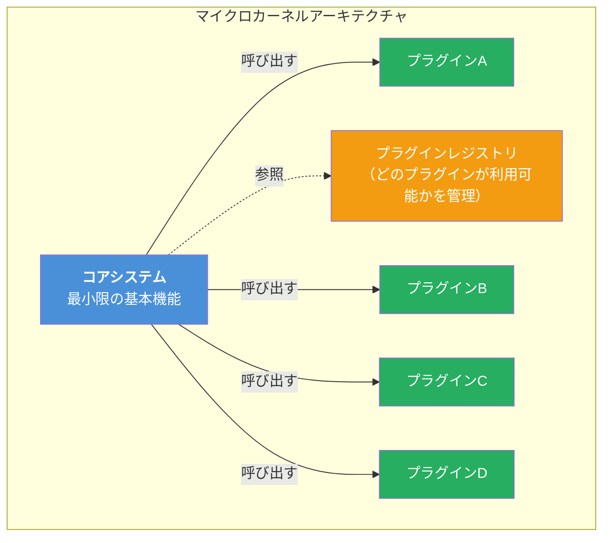
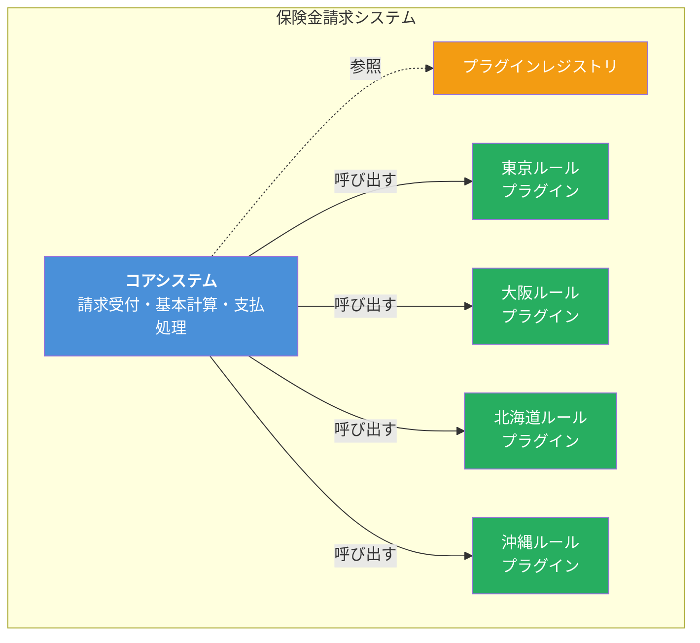
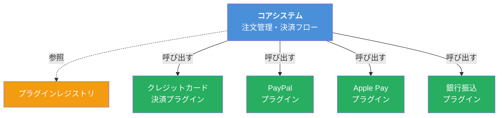

# マイクロカーネルアーキテクチャ（Microkernel Architecture）

## 一言で言うと

**「コアシステム」に「プラグイン」を差し込んで機能を拡張するアーキテクチャ。** IDEにプラグインを追加したり、ブラウザに拡張機能をインストールする仕組みそのもの。「プラグインアーキテクチャ」とも呼ばれる。

> **注意**: OSの「マイクロカーネル」（Mach、L4など）とは別の概念。名前は同じだが、ここではソフトウェアアーキテクチャパターンとしてのマイクロカーネルを扱う。

---

## 目次

1. [何を解決するのか](#何を解決するのか)
2. [身近な例で理解する](#身近な例で理解する)
3. [アーキテクチャの構造](#アーキテクチャの構造)
4. [コアシステムとプラグインの関係](#コアシステムとプラグインの関係)
5. [プラグインの接続方式](#プラグインの接続方式)
6. [メリット](#メリット)
7. [デメリット](#デメリット)
8. [実際のシステム例](#実際のシステム例)
9. [レイヤードアーキテクチャとの違い](#レイヤードアーキテクチャとの違い)
10. [どういうときに選ぶべきか](#どういうときに選ぶべきか)
11. [まとめ](#まとめ)

---

## 何を解決するのか

### 課題：カスタマイズ要求が際限なく増える

プロダクトが成長すると、「この顧客にはこの機能が必要」「あの業界ではこのルールが必要」というカスタマイズ要求が増えてくる。これを1つのコードベースで対応しようとすると以下の問題が発生する。

| 問題 | 具体例 |
|------|--------|
| **if文の地獄** | `if (customerA) { ... } else if (customerB) { ... }` が至るところに散在する |
| **機能の追加が全体に影響** | 新しい税計算ルールを追加したら、既存の処理まで壊れた |
| **不要な機能を外せない** | 特定の顧客には不要な機能も含めてデプロイしなければならない |
| **サードパーティ拡張ができない** | ユーザーや外部開発者が独自機能を追加する手段がない |

### 解決方法：コアと拡張を分離する

マイクロカーネルアーキテクチャは、変わらない核（コアシステム）と、変わる部分（プラグイン）を明確に分離する。新しい機能はプラグインとして追加し、コアシステムには手を加えない。

「ストラテジーパターンで十分では？」と思うかもしれない。確かにGoのインターフェースやJavaのStrategyパターンでも実装の差し替えは可能である。マイクロカーネルはそれを**アーキテクチャレベル**に拡大したもので、以下の点が異なる:
- プラグインは**独立したデプロイ単位**になり得る（コアと別にリリースできる）
- **サードパーティがプラグインを開発・配布**できる仕組みを含む
- レジストリによる**プラグインの動的な管理**（有効化/無効化/設定変更）ができる

---

## 身近な例で理解する

### VS Code

最も分かりやすいマイクロカーネルアーキテクチャの例。

```
コアシステム:  テキストエディタの基本機能（ファイル編集、タブ管理、ターミナル）
プラグイン:    ESLint、Prettier、Go拡張、Python拡張、テーマ、Git連携 ...
```

- コアだけでもテキストエディタとして動く
- プラグインを追加すると特定の言語やツールに対応できる
- プラグインを無効化してもコアの動作には影響しない
- 誰でもプラグインを開発・公開できる

### Webブラウザ（Chrome）

```
コアシステム:  HTML/CSS/JSのレンダリング、タブ管理、ブックマーク
プラグイン:    広告ブロッカー、パスワードマネージャー、翻訳ツール ...
```

---

## アーキテクチャの構造



### コアシステム（Core System）

- アプリケーションの**最小限の基本機能**を提供する
- プラグインなしでも単独で動作可能
- プラグインが接続するための**インターフェース（API）** を定義する
- 個々のプラグインの詳細を知らない

### プラグイン（Plug-in Component）

- **独立した追加機能**を提供する
- コアシステムのインターフェースを実装する
- 他のプラグインとは**独立**している（原則として）
- 追加・削除・更新がコアに影響しない

### プラグインレジストリ

- 利用可能なプラグインの情報を管理する
- プラグインの名前、接続方法、設定などを保持する
- 実装例: 設定ファイル（JSON/YAML）、データベース、内部マップ

---

## コアシステムとプラグインの関係

### 具体例：保険金請求システム

保険会社では、各都道府県ごとに異なる規則で保険金を計算する必要がある。



**コアシステム**:
- 請求の受付処理
- 基本的な保険金計算
- 支払処理
- プラグインインターフェースの定義

**プラグイン（都道府県ルール）**:
- 各都道府県固有の計算ルール
- 地域固有の上限額
- 独自の割引・加算ルール

```go
// コアシステムが定義するインターフェース
type ClaimCalculator interface {
    Calculate(claim *Claim) (*Result, error)
    GetRegionCode() string
}

// 東京ルールプラグイン
type TokyoCalculator struct{}

func (c *TokyoCalculator) Calculate(claim *Claim) (*Result, error) {
    // 東京固有の計算ロジック
    base := claim.Amount * 0.8
    if claim.Category == "medical" {
        base += 50000 // 東京の医療補助加算
    }
    return &Result{Amount: base}, nil
}

func (c *TokyoCalculator) GetRegionCode() string {
    return "13" // 東京都コード
}
```

新しい県のルールが必要になったら、新しいプラグインを追加するだけ。コアシステムを変更する必要はない。

---

## プラグインの接続方式

プラグインをコアシステムに接続する方法は複数ある。

### 1. ポイント・ツー・ポイント接続（直接呼び出し）

プラグインがコアシステムと同じプロセス内で動作し、直接呼び出される。最もシンプル。

```
コアシステム ←→ プラグイン（同一プロセス内）
```

**例**: Goのインターフェース実装、Javaのサービスプロバイダー

### 2. リモートプラグインアクセス（REST / メッセージング）

プラグインが別プロセスやリモートサーバーで動作する。独立デプロイが可能になる反面、ネットワーク越しの通信コストが発生する。

```
コアシステム ←→ REST API / メッセージキュー ←→ プラグイン（別プロセス）
```

**例**: Webhook、マイクロサービス化されたプラグイン、Eclipse（OSGi）

| 接続方式 | レイテンシ | 柔軟性 | 複雑性 |
|---------|-----------|--------|--------|
| ポイント・ツー・ポイント | 低 | 低（再デプロイ必要） | 低 |
| リモートアクセス | 高 | 高（独立デプロイ可能） | 高 |

---

## メリット

| メリット | 説明 |
|---------|------|
| **拡張性が高い** | コアを変更せずにプラグインで機能追加できる |
| **機能の分離** | 各プラグインが独立しており、あるプラグインの不具合が他に影響しにくい |
| **段階的リリース** | 新機能をプラグインとして一部ユーザーにのみ提供できる |
| **サードパーティ拡張** | 外部開発者がプラグインを開発・配布できる |
| **テストの容易さ** | コアとプラグインを独立してテストできる |
| **カスタマイズの柔軟性** | 顧客ごとに有効にするプラグインを変えるだけで対応できる |

---

## デメリット

| デメリット | 説明 |
|-----------|------|
| **コアの設計が難しい** | 拡張ポイント（プラグインインターフェース＝コントラクト）を適切に設計する必要がある。コントラクトを間違えると、後から変更した際にすべてのプラグインが壊れる |
| **スケーラビリティの限界** | 基本的にモノリスであり、水平スケーリングが難しい |
| **プラグイン間の依存** | 原則として独立だが、プラグイン間に依存関係が生まれると管理が複雑化する |
| **バージョン管理** | コアのAPIバージョンとプラグインの互換性管理が必要 |
| **セキュリティ** | サードパーティプラグインがコアシステムにアクセスできるため、悪意あるプラグインのリスクがある |

---

## 実際のシステム例

### 1. IDE・テキストエディタ

| ツール | コアシステム | プラグイン例 |
|--------|-------------|-------------|
| VS Code | エディタ基盤 | 言語サポート、テーマ、デバッガ |
| IntelliJ IDEA | Java IDE基盤 | Kotlin、Scala、DB連携 |
| Vim / Neovim | テキスト編集 | LSP、ファイラー、Git連携 |

### 2. Webブラウザ

| ブラウザ | コアシステム | プラグイン例 |
|---------|-------------|-------------|
| Chrome | レンダリングエンジン | 広告ブロック、翻訳、開発者ツール |
| Firefox | Geckoエンジン | プライバシー拡張、スクリーンキャプチャ |

### 3. ビルドツール・タスクランナー

| ツール | コアシステム | プラグイン例 |
|--------|-------------|-------------|
| webpack | モジュールバンドル | babel-loader、css-loader、各種プラグイン |
| Jenkins | CI/CD基盤 | Git連携、Slack通知、Dockerビルド |
| Gradle | ビルド基盤 | Java、Kotlin、Android、Spring Boot |

### 4. 決済システム



新しい決済手段が登場したら、プラグインを追加するだけで対応可能。

---

## レイヤードアーキテクチャとの違い

| 観点 | レイヤード | マイクロカーネル |
|------|-----------|----------------|
| **構造** | 水平方向の層分け | コア＋プラグインの組み合わせ |
| **拡張方法** | 既存の層にコードを追加 | 新しいプラグインを追加 |
| **変更の影響** | 層をまたいで伝播する可能性 | コアに影響しない |
| **カスタマイズ** | コード修正が必要 | プラグインの有効/無効で切り替え |
| **典型的な用途** | 業務アプリケーション全般 | 拡張性が求められるプロダクト |

---

## どういうときに選ぶべきか

### 向いているケース

- 製品として販売するソフトウェア（顧客ごとにカスタマイズが必要）
- 拡張機能をサードパーティに開放したい
- 機能の追加・削除を頻繁に行う
- 機能単位でのテスト・リリースが求められる

### 向いていないケース

- 高いスケーラビリティが必要 → マイクロサービスアーキテクチャ等を検討
- コアとプラグインの境界が不明確なシステム
- リアルタイム処理や高スループットが求められるシステム → イベント駆動アーキテクチャ等を検討
- プラグイン間の連携が頻繁に必要なシステム

---

## まとめ

以下は『ソフトウェアアーキテクチャの基礎』の評価をもとにした星評価。

```
マイクロカーネルアーキテクチャの特性評価（★5段階）

デプロイ容易性:   ★★★☆☆  （プラグイン単位でのデプロイが可能）
弾力性:          ★☆☆☆☆  （基本的にモノリス）
進化性:          ★★★☆☆  （プラグインによる拡張は容易）
障害耐性:        ★☆☆☆☆  （コアの障害は全体に波及する）
モジュール性:     ★★★☆☆  （プラグインによる論理的な分離は明確）
全体コスト:       ★★★★★  （シンプルな構造で低コスト）
パフォーマンス:   ★★★☆☆  （プラグインのロード方式による）
信頼性:          ★★★☆☆  （コアのシンプルさが安定性につながる）
スケーラビリティ: ★☆☆☆☆  （基本的にモノリシック）
シンプルさ:       ★★★★☆  （コア＋プラグインの概念は直感的）
テスタビリティ:   ★★★☆☆  （プラグイン単位のテストは容易）
```

マイクロカーネルアーキテクチャは「拡張性」に特化したアーキテクチャ。VS Code、Chrome、Jenkinsなど、成功しているソフトウェアの多くがこのパターンを採用している。「コアを小さく保ち、変化する部分はプラグインに切り出す」という設計思想は、マイクロサービスにも通じる考え方である。
