# マイクロサービスアーキテクチャ（Microservices Architecture）

## 一言で言うと

**アプリケーションを「何も共有しない（Share Nothing）」完全に独立した小さなサービス群に分解し、それぞれが独自のDBを持ち、ネットワーク越しに協調動作するアーキテクチャ。** 大規模な組織が多数のチームで独立して開発・デプロイするために生まれた、現代クラウドネイティブ開発の中心的手法。

---

## 目次

1. [何を解決するのか](#何を解決するのか)
2. [アーキテクチャの構造](#アーキテクチャの構造)
3. [境界づけられたコンテキスト（Bounded Context）](#境界づけられたコンテキストbounded-context)
4. [APIレイヤーとAPIゲートウェイ](#apiレイヤーとapiゲートウェイ)
5. [通信パターン：同期 vs 非同期](#通信パターン同期-vs-非同期)
6. [サイドカーパターンとサービスメッシュ](#サイドカーパターンとサービスメッシュ)
7. [データ管理：サービスごとのDB](#データ管理サービスごとのdb)
8. [コレオグラフィ vs オーケストレーション（Sagaパターン）](#コレオグラフィ-vs-オーケストレーションsagaパターン)
9. [メリット](#メリット)
10. [デメリット](#デメリット)
11. [実際のシステム例](#実際のシステム例)
12. [アンチパターン：分散モノリス](#アンチパターン分散モノリス)
13. [サービスベースアーキテクチャとの比較](#サービスベースアーキテクチャとの比較)
14. [どういうときに選ぶべきか](#どういうときに選ぶべきか)
15. [まとめ](#まとめ)

---

## 何を解決するのか

### 課題：大規模組織でのモノリスの限界

数百名のエンジニアが1つのコードベースを触るとき、何が起こるか。

```
モノリスの1日:
09:00  チームAがユーザー認証機能をmainブランチにマージ
09:30  チームBの注文機能のテストが突然壊れる（認証コードが影響）
10:00  チームCはデプロイ待ち（チームAの修正待ち）
11:00  ようやくデプロイ → 実は決済機能にも問題が潜んでいた
11:30  全サービスをロールバック（注文・決済・配送・通知…全部一緒に）
```

| モノリスの問題 | 影響 |
|-------------|------|
| **全体一括デプロイ** | 1箇所の変更が全体に波及。リリースが月1回になる |
| **コードの結合** | 決済コードが注文コードを直接呼び出す。変更が怖い |
| **スケーリングの非効率** | 検索機能だけ負荷が高くても、全体をスケールアウト |
| **技術スタックの固定** | 機械学習部分にPythonを使いたくても全部Goにしばられる |
| **チームの渋滞** | 誰かのコードが壊れると全員が止まる |

### 解決方法：「何も共有しない」完全分離

マイクロサービスは、「チームが独立して動けること」を最優先とする。

```
マイクロサービスの1日:
09:00  チームAが認証サービスをデプロイ（他チームは無関係）
09:30  チームBが注文サービスをデプロイ（認証サービスのAPIは変わっていない）
10:00  チームCが決済サービスをスケールアウト（Black Friday対策）
11:00  決済サービスの1インスタンスがクラッシュ → 自動で再起動、影響なし
```

> 書籍『ソフトウェアアーキテクチャの基礎』では、マイクロサービスは**「ドメイン分割性（Domain Partitioning）」を極限まで追求したアーキテクチャ**と位置づけられている。ビジネスドメインの独立性がアーキテクチャの中心にある。

---

## アーキテクチャの構造

### 全体像

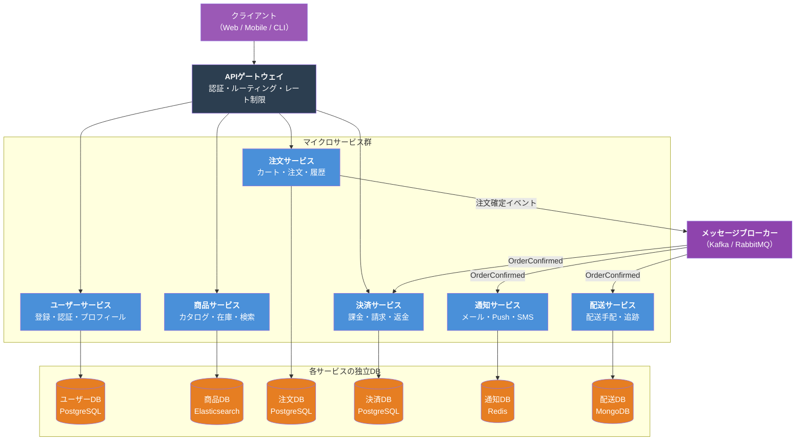

### 基本構成要素

| 要素 | 役割 |
|------|------|
| **APIゲートウェイ** | クライアントの唯一の入口。認証・ルーティング・レート制限を担う |
| **マイクロサービス** | 1つのビジネス機能に特化した小さなサービス。独立してデプロイ可能 |
| **独立DB** | 各サービスが専用DBを持つ。他サービスのDBに直接アクセスしない |
| **メッセージブローカー** | 非同期通信の基盤。サービス間の疎結合を実現 |
| **サービスメッシュ** | サービス間通信の制御・監視・セキュリティを横断的に管理 |

---

## 境界づけられたコンテキスト（Bounded Context）

### DDDの中核概念とマイクロサービスの関係

マイクロサービスの粒度を決める最も重要な概念が、ドメイン駆動設計（DDD）の**境界づけられたコンテキスト（Bounded Context）**だ。

> **Bounded Context とは**: ある用語やモデルが一貫した意味を持つ「境界」。その境界の中では、同じ言葉が同じ意味で使われる。

ECサイトで「**商品（Product）**」という言葉を考えてみよう。

```
カタログコンテキストの「商品」:
  - 名前、説明、画像、カテゴリ、メタデータ
  - 「商品を見つけやすくすること」が関心事

在庫コンテキストの「商品」:
  - SKU、数量、倉庫ロケーション、補充ルール
  - 「在庫を切らさないこと」が関心事

配送コンテキストの「商品」:
  - 重量、サイズ、梱包種別、危険物フラグ
  - 「安全に届けること」が関心事
```

3つのコンテキストはすべて「商品」を扱うが、**まったく異なるモデル**を持つ。これを1つの巨大な「商品テーブル」に押し込めると、すべてのカラムが混在した管理不能なモデルになる。

### 各サービスが自分のドメインとデータを所有する

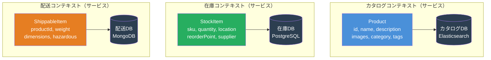

### GoコードでのBounded Context実装例

```go
// カタログサービス: 商品の「見つけやすさ」を関心事とするモデル
package catalog

type Product struct {
    ID          string   `json:"id"`
    Name        string   `json:"name"`
    Description string   `json:"description"`
    Images      []string `json:"images"`
    Category    string   `json:"category"`
    Tags        []string `json:"tags"`
    SearchScore float64  `json:"searchScore"` // 検索ランキング用
}

// 在庫サービス: 「在庫管理」を関心事とするモデル
// ※ "Product" ではなく "StockItem" という名前を使う
package inventory

type StockItem struct {
    SKU          string `json:"sku"`
    ProductID    string `json:"productId"` // カタログへの参照はIDのみ
    Quantity     int    `json:"quantity"`
    Location     string `json:"location"`
    ReorderPoint int    `json:"reorderPoint"`
    SupplierID   string `json:"supplierId"`
}

// 重要: 在庫サービスはカタログサービスのDBを直接参照しない
// 商品名が必要な場合はAPIを経由して取得する
func (s *StockService) GetStockWithName(sku string) (*StockItemDetail, error) {
    item, err := s.repo.FindBySKU(sku)
    if err != nil {
        return nil, err
    }
    // 商品名はカタログサービスのAPIから取得（DBアクセスではない）
    product, err := s.catalogClient.GetProduct(item.ProductID)
    if err != nil {
        // カタログサービスが落ちていても在庫情報は返せる
        return &StockItemDetail{StockItem: item, ProductName: "Unknown"}, nil
    }
    return &StockItemDetail{StockItem: item, ProductName: product.Name}, nil
}
```

> **書籍のポイント**: 「サービスの粒度は、機能の数ではなくBounded Contextの数で決める。1つのBounded Contextが1つのマイクロサービスになるのが理想的」

---

## APIレイヤーとAPIゲートウェイ

### クライアントが直接サービスを呼ぶと何が起こるか

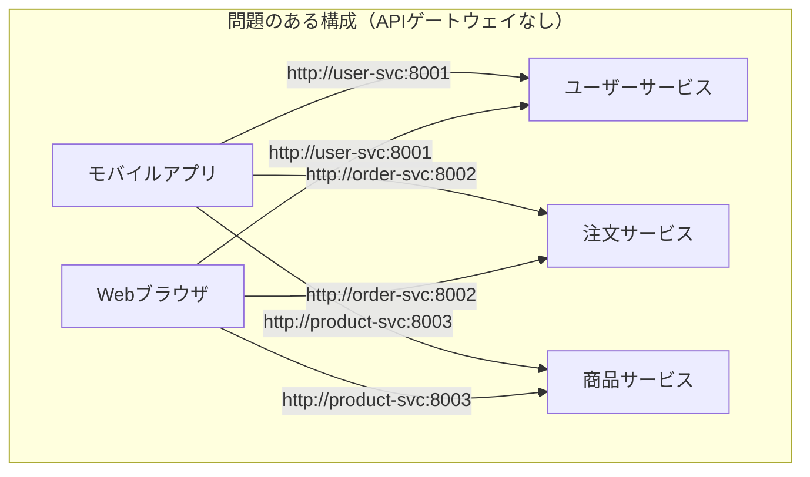

問題点: クライアントが全サービスのURLを知っている。サービスの変更（スケールアップ、リネーム、分割）が即座にクライアント側への修正を要求する。

### APIゲートウェイパターン

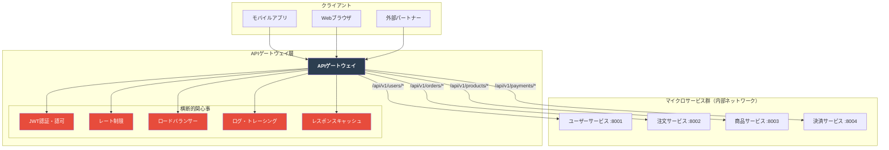

### GoでのAPIゲートウェイ実装イメージ

```go
package gateway

import (
    "net/http"
    "net/http/httputil"
    "net/url"
    "strings"
)

type Gateway struct {
    routes map[string]string // pathPrefix -> upstream URL
}

func NewGateway() *Gateway {
    return &Gateway{
        routes: map[string]string{
            "/api/v1/users":    "http://user-service:8001",
            "/api/v1/orders":   "http://order-service:8002",
            "/api/v1/products": "http://product-service:8003",
            "/api/v1/payments": "http://payment-service:8004",
        },
    }
}

func (g *Gateway) ServeHTTP(w http.ResponseWriter, r *http.Request) {
    // 1. 認証（JWTの検証）
    if !g.authenticate(r) {
        http.Error(w, "Unauthorized", http.StatusUnauthorized)
        return
    }

    // 2. レート制限
    if !g.checkRateLimit(r) {
        http.Error(w, "Too Many Requests", http.StatusTooManyRequests)
        return
    }

    // 3. ルーティング: パスプレフィックスでアップストリームを決定
    upstream := g.route(r.URL.Path)
    if upstream == "" {
        http.Error(w, "Not Found", http.StatusNotFound)
        return
    }

    // 4. リバースプロキシでアップストリームに転送
    target, _ := url.Parse(upstream)
    proxy := httputil.NewSingleHostReverseProxy(target)
    proxy.ServeHTTP(w, r)
}

func (g *Gateway) route(path string) string {
    for prefix, upstream := range g.routes {
        if strings.HasPrefix(path, prefix) {
            return upstream
        }
    }
    return ""
}
```

### BFF（Backends for Frontends）パターン

大規模システムでは、クライアントの種類ごとに専用のAPIゲートウェイを用意する **BFF パターン**が使われる。

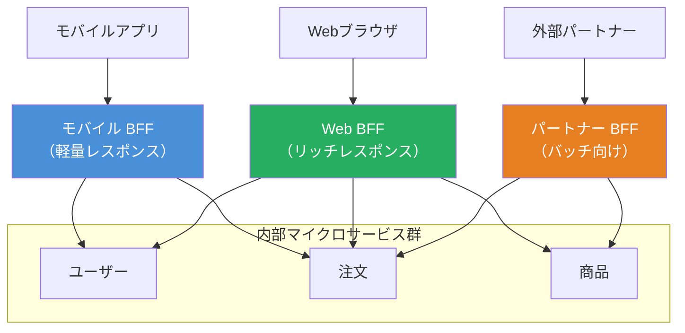

---

## 通信パターン：同期 vs 非同期

### 同期通信（REST / gRPC）

**いつ使うか**: リクエスト結果をすぐに返す必要がある処理（ユーザー情報取得、在庫確認など）

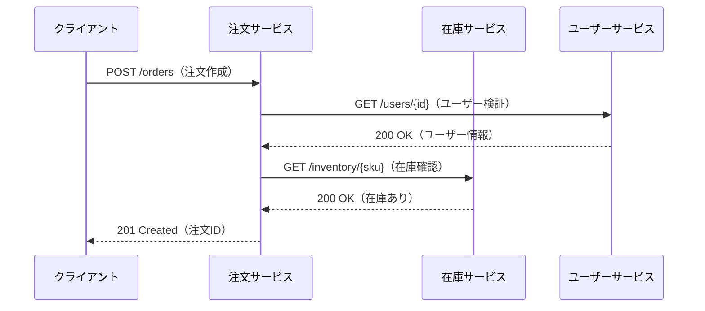

#### REST vs gRPC の使い分け

| 観点 | REST（HTTP/JSON） | gRPC（HTTP/2 + Protobuf） |
|------|-----------------|--------------------------|
| **主な用途** | 外部公開API、BFF | サービス間内部通信 |
| **パフォーマンス** | 普通 | 高速（バイナリ・多重化） |
| **型安全性** | 弱い | 強い（スキーマ定義必須） |
| **ストリーミング** | 非対応 | 対応 |
| **学習コスト** | 低い | 中程度 |

```go
// gRPC サービス定義（inventory.proto）
// service InventoryService {
//   rpc CheckStock(CheckStockRequest) returns (CheckStockResponse);
//   rpc WatchStock(WatchRequest) returns (stream StockUpdate); // サーバーサイドストリーミング
// }

// GoでのgRPCクライアント実装
package order

import (
    "context"
    "time"

    pb "github.com/example/inventory/proto"
    "google.golang.org/grpc"
)

type OrderService struct {
    inventoryClient pb.InventoryServiceClient
}

func (s *OrderService) CreateOrder(ctx context.Context, req *CreateOrderRequest) (*Order, error) {
    // gRPCで在庫確認（タイムアウト付き）
    ctx, cancel := context.WithTimeout(ctx, 2*time.Second)
    defer cancel()

    stockResp, err := s.inventoryClient.CheckStock(ctx, &pb.CheckStockRequest{
        Sku:      req.SKU,
        Quantity: int32(req.Quantity),
    })
    if err != nil {
        return nil, fmt.Errorf("在庫確認失敗: %w", err)
    }
    if !stockResp.Available {
        return nil, ErrOutOfStock
    }

    // 注文を作成...
    return s.createOrderInternal(ctx, req)
}
```

### 非同期通信（メッセージング）

**いつ使うか**: 結果を即座に返す必要がなく、複数サービスへの通知が必要な処理（注文確定後の後続処理など）

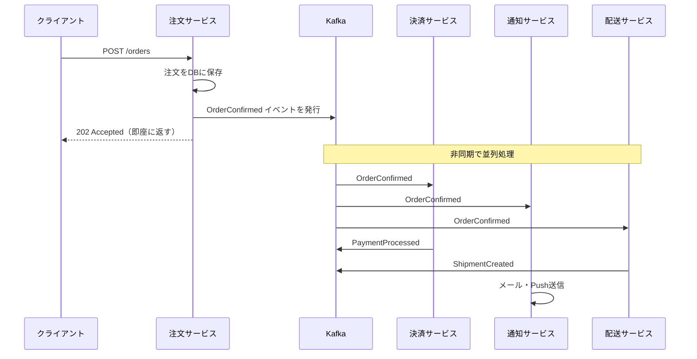

```go
// Kafkaを使ったイベント発行（注文サービス）
package order

import (
    "encoding/json"

    "github.com/segmentio/kafka-go"
)

type OrderConfirmedEvent struct {
    OrderID    string  `json:"orderId"`
    UserID     string  `json:"userId"`
    TotalPrice float64 `json:"totalPrice"`
    Items      []Item  `json:"items"`
    OccurredAt string  `json:"occurredAt"`
}

type OrderService struct {
    repo     OrderRepository
    producer *kafka.Writer
}

func (s *OrderService) ConfirmOrder(ctx context.Context, orderID string) error {
    order, err := s.repo.FindByID(orderID)
    if err != nil {
        return err
    }

    // DBへの注文確定を先に行う
    if err := s.repo.Confirm(orderID); err != nil {
        return err
    }

    // イベントを発行（この処理自体は軽量・高速）
    event := OrderConfirmedEvent{
        OrderID:    order.ID,
        UserID:     order.UserID,
        TotalPrice: order.TotalPrice,
        Items:      order.Items,
        OccurredAt: time.Now().UTC().Format(time.RFC3339),
    }
    payload, _ := json.Marshal(event)

    return s.producer.WriteMessages(ctx, kafka.Message{
        Key:   []byte(order.ID),
        Value: payload,
        Topic: "order.confirmed",
    })
}

// Kafkaからイベントを受信（決済サービス）
package payment

func (s *PaymentService) ConsumeOrderEvents(ctx context.Context) {
    reader := kafka.NewReader(kafka.ReaderConfig{
        Brokers: []string{"kafka:9092"},
        Topic:   "order.confirmed",
        GroupID: "payment-service", // コンシューマーグループ（各サービスが独立して消費）
    })

    for {
        msg, err := reader.ReadMessage(ctx)
        if err != nil {
            break
        }
        var event OrderConfirmedEvent
        json.Unmarshal(msg.Value, &event)

        // 決済処理
        s.processPayment(ctx, event)
    }
}
```

### サーキットブレーカー（同期通信の防御）

同期通信では、依存先サービスの障害が連鎖的に広がる「カスケード障害」が最大のリスクだ。

```go
// サーキットブレーカーの実装イメージ
package circuit

type State int

const (
    Closed   State = iota // 正常: リクエストを通す
    Open                  // 開放: リクエストを即座に拒否（障害中）
    HalfOpen              // 半開: 試験的にリクエストを通す
)

type CircuitBreaker struct {
    state        State
    failureCount int
    threshold    int
    lastFailure  time.Time
    timeout      time.Duration
    mu           sync.Mutex
}

func (cb *CircuitBreaker) Execute(fn func() error) error {
    cb.mu.Lock()
    defer cb.mu.Unlock()

    switch cb.state {
    case Open:
        // タイムアウト経過後はHalfOpenに移行
        if time.Since(cb.lastFailure) > cb.timeout {
            cb.state = HalfOpen
        } else {
            return ErrCircuitOpen // 即座に拒否
        }
    case Closed, HalfOpen:
        err := fn()
        if err != nil {
            cb.failureCount++
            cb.lastFailure = time.Now()
            if cb.failureCount >= cb.threshold {
                cb.state = Open // 障害しきい値超過 → 遮断
            }
            return err
        }
        // 成功したらリセット
        cb.state = Closed
        cb.failureCount = 0
    }
    return nil
}
```

---

## サイドカーパターンとサービスメッシュ

### 横断的関心事の問題

サービス間通信には、すべてのサービスが共通して必要とする「横断的関心事」がある。

```
すべてのサービスが必要とするもの:
  ✗ mTLS（相互TLS認証）
  ✗ サービスディスカバリ
  ✗ ロードバランシング
  ✗ サーキットブレーカー
  ✗ リトライ・タイムアウト
  ✗ 分散トレーシング
  ✗ メトリクス収集
```

これをサービスごとに実装すると、全サービスのコードが複雑化し、実装の一貫性が失われる。

### サイドカーパターン

**サイドカー（Sidecar）** は、メインサービスのコンテナの隣に配置される補助コンテナだ。サービス本体は自分のビジネスロジックに集中し、横断的関心事はサイドカーに委ねる。

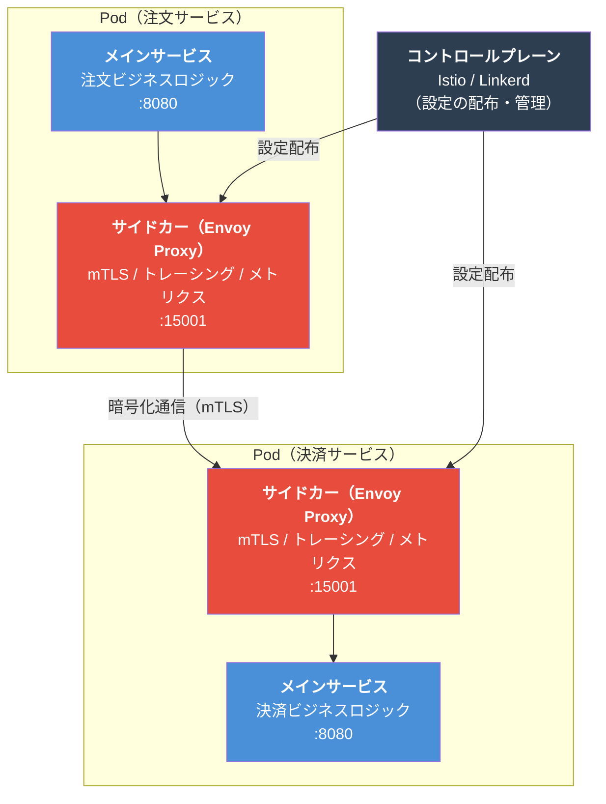

### サービスメッシュ

サイドカーをすべてのサービスに展開し、**コントロールプレーン**で一元管理する仕組みが**サービスメッシュ（Service Mesh）**だ。

| 機能 | 説明 |
|------|------|
| **mTLS** | サービス間通信を自動で暗号化。サービス本体にTLS実装不要 |
| **サービスディスカバリ** | サービスのIPを動的に解決。ハードコードなし |
| **トラフィック管理** | カナリーリリース、A/Bテスト、フォールトインジェクション |
| **オブザーバビリティ** | 分散トレーシング（Jaeger）、メトリクス（Prometheus）を自動収集 |
| **ポリシー適用** | どのサービスが誰を呼べるかをコードなしで制御 |

```yaml
# Istio VirtualService: カナリーリリースの設定例
# （Goコードを変更せずにトラフィックを制御）
apiVersion: networking.istio.io/v1alpha3
kind: VirtualService
metadata:
  name: order-service
spec:
  http:
  - match:
    - headers:
        x-canary-user:
          exact: "true"
    route:
    - destination:
        host: order-service
        subset: v2  # カナリー版（新バージョン）
  - route:
    - destination:
        host: order-service
        subset: v1  # 安定版（既存）
      weight: 90
    - destination:
        host: order-service
        subset: v2
      weight: 10  # 10%のトラフィックを新バージョンへ
```

> **書籍のポイント**: サービスメッシュはマイクロサービスの「運用コスト」の一部だが、サービス本体のコードをシンプルに保つための重要な投資だ。Istio や Linkerd などが代表的な実装。

---

## データ管理：サービスごとのDB

### なぜ「サービスごとのDB」が必要か

マイクロサービスの根本原則は **「Share Nothing（何も共有しない）」** だ。DBを共有すると何が起こるか。

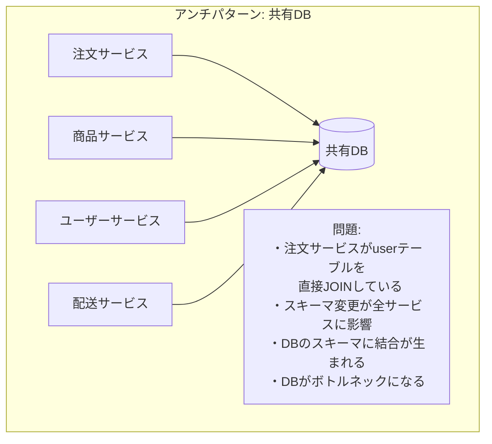

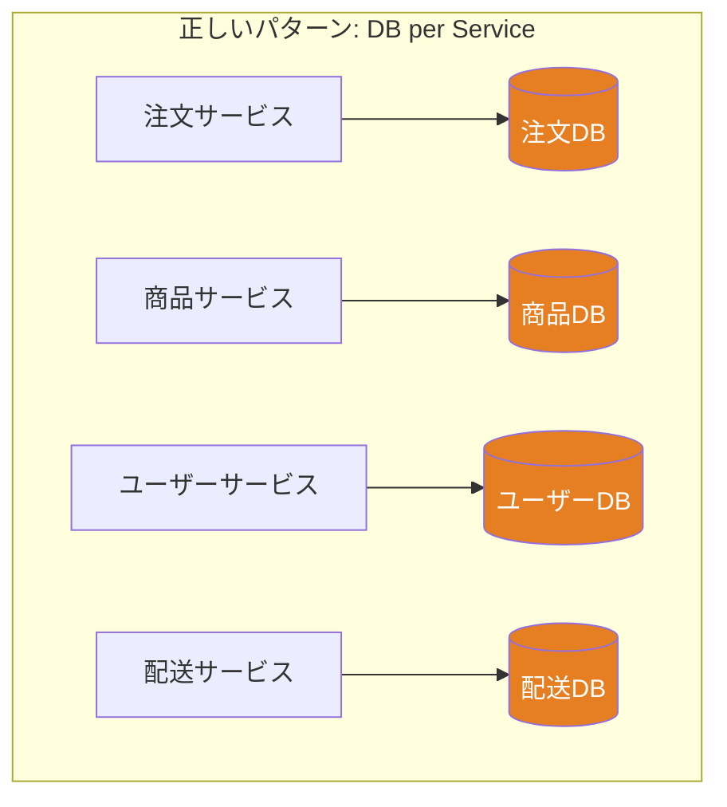

### 最大の課題：クロスサービスのクエリ

共有DBがないと、**「注文一覧を取得して、各注文のユーザー名・商品名も一緒に表示したい」**というよくある要件が、SQLのJOIN1行では済まなくなる。

```go
// モノリスでの実装（JOIN一発で終わる）
// SELECT o.*, u.name, p.name FROM orders o
//   JOIN users u ON o.user_id = u.id
//   JOIN products p ON o.product_id = p.id
// WHERE o.id = ?

// マイクロサービスでの実装（APIを複数回呼ぶ）
func (s *OrderService) GetOrderDetail(ctx context.Context, orderID string) (*OrderDetail, error) {
    // 1. 注文を取得（自分のDB）
    order, err := s.repo.FindByID(orderID)
    if err != nil {
        return nil, err
    }

    // 2. ユーザー情報をユーザーサービスのAPIから取得
    user, err := s.userClient.GetUser(ctx, order.UserID)
    if err != nil {
        // 障害耐性: ユーザー情報が取れなくても注文情報は返す
        user = &User{Name: "Unknown"}
    }

    // 3. 商品情報を商品サービスのAPIから取得
    product, err := s.productClient.GetProduct(ctx, order.ProductID)
    if err != nil {
        product = &Product{Name: "Unknown"}
    }

    return &OrderDetail{
        Order:       order,
        UserName:    user.Name,
        ProductName: product.Name,
    }, nil
}
```

### CQRS（Command Query Responsibility Segregation）で解決する

大量データの集計が必要な場合、**CQRS + Read Model** パターンで対処する。

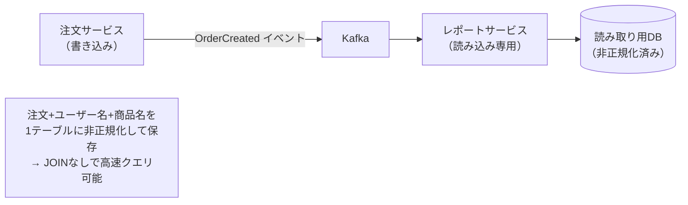

```go
// 読み取り専用の非正規化モデル（JOINの代替）
type OrderReadModel struct {
    OrderID     string    `db:"order_id"`
    UserID      string    `db:"user_id"`
    UserName    string    `db:"user_name"`    // 非正規化: ユーザーサービスから取得済み
    ProductID   string    `db:"product_id"`
    ProductName string    `db:"product_name"` // 非正規化: 商品サービスから取得済み
    TotalPrice  float64   `db:"total_price"`
    Status      string    `db:"status"`
    CreatedAt   time.Time `db:"created_at"`
}

// イベントハンドラ: 注文作成時に読み取りモデルを構築
func (h *OrderProjectionHandler) Handle(ctx context.Context, event OrderCreatedEvent) error {
    // 各サービスから情報を取得して非正規化モデルを構築
    user, _ := h.userClient.GetUser(ctx, event.UserID)
    product, _ := h.productClient.GetProduct(ctx, event.ProductID)

    readModel := &OrderReadModel{
        OrderID:     event.OrderID,
        UserID:      event.UserID,
        UserName:    user.Name,
        ProductID:   event.ProductID,
        ProductName: product.Name,
        TotalPrice:  event.TotalPrice,
        Status:      "CREATED",
        CreatedAt:   event.OccurredAt,
    }
    return h.readRepo.Save(ctx, readModel)
}
```

---

## コレオグラフィ vs オーケストレーション（Sagaパターン）

### 分散トランザクションの問題

「注文確定」には複数サービスにまたがるトランザクションが必要だ。しかし、DBが分散している以上、従来のACIDトランザクション（2相コミット）はパフォーマンスが悪く、実用的でない。

**Sagaパターン**は、長時間にわたるビジネストランザクションを、各サービスが担う小さなローカルトランザクションの連鎖として実装する手法だ。

### コレオグラフィ（Choreography）: イベントで踊る

各サービスが自律的にイベントを発行・受信し、全体の流れを形成する。中央の司令塔はいない。

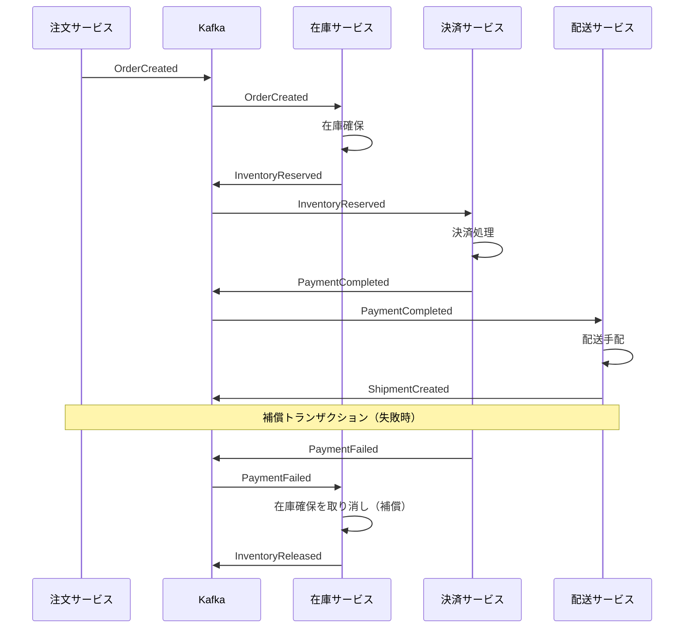

```go
// コレオグラフィ: 在庫サービスのイベントハンドラ
func (s *InventoryService) HandleOrderCreated(ctx context.Context, event OrderCreatedEvent) error {
    // ローカルトランザクション: 在庫確保
    if err := s.repo.Reserve(ctx, event.SKU, event.Quantity); err != nil {
        // 失敗したら InventoryReservationFailed を発行
        s.publisher.Publish(ctx, InventoryReservationFailedEvent{
            OrderID: event.OrderID,
            Reason:  err.Error(),
        })
        return nil
    }

    // 成功したら InventoryReserved を発行（次のサービスが受け取る）
    s.publisher.Publish(ctx, InventoryReservedEvent{
        OrderID:  event.OrderID,
        SKU:      event.SKU,
        Quantity: event.Quantity,
    })
    return nil
}
```

### オーケストレーション（Orchestration）: 司令塔が指揮する

**Sagaオーケストレーター**が各サービスに対してコマンドを送り、全体のフローを制御する。

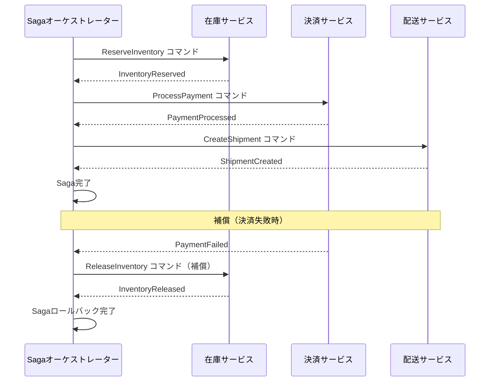

```go
// オーケストレーション: Sagaオーケストレーターの実装
type OrderSaga struct {
    inventoryClient InventoryClient
    paymentClient   PaymentClient
    shippingClient  ShippingClient
    repo            SagaRepository
}

type SagaStep func(ctx context.Context, state *SagaState) error
type CompensateStep func(ctx context.Context, state *SagaState) error

func (s *OrderSaga) Execute(ctx context.Context, orderID string) error {
    state := &SagaState{OrderID: orderID, Step: "STARTED"}
    s.repo.Save(ctx, state)

    steps := []struct {
        name       string
        forward    SagaStep
        compensate CompensateStep
    }{
        {
            name:       "RESERVE_INVENTORY",
            forward:    s.reserveInventory,
            compensate: s.releaseInventory,
        },
        {
            name:       "PROCESS_PAYMENT",
            forward:    s.processPayment,
            compensate: s.refundPayment,
        },
        {
            name:    "CREATE_SHIPMENT",
            forward: s.createShipment,
            // 配送作成後のロールバックは複雑なので別途対応
        },
    }

    completed := []CompensateStep{}

    for _, step := range steps {
        state.Step = step.name
        s.repo.Save(ctx, state)

        if err := step.forward(ctx, state); err != nil {
            // 失敗: 完了済みステップを逆順に補償
            for i := len(completed) - 1; i >= 0; i-- {
                completed[i](ctx, state)
            }
            return fmt.Errorf("saga failed at step %s: %w", step.name, err)
        }

        if step.compensate != nil {
            completed = append(completed, step.compensate)
        }
    }

    state.Step = "COMPLETED"
    s.repo.Save(ctx, state)
    return nil
}
```

### コレオグラフィ vs オーケストレーションの使い分け

| 観点 | コレオグラフィ | オーケストレーション |
|------|-------------|------------------|
| **制御の所在** | なし（自律分散） | Sagaオーケストレーター |
| **結合度** | 低い（イベントのみ） | 中程度（コマンド送受信） |
| **見通しの良さ** | 悪い（全体像が追いにくい） | 良い（一箇所で把握できる） |
| **デバッグ** | 困難 | 容易 |
| **適用シーン** | シンプルなフロー、サービス数が少ない | 複雑な業務フロー、条件分岐が多い |

---

## メリット

| メリット | 説明 |
|---------|------|
| **チームの独立性** | 各チームが自律してデプロイできる。他チームの作業待ちがなくなる |
| **技術的自由度** | サービスごとに最適な言語・DBを選べる（ポリグロット） |
| **細粒度スケーリング** | 負荷の高いサービスだけをスケールアウト。コスト効率が高い |
| **高い障害耐性** | サーキットブレーカーで障害の連鎖を防止。1サービスの障害が全体に波及しない |
| **独立デプロイ** | 1日に数百回のデプロイが可能。NetflixやAmazonの事例では1時間に数千回 |
| **進化の容易さ** | サービス単位でリプレイスできる。Strangler Figパターンで段階的移行が可能 |

---

## デメリット

| デメリット | 説明 |
|-----------|------|
| **運用の複雑さ** | 数十〜数百のサービスのデプロイ・監視・ログ管理。Kubernetes必須 |
| **分散トレーシングが必要** | 1リクエストが複数サービスをまたぐため、デバッグが困難。JaegerやZipkin必須 |
| **分散トランザクション** | ACIDトランザクションが使えない。Sagaパターンで最終的整合性を実装する必要がある |
| **ネットワーク遅延** | サービス間呼び出しがネットワーク越しになる。モノリスのメソッド呼び出しより遅い |
| **データ一貫性** | サービス間のデータが一時的に不整合になる。結果整合性を許容する設計が必要 |
| **DevOps成熟度が前提** | CI/CD、コンテナオーケストレーション（Kubernetes）、サービスメッシュの運用スキルが必要 |
| **テストの複雑さ** | 結合テストにはすべてのサービスを立ち上げる必要がある。Contract Testingが必要 |

---

## 実際のシステム例

### 1. Netflix：1000以上のマイクロサービス

Netflixはマイクロサービスの先駆者だ。2008年のDB障害をきっかけに、モノリスから完全移行した。

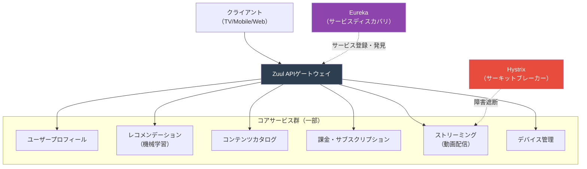

**Netflixから学ぶポイント**:
- Chaos Engineering（Chaos Monkey）: 意図的にサービスを落として耐障害性を検証
- 各サービスを担当するチームは「2枚のピザで養えるサイズ（2 Pizza Rule）」
- レコメンデーションはPython（機械学習）、配信システムはJava、というポリグロット構成

### 2. Amazon：「あなたも注文できますか？」テスト

Amazonは2002年にジェフ・ベゾスが「APIマンデート」を発令し、全サービスがAPIを通じてのみ通信するよう命じた。

```
Amazon EC「注文フロー」の主要サービス:
  ・商品カタログサービス（検索・詳細）
  ・価格サービス（動的価格設定）
  ・在庫サービス（リアルタイム在庫）
  ・レコメンデーションサービス（パーソナライズ）
  ・カートサービス（セッション管理）
  ・注文サービス（注文確定・履歴）
  ・決済サービス（課金・返金）
  ・Fulfillmentサービス（倉庫・梱包）
  ・配送サービス（配送手配・追跡）
  ・通知サービス（メール・SMS）
  ...（実際には数百サービス）
```

### 3. ECサイトのマイクロサービス分解

中規模ECサイトをマイクロサービスで設計した場合のサービス分解例。

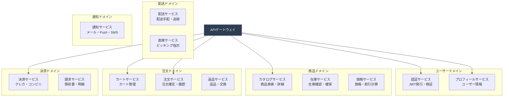

---

## アンチパターン：分散モノリス

### 最も避けるべき失敗

マイクロサービスで最も危険なアンチパターンが **「分散モノリス（Distributed Monolith）」** だ。サービスを分割したつもりなのに、サービス間の結合度が高く、モノリスの問題を全部持ったまま分散の複雑さまで加わってしまう。

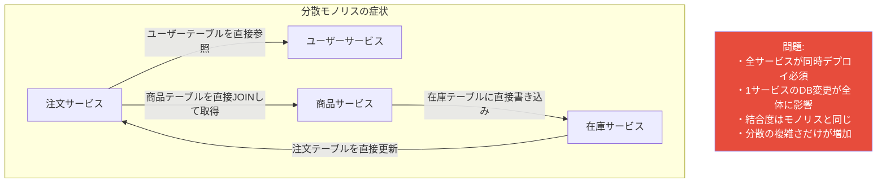

### 分散モノリスに陥るパターン

```go
// アンチパターン: 他サービスのDBに直接アクセス
// 注文サービスがユーザーサービスのDBに直接SQL発行
package order

// ❌ これは絶対にやってはいけない
func (s *OrderService) GetOrderWithUserBad(orderID string) (*OrderDetail, error) {
    var detail OrderDetail

    // 注文サービスのDBと、ユーザーサービスのDBをまたいでJOIN
    query := `
        SELECT o.id, o.total_price, u.name, u.email
        FROM orders o                          -- 注文サービスのDB
        JOIN user_db.users u ON o.user_id = u.id  -- ユーザーサービスのDBに直接アクセス！
        WHERE o.id = ?
    `
    return &detail, s.db.Raw(query, orderID).Scan(&detail).Error
}

// 正しいアプローチ: APIを通じてのみアクセス
// ✅ ユーザー情報はユーザーサービスのAPIから取得
func (s *OrderService) GetOrderWithUserGood(ctx context.Context, orderID string) (*OrderDetail, error) {
    order, err := s.repo.FindByID(orderID)
    if err != nil {
        return nil, err
    }

    user, err := s.userClient.GetUser(ctx, order.UserID) // HTTP / gRPC経由
    if err != nil {
        user = &User{Name: "Unknown"} // 障害耐性: エラーでも動作継続
    }

    return &OrderDetail{Order: order, UserName: user.Name}, nil
}
```

### 分散モノリスの診断チェックリスト

```
以下が1つでも当てはまる場合、分散モノリスの可能性がある:

□ 1つのサービスを変更すると、他のサービスも同時にデプロイが必要
□ サービスAのDBのテーブルを、サービスBが直接参照している
□ すべてのサービスが同じライブラリ・フレームワークの特定バージョンに依存
□ サービス間でデータ構造（DTO）を共有した共通ライブラリがある
□ あるサービスのデプロイが失敗すると、他のサービスも動かなくなる
□ サービス間の同期呼び出しが深い連鎖になっている（A→B→C→D→E）
```

> **書籍のポイント**: 「粒度が細かすぎるとサービス間の結合が増え、分散モノリスになる。Bounded Contextを守り、サービスは本当に独立できる単位で分割すること」

---

## サービスベースアーキテクチャとの比較

マイクロサービスはサービスベースアーキテクチャとよく混同される。決定的な違いを整理する。

| 観点 | サービスベース | マイクロサービス |
|------|-------------|----------------|
| **サービス数** | 4〜12個 | 数十〜数百個 |
| **粒度** | 粗い（ドメイン全体） | 細かい（Bounded Context単位） |
| **データベース** | 通常は共有DB（SQLのJOINが使える） | サービスごとに独立DB（JOINなし） |
| **トランザクション** | ACID（共有DB） | 最終的整合性（Saga） |
| **チーム規模** | 5〜20名 | 数十〜数百名 |
| **デプロイ頻度** | 週〜月単位 | 1日に何度でも |
| **運用コスト** | 中程度（Kubernetes不要なことも） | 高い（Kubernetes + サービスメッシュ必須） |
| **DevOps成熟度** | 中程度で可 | 高い成熟度が必要 |
| **API Gateway** | あってもなくてもよい | 必須 |
| **サービスメッシュ** | 通常不要 | 大規模では必須 |

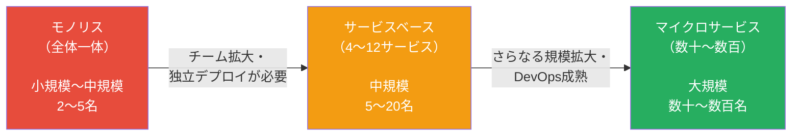

> **判断基準**: サービスベースで解決できるならマイクロサービスは不要。複雑さを加えるだけの価値があるかを問うこと。

---

## どういうときに選ぶべきか

### 向いているケース

- エンジニアが数十名以上いて、複数チームが独立して動きたい
- ドメインごとに異なる技術スタックを使いたい（例: ML部分はPython、APIはGo）
- 特定サービスのスケーリング要件が極端に異なる（例: 検索は高負荷、管理画面は低負荷）
- 1日に何度もデプロイしたい（CD: Continuous Delivery）
- 会社全体がDevOpsに成熟しており、Kubernetesを運用できるチームがいる
- Netflix、Amazon、Uberクラスの規模と組織

### 向いていないケース

- チームが10名以下（サービスベースやモノリスで十分）
- DevOps・インフラが整っていない（Kubernetesを運用できるチームがいない）
- ビジネスが成熟しておらず、ドメイン境界が頻繁に変わる（早期のマイクロサービス化は危険）
- トランザクション整合性が強く求められる（金融の中核システムなど）
- スピードを重視したMVP・プロトタイプ開発
- Netflixのような企業ですら「ファウンダー段階ではモノリスから始めた」

```
判断フローチャート:

エンジニアが50名以上いるか？
  No → サービスベースアーキテクチャを検討
  Yes → 続く

Kubernetesを本番運用できるチームがいるか？
  No → まずDevOpsを成熟させる
  Yes → 続く

ドメイン境界が安定しているか？
  No → 先にモノリスで境界を探る（Modular Monolith）
  Yes → マイクロサービスを検討

それでも必要か本当に考える:
  「マイクロサービスは解決策ではなく、
   特定の問題を解決するための道具だ」
```

---

## まとめ

以下は『ソフトウェアアーキテクチャの基礎』の評価をもとにした星評価。

```
マイクロサービスアーキテクチャの特性評価（★5段階）

デプロイ容易性:   ★★★★★  （サービス単位の独立デプロイ。1日に何百回でも）
弾力性:          ★★★★★  （サービスが独立しており、障害の連鎖を防止）
スケーラビリティ: ★★★★★  （サービス単位の細粒度スケーリング）
進化性:          ★★★★★  （サービス単位でリプレイス・技術変更が可能）
障害耐性:        ★★★★☆  （サーキットブレーカー等を実装すれば高い耐性）
モジュール性:     ★★★★★  （Bounded Contextによる高いモジュール性）
テスタビリティ:   ★★★★☆  （Contract Testingなどの手法が必要）
パフォーマンス:   ★★★☆☆  （ネットワーク越しの通信オーバーヘッドがある）
信頼性:          ★★★★☆  （適切に実装すれば高い信頼性）
シンプルさ:       ★☆☆☆☆  （分散システムの複雑さが全面に出る）
全体コスト:       ★★☆☆☆  （インフラ・運用コストが非常に高い）
```

マイクロサービスは銀の弾丸ではない。「Netflixがやっているから」という理由だけで採用すべきものではない。

書籍が強調する核心は次の3点だ。

1. **Share Nothing**: サービス間でDBを共有しない。これがすべての出発点。
2. **Bounded Context**: 機能数ではなくドメイン境界でサービスを分割する。粒度が細かすぎると分散モノリスになる。
3. **DevOps成熟度が前提**: コンテナオーケストレーション、CI/CD、サービスメッシュ、分散トレーシングを運用できるチームなしには成立しない。

サービスベースアーキテクチャで解決できる問題をマイクロサービスで解こうとすると、組織とシステムが不必要な複雑さに飲み込まれる。「本当に必要か」を自問してから採用を判断することが、このアーキテクチャを正しく扱う第一歩だ。
