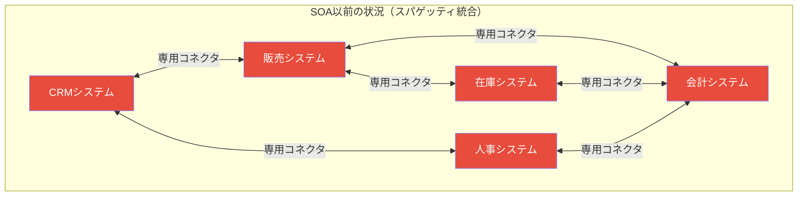
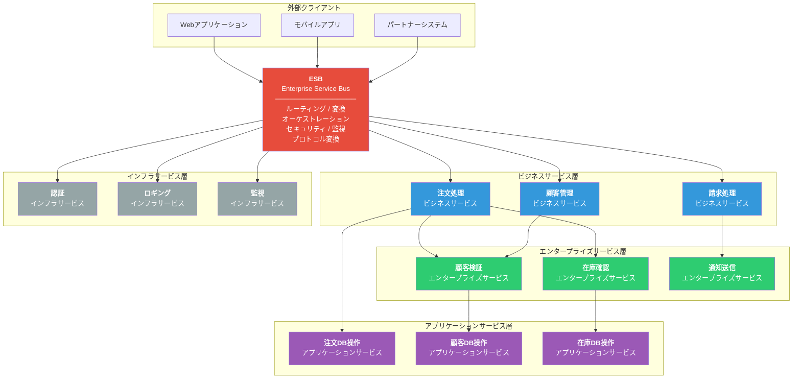
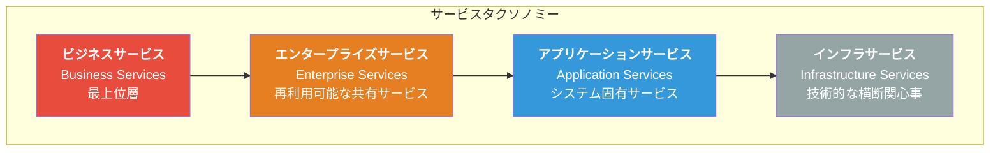
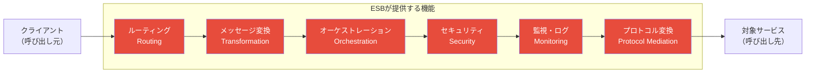
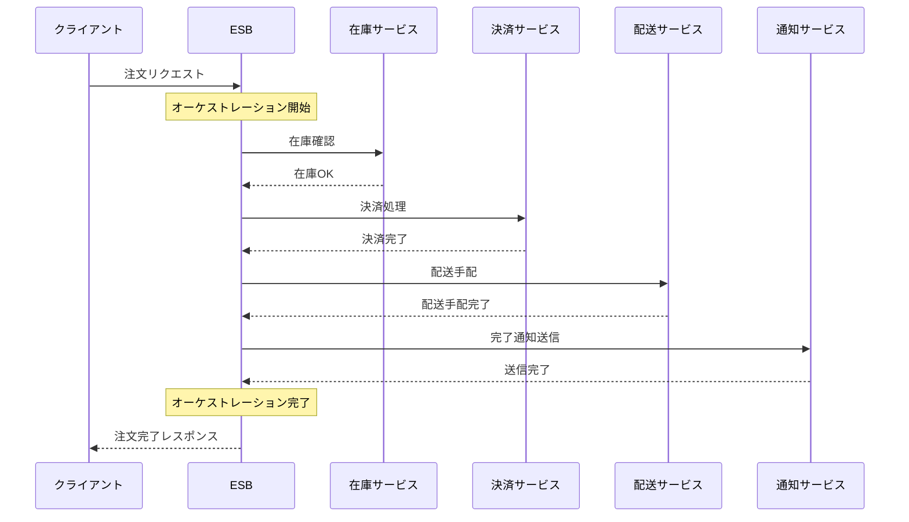
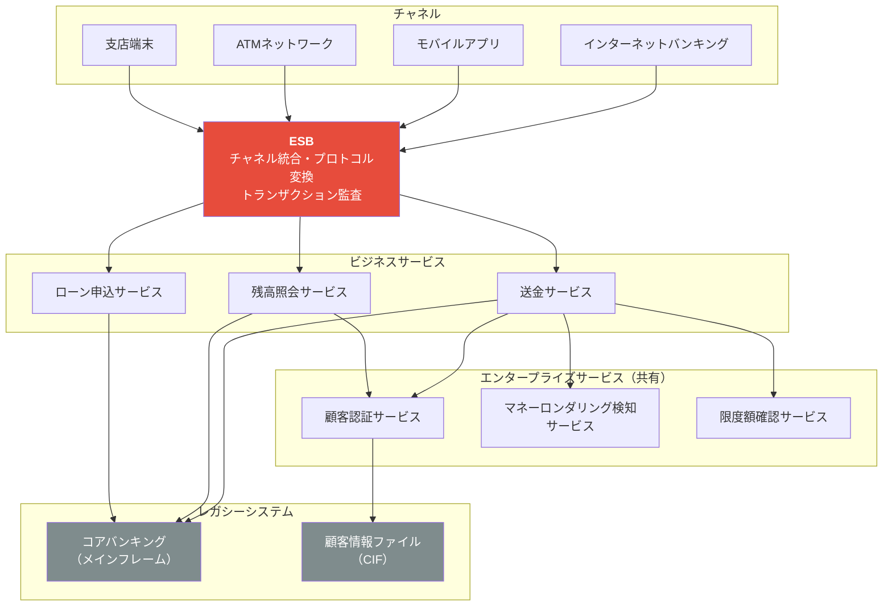
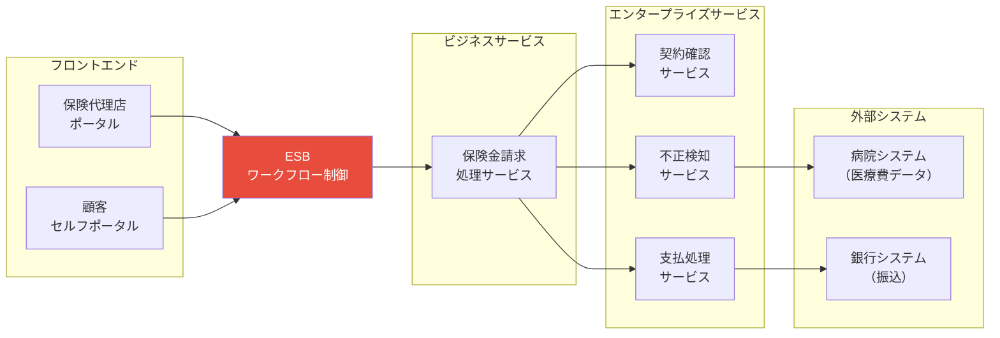
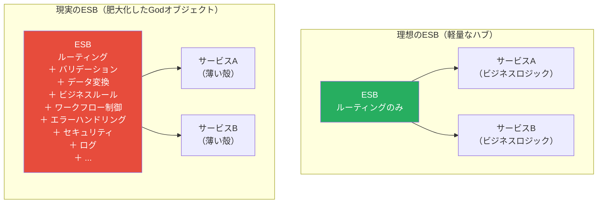
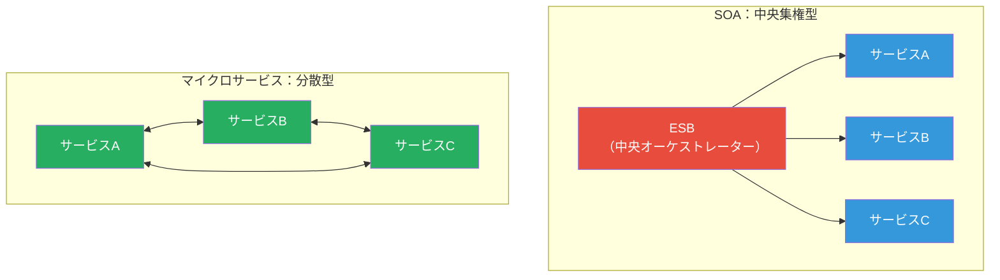
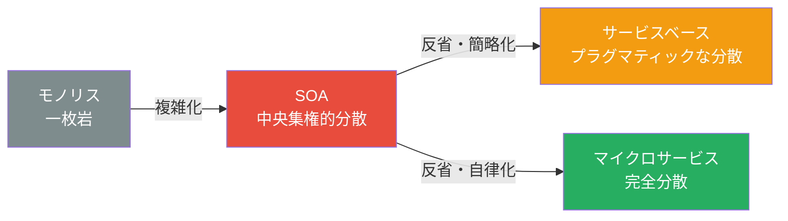

# オーケストレーション駆動サービス指向アーキテクチャ（Orchestration-Driven SOA）

## 一言で言うと

**2000年代に企業が競って導入した「サービスの再利用」思想に基づくアーキテクチャ。ESB（Enterprise Service Bus）がすべての通信を一手に引き受ける中央集権型構造だが、その複雑さがアーキテクチャの「反面教師」となった。**

---

## 目次

1. [何を解決するのか](#何を解決するのか)
2. [アーキテクチャの構造](#アーキテクチャの構造)
3. [サービスの分類（タクソノミー）](#サービスの分類タクソノミー)
4. [ESB（Enterprise Service Bus）の役割](#esbenterprise-service-busの役割)
5. [メリット](#メリット)
6. [デメリット](#デメリット)
7. [実際のシステム例](#実際のシステム例)
8. [なぜ衰退したのか](#なぜ衰退したのか)
9. [他のアーキテクチャとの比較](#他のアーキテクチャとの比較)
10. [どういうときに選ぶべきか](#どういうときに選ぶべきか)
11. [まとめ](#まとめ)

---

## 何を解決するのか

### 時代背景：2000年代の企業IT

1990年代〜2000年代初頭、大企業のITシステムは**巨大なモノリス**と**無数のサイロ化したシステム**の組み合わせで成り立っていた。

| 当時の課題 | 具体的な状況 |
|------------|-------------|
| **システムの断絶** | 販売システム、在庫システム、会計システムがそれぞれ独立していて連携できない |
| **再利用の欠如** | 「顧客情報の検証」ロジックが各システムにコピーされて存在する |
| **統合コストの爆発** | システムAとBをつなぐ専用コネクタが無数に乱立する（スパゲッティ統合） |
| **重複開発** | 同じようなビジネスロジックを各チームが別々に実装する |



> N個のシステムを相互接続すると N*(N-1)/2 本の専用コネクタが必要になる。10システムなら45本、20システムなら190本。

### SOAの解答：「共有サービス」と「バスによる統合」

SOAが掲げたビジョンは明快だった。

- **ビジネスロジックをサービスとして公開**し、複数のシステムから再利用する
- **ESBを中央ハブ**として、すべてのシステム間通信をESBを経由させる
- **標準プロトコル（SOAP/WSDL）** によって異なる技術スタックのシステムを統合する

このビジョンは特に大企業のIT部門に強く訴えた。「一度作ったロジックを何度でも再利用できる」という考え方は、当時の経営層にとって非常に魅力的に映った。

---

## アーキテクチャの構造

### 全体像



---

## サービスの分類（タクソノミー）

SOAの最も重要な概念の一つが**サービスのタクソノミー（分類体系）**だ。すべてのサービスを4種類に分類し、それぞれの責務を明確に定義する。

### サービス階層の全体像



### 1. ビジネスサービス（Business Services）

**最上位層。ビジネスドメインの観点から定義されるサービス。**

- ビジネスオペレーションそのものを表現する
- 技術的な詳細は持たず、「何をするか」を定義する
- 通常、エンタープライズアーキテクトが設計する

```
例:
  - ExecuteOrder（注文を実行する）
  - ProcessClaim（保険請求を処理する）
  - TransferFunds（送金する）
  - OnboardCustomer（顧客を登録する）
```

### 2. エンタープライズサービス（Enterprise Services）

**複数のビジネスサービスから再利用される共有サービス。SOAの「再利用」思想の中核。**

- 企業全体で共有されることを前提に設計される
- 特定のアプリケーションに依存しない
- 「顧客の住所を検証する」「在庫を確認する」など、複数のビジネスプロセスで使われる機能

```
例:
  - CheckCustomerValidity（顧客の有効性を確認する）
  - RetrieveInventory（在庫を取得する）
  - SendNotification（通知を送信する）
  - ValidateAddress（住所を検証する）
```

> **注意**: この「再利用可能なエンタープライズサービス」の設計・管理こそ、SOAが最も困難な部分だった。誰が所有するか、変更するときの合意形成、バージョン管理など、現実の組織では膨大な調整コストがかかった。

### 3. アプリケーションサービス（Application Services）

**特定のアプリケーションやシステムに固有のサービス。再利用は意図していない。**

- 特定のデータベースや外部システムへのアクセスを担当する
- アプリケーション固有のビジネスルールを含む場合もある
- エンタープライズサービスから呼び出される

```
例:
  - CreateCustomerInLegacyCRM（旧CRMに顧客を作成する）
  - GetInventoryFromWarehouseSystem（倉庫システムから在庫を取得する）
  - InsertOrderToOracleDB（Oracle DBに注文を挿入する）
```

### 4. インフラサービス（Infrastructure Services）

**技術的な横断関心事を担当するサービス。ビジネスロジックは持たない。**

- 認証・認可
- ロギング・監査
- 監視・メトリクス収集
- メッセージング・キューイング

```
例:
  - AuthenticationService（認証サービス）
  - AuditLoggingService（監査ログサービス）
  - AlertingService（アラートサービス）
```

### タクソノミーの対応表

| 層 | 主な目的 | 設計者 | 再利用性 | 変更頻度 |
|----|----------|--------|----------|----------|
| **ビジネスサービス** | ビジネスオペレーションの定義 | エンタープライズアーキテクト | 低（ビジネス固有） | 低 |
| **エンタープライズサービス** | 企業横断の共有機能 | 中央チーム | 高（これが目標） | 中（変更困難） |
| **アプリケーションサービス** | システム固有の操作 | アプリチーム | 低（意図しない） | 高 |
| **インフラサービス** | 技術的横断関心事 | インフラチーム | 高 | 低 |

---

## ESB（Enterprise Service Bus）の役割

ESBはSOAの**心臓部**であり、同時に**最大の問題の源**でもある。

### ESBが担う機能



| ESBの機能 | 説明 | 具体例 |
|-----------|------|--------|
| **ルーティング** | リクエストを適切なサービスに転送する | 「顧客ID=1234のリクエスト」→顧客サービスへ転送 |
| **メッセージ変換** | 異なるデータ形式間の変換 | XMLフォーマット A → XMLフォーマット B への変換 |
| **オーケストレーション** | 複数サービスの呼び出しを調整・順序制御 | 「注文処理」= 在庫確認 → 決済 → 配送手配 の順序制御 |
| **プロトコル変換** | 異なるプロトコル間の橋渡し | SOAP → REST、HTTP → JMS などの変換 |
| **セキュリティ** | 認証・認可の一元管理 | すべてのリクエストのトークン検証 |
| **監視・ログ** | トランザクションの追跡と監視 | すべての呼び出しの記録と障害検知 |

### オーケストレーションの例：注文処理フロー



**重要**: このフロー全体の制御はESBが担う。各サービスはESBに呼ばれるだけで、自分がどのフローの一部かを知らない。これがオーケストレーション（指揮者型）の本質だ。

### ESBの実装製品

2000年代〜2010年代に多くのベンダーがESB製品を提供した。

| 製品 | ベンダー |
|------|---------|
| IBM WebSphere ESB | IBM |
| Oracle Service Bus | Oracle |
| TIBCO ActiveMatrix | TIBCO |
| MuleSoft Mule ESB | MuleSoft |
| Microsoft BizTalk | Microsoft |
| JBoss ESB | Red Hat |

これらは非常に高価な商用製品が多く、ライセンスコストだけで年間数千万円〜数億円に達することもあった。

---

## メリット

SOAが掲げた理想は、当時のエンタープライズ課題への明確な解答だった。

| メリット | 説明 |
|---------|------|
| **システム統合** | 異種システムをESB経由で統合できる。スパゲッティ統合の解消 |
| **プロトコル標準化** | SOAP/WSDLにより、異なる技術スタック間の通信が標準化される |
| **再利用性** | エンタープライズサービスを複数のビジネスプロセスから共有できる（理想） |
| **一元管理** | ESBでセキュリティ・ログ・監視を一元化できる |
| **疎結合** | サービス間の直接依存をESBが仲介することで、サービス間の直接結合を排除できる（理想） |
| **レガシー統合** | 古いシステムをESBのアダプタ経由でSOAに組み込める |

---

## デメリット

しかし現実には、これらのメリットのほとんどが「理想」にとどまり、多大なコストを伴う問題が浮上した。

| デメリット | 説明 |
|-----------|------|
| **ESBへの過度な依存** | すべての通信がESBを経由するため、ESBが単一障害点（SPOF）になる |
| **ESBの肥大化** | ビジネスロジックがESBに流入し始め、ESBがGodオブジェクトになる |
| **変更困難** | エンタープライズサービスは多くのチームが依存するため、変更に膨大な調整が必要 |
| **組織的摩擦** | 「共有サービス」の所有権・優先順位・変更管理で組織間の政治的問題が発生 |
| **パフォーマンス** | すべての通信がESBを経由するため、レイテンシが増大する |
| **高コスト** | 商用ESB製品のライセンスコストが非常に高い |
| **テストの困難さ** | ESBを介した結合テストが複雑で、環境構築だけで数ヶ月かかることも |
| **学習コスト** | SOAP、WSDL、BPEL、XSLTなど習得すべき技術スタックが多い |

---

## 実際のシステム例

### 1. 銀行：コアバンキングの統合

銀行システムはSOAの典型的な適用例だ。数十年前に構築されたメインフレームの「コアバンキングシステム」を、新しいチャネル（インターネットバンキング、モバイルアプリ、ATM）と統合する必要があった。



**SOAが有効だった理由**:
- 複数チャネルから同じコアバンキング機能を呼び出す必要があった
- レガシーシステムへのアダプタをESBに集中させることで保守性を確保
- AML（マネーロンダリング検知）など規制対応の横断機能を共有サービス化

**問題が起きた部分**:
- AMLサービスに変更要件が来たとき、全チャネルへの影響調査と合意形成に6ヶ月かかった
- ESBの障害で全チャネルが同時停止する事態が発生した

### 2. 保険：保険金請求処理

保険業界も複雑なビジネスプロセスをSOAで統合しようとした典型例だ。



**典型的なSOAの問題が発生した例**:

```
請求処理のフロー変更要求：
「不正検知の前に医師の診断書確認ステップを追加してほしい」

SOAでの対応コスト:
1. ESBのオーケストレーション定義（BPEL）を変更　... 2週間
2. エンタープライズサービスの変更影響調査　　　... 3週間
3. 関係チーム（5チーム）との調整・合意形成　　... 6週間
4. テスト環境の準備と結合テスト　　　　　　　... 4週間
5. 本番デプロイ（メンテナンス窓口を取得）　　... 2週間

合計: 約17週間（4ヶ月以上）
```

ビジネス側からは「たった1ステップ追加するのになぜ4ヶ月もかかるのか」と不満が噴出した。

---

## なぜ衰退したのか

SOAは2000年代後半にピークを迎えたが、2010年代に入ると急速に評判を落とした。その主な理由を整理する。

### 原因1：ESBのGodオブジェクト化



時間が経つにつれ、開発者はビジネスロジックをESBに書き込み始めた。「どうせESBを通るのだから、ここで変換してしまおう」という発想だ。結果として、ESBは単純なルーターではなく、すべての知識を持った**Godオブジェクト**になった。

### 原因2：「再利用」のコストが「開発」のコストを上回った

```
エンタープライズサービスを新規作成する場合のコスト:
  - 要件定義                  : 2週間
  - 設計・アーキテクチャレビュー: 3週間（全チームの合意が必要）
  - 実装                      : 2週間
  - テスト                    : 2週間
  - ドキュメント作成           : 1週間
  合計: 約10週間

各チームが独自に実装する場合のコスト:
  - 実装: 1週間
  - テスト: 1週間
  合計: 約2週間

再利用するまでに同じ機能を3〜4回開発できてしまう。
```

### 原因3：組織構造との不一致

SOAは「技術的な共有」を前提とするが、組織は**ビジネスドメインごとに独立したチーム**として動く。エンタープライズサービスの所有権は中央チームにあるが、変更要求はドメインチームから来る。誰が優先順位を決めるか、誰がコストを負担するかで政治的対立が生じた。

### 原因4：クラウドとアジャイルの台頭

- **クラウド**の普及により、インフラの抽象化が進み、ESBのような高価なアプライアンスが不要になった
- **アジャイル開発**の普及により、チームごとの自律性と迅速なリリースサイクルが求められるようになった
- SOAの重厚な変更プロセスはアジャイルの価値観と根本的に相容れなかった

### 衰退の年表

```
2000年代前半: SOAブーム。大企業が競って導入
2005〜2008年: ESBベンダーが隆盛。ガートナーが「SOAは義務」と宣言
2008〜2010年: 現場から「使いにくい」の声が上がり始める
2011年:       Netflix、Amazon等がマイクロサービスアーキテクチャを公開
2012〜2014年: マイクロサービスが急速に普及。SOAの「反省」として位置づけられる
2015年以降:   新規プロジェクトでのSOA採用はほぼ消滅。
              ただし既存の大企業システムは現在も稼働中
```

---

## 他のアーキテクチャとの比較

### SOA vs マイクロサービス（最重要な比較）

マイクロサービスは「SOAへの反省」として生まれた、と理解するのが正確だ。



| 観点 | SOA | マイクロサービス |
|------|-----|----------------|
| **通信の中心** | ESB（中央集権） | サービス間直接通信 or 軽量メッセージキュー |
| **サービス粒度** | 粗い（ビジネスドメイン単位） | 細かい（単一責務） |
| **データベース** | 共有DBが一般的 | サービスごとに独立DB |
| **デプロイ単位** | サービス（変更は中央の合意が必要） | サービス（チームが自律的に判断） |
| **組織との対応** | 中央チームによる管理 | チームが独立してオーナーシップを持つ |
| **変更の速度** | 遅い（調整コスト大） | 速い（チームが自律的に決定） |
| **スケーリング** | ESBがボトルネック | サービスごとに独立してスケール |
| **技術スタック** | 標準化（SOAP/WSDL） | 多様（各チームが選択） |
| **「スマートさ」の場所** | ESBにロジックが集中 | サービス自身がロジックを持つ（「スマートエンドポイント、ダムパイプ」） |

> **「スマートエンドポイント、ダムパイプ（Smart endpoints, dumb pipes）」** — これはマイクロサービスがSOAから学んだ最大の教訓を表すフレーズだ。ロジックはサービス自身（エンドポイント）が持つべきであり、通信経路（パイプ）は単純であるべきだ。ESBの失敗がこの設計原則を生んだ。

### SOA vs サービスベースアーキテクチャ

| 観点 | SOA | サービスベース |
|------|-----|--------------|
| **中心的な仕組み** | ESB | なし（直接呼び出し） |
| **再利用の哲学** | 企業全体での最大化 | チーム内での適度な再利用 |
| **サービス数** | 多い（階層に分けて多数） | 少ない（4〜12個程度） |
| **適用規模** | 大企業のエンタープライズ統合 | 中規模アプリケーション |
| **運用コスト** | 非常に高い | 中程度 |

### アーキテクチャ比較まとめ



---

## どういうときに選ぶべきか

### 現在（2024年以降）においてSOAを新規採用するケース

率直に言って、SOAを新規プロジェクトで選択することは**ほぼない**。書籍『ソフトウェアアーキテクチャの基礎』でも、SOAは「歴史的なアーキテクチャ」として、主に**教訓**のために紹介されている。

しかし、以下のような限定的なシナリオでは部分的な考え方が活きることがある。

### SOAのアプローチが有効な場面

| シナリオ | 理由 |
|----------|------|
| **異種レガシーシステムの統合** | SOAPベースのレガシーAPIを統合する際、ESBのプロトコル変換機能は依然として有効 |
| **大規模な規制対応** | 金融・医療など規制要件が厳しく、監査ログや一元管理が義務付けられる場合 |
| **既存SOAの維持・拡張** | すでにSOAで構築された大企業システムの保守・機能追加 |

### 向いていないケース（ほぼすべての新規開発）

| ケース | 代替として検討すべきアーキテクチャ |
|--------|--------------------------------|
| **新規Webアプリケーション** | マイクロサービス or サービスベースアーキテクチャ |
| **スタートアップ・中小規模** | モノリス or サービスベースアーキテクチャ |
| **高速なリリースサイクルが必要** | マイクロサービス |
| **チームの自律性を重視** | マイクロサービス |
| **クラウドネイティブ** | マイクロサービス + イベント駆動アーキテクチャ |

### 現在もSOAで動いているシステムについて

重要な事実として、世界中の銀行・保険・通信・政府機関の基幹システムの多くは**今もSOAで稼働している**。これらを「現代的なアーキテクチャ」に移行するコストとリスクは計り知れないため、数十年単位で使われ続ける。

---

## まとめ

以下は『ソフトウェアアーキテクチャの基礎』の評価をもとにした星評価。SOAへの評価は全体的に厳しい。

```
オーケストレーション駆動SOAの特性評価（★5段階）

デプロイ容易性:   ★☆☆☆☆  （ESBと多数サービスの協調デプロイが非常に困難）
弾力性:          ★★☆☆☆  （ESBが単一障害点。一つの障害が全体に波及しやすい）
進化性:          ★☆☆☆☆  （変更に膨大な調整コスト。新機能追加が遅い）
障害耐性:        ★★☆☆☆  （ESBのダウンが全サービスに影響する）
モジュール性:     ★★★☆☆  （タクソノミーは明確だが、ESBへの依存で結合度が高い）
全体コスト:       ★☆☆☆☆  （商用ESBライセンス、専門チーム、長大な開発期間）
パフォーマンス:   ★★☆☆☆  （ESBを経由する全通信のオーバーヘッド）
信頼性:          ★★★☆☆  （安定稼働しているが変更リスクが高い）
スケーラビリティ: ★★☆☆☆  （ESBがスケーリングのボトルネック）
シンプルさ:       ★☆☆☆☆  （ESB設定・サービスタクソノミー・SOAP/WSDLなど極めて複雑）
テスタビリティ:   ★★☆☆☆  （ESBを含む結合テストの環境構築と実行が困難）
```

### SOAから学べる本質的な教訓

SOAは「失敗したアーキテクチャ」ではなく、**適切な文脈なしに過度に複雑なソリューションを適用した例**として学ぶべき存在だ。

1. **ロジックをインフラに持たせるな** → ESBのGodオブジェクト化が招いた悪夢
2. **再利用のコストを過小評価するな** → 「書き直すより共有サービスを調整する方が遅い」
3. **組織と技術アーキテクチャを一致させよ** → コンウェイの法則：中央集権的な組織には中央集権的なアーキテクチャが生まれ、その逆も然り
4. **標準化はアジリティのトレードオフ** → SOAP/WSDLは異種システム統合には強力だが、変更速度を犠牲にする

マイクロサービスはSOAの「反省」として生まれた。「スマートエンドポイント、ダムパイプ」の原則は、まさにESBに集中しすぎたSOAへの直接的な反論だ。SOAを知ることは、現代のアーキテクチャ選択がなぜこのような形になっているかを理解するための**必須の歴史的文脈**となっている。
