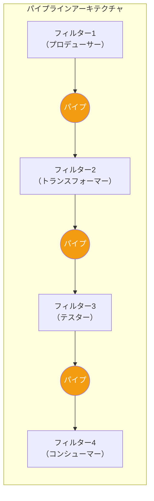
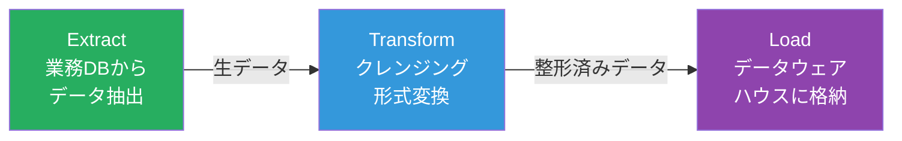
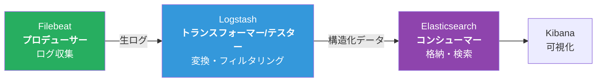

# パイプラインアーキテクチャ（Pipeline Architecture）

## 一言で言うと

**データを「パイプ」で流し、「フィルター」で加工・変換していくアーキテクチャ。** UNIXの `cat file.txt | grep "error" | sort | uniq` と同じ発想をシステム全体に適用する。

---

## 目次

1. [何を解決するのか](#何を解決するのか)
2. [UNIXコマンドで理解するパイプライン](#unixコマンドで理解するパイプライン)
3. [アーキテクチャの構造](#アーキテクチャの構造)
4. [フィルターの4つのタイプ](#フィルターの4つのタイプ)
5. [処理の流れ](#処理の流れ)
6. [メリット](#メリット)
7. [デメリット](#デメリット)
8. [実際のシステム例](#実際のシステム例)
9. [レイヤードアーキテクチャとの違い](#レイヤードアーキテクチャとの違い)
10. [どういうときに選ぶべきか](#どういうときに選ぶべきか)
11. [まとめ](#まとめ)

---

## 何を解決するのか

### 課題：処理ステップが密結合になる

データ処理システムでは、「入力 → 変換1 → 変換2 → 出力」のような連続した処理が必要になる。これを1つの大きな関数やクラスにまとめると以下の問題が発生する。

| 問題 | 具体例 |
|------|--------|
| **処理の順番を変えられない** | CSVの読み込み→データ変換→出力が固定されており、途中にフィルタリングを挟めない |
| **一部だけ再利用できない** | データ変換ロジックを別の入力形式（JSON）で使いたいが、CSV前提でハードコードされている |
| **テストが困難** | 全体を通さないと個々の変換ロジックが正しいか確認できない |
| **並行開発が難しい** | 1つの処理パイプラインの変更が他の処理に影響する |

これらの問題はすべて「処理ステップが密結合になっている」という一つの根本原因から来ている。

### 解決方法：処理をフィルターに分割し、パイプでつなぐ

パイプラインアーキテクチャは、各処理ステップを**独立したフィルター**として定義し、**パイプ**で接続する。各フィルターは入力を受け取り、処理し、出力する。それだけ。前後のフィルターが何をしているかは知らない。

---

## UNIXコマンドで理解するパイプライン

パイプラインアーキテクチャの最も身近な例がUNIXコマンド。

```bash
# Webサーバーのアクセスログからエラーを分析する
cat access.log | grep "500" | awk '{print $7}' | sort | uniq -c | sort -rn | head -10
```

この1行を分解すると:


各コマンドは **独立している**。`grep` は `cat` のことを知らないし、`awk` は `grep` のことを知らない。ただ標準入力からデータを受け取り、処理し、標準出力に流すだけ。この「独立性」こそがパイプラインアーキテクチャの核心である。

---

## アーキテクチャの構造

パイプラインアーキテクチャは **パイプ（Pipe）** と **フィルター（Filter）** の2つの要素で構成される。



### パイプ（Pipe）

- フィルター間のデータ転送チャネル
- 通常は**一方向**（入力→出力）
- ポイント・ツー・ポイント（1対1接続）

パイプの実装は大きく2種類ある:
- **同期パイプ**: UNIXパイプのように、前段の出力が直接後段の入力に渡される
- **非同期パイプ**: メッセージキュー（Kafka、RabbitMQなど）を介してデータが渡される。フィルター間の処理速度の差を吸収できる

### フィルター（Filter）

- 独立した処理コンポーネント
- 入力を受け取り、処理し、出力する
- **ステートレス**（自身の状態を持たない）が理想
- 他のフィルターの存在を知らない

---

## フィルターの4つのタイプ

| タイプ | 入力 | 出力 | 役割 | 例 |
|--------|------|------|------|-----|
| **プロデューサー（Producer）** | なし | あり | パイプラインの起点。データを生成・取得する | ファイル読み込み、API呼び出し、DBクエリ |
| **トランスフォーマー（Transformer）** | あり | あり | データを変換・加工する。`map` に相当 | JSON→CSV変換、金額計算、文字コード変換 |
| **テスター（Tester）** | あり | あり | 条件に基づいてデータをフィルタリングする。`filter` に相当 | 金額が10,000円以上のみ通す、不正データの除外 |
| **コンシューマー（Consumer）** | あり | なし | パイプラインの終点。最終結果を出力する | ファイル書き込み、DB保存、画面表示 |

---

## 処理の流れ

### 例：ECサイトの注文データ処理

毎日の注文データを集計してレポートを生成する処理。


各フィルターは独立しているため、以下のような変更が容易にできる:

- 「税込金額計算」の前に「割引適用」フィルターを追加する
- 「カテゴリ別集計」を「地域別集計」に差し替える
- 「レポート出力」を「CSV出力」と「メール送信」の2系統に分岐する

---

## メリット

| メリット | 説明 |
|---------|------|
| **モジュール性が高い** | 各フィルターが独立しており、追加・削除・入れ替えが容易 |
| **再利用性** | 同じフィルターを異なるパイプラインで使い回せる |
| **テストが容易** | 各フィルターを単体でテストできる（入力→期待する出力） |
| **拡張性** | 新しいフィルターを途中に挿入するだけで機能追加できる |
| **並列処理の余地** | フィルターが独立しているため、実装次第で個々のフィルターを並列化できる（ただしアーキテクチャとしてのスケーラビリティは低い） |

---

## デメリット

| デメリット | 説明 |
|-----------|------|
| **エラーハンドリングが複雑** | パイプラインの途中でエラーが発生した場合、上流に戻して再処理するのが困難 |
| **全体の状態管理が難しい** | 各フィルターがステートレスなため、トランザクション的な処理に不向き |
| **デバッグの難しさ** | 長いパイプラインでは、どのフィルターで問題が起きたか特定しにくい |
| **パフォーマンスのボトルネック** | 最も遅いフィルターが全体のスループットを制限する |
| **対話的な処理に不向き** | 一方向のデータフローが前提のため、リクエスト/レスポンス型の処理には適さない |

---

## 実際のシステム例

### 1. ETLパイプライン（データウェアハウス）

最も典型的なパイプラインアーキテクチャの例。



**具体的なツール**: Apache NiFi、AWS Glue、dbt

### 2. ログ収集・分析パイプライン



いわゆるELKスタック。各コンポーネントがフィルターとして機能する。

### 3. CI/CDパイプライン


GitHub Actions、GitLab CI、Jenkinsなど。パイプラインのステージを追加・削除・順番変更できるのは、まさにパイプラインアーキテクチャの特性。

### 4. 画像処理パイプライン

```
画像読み込み → リサイズ → フィルター適用 → フォーマット変換 → 保存
```

各ステップが独立したフィルター。リサイズの後にウォーターマーク追加を挟む、といった拡張が容易。

### 5. コンパイラ

```
字句解析（Lexer）→ 構文解析（Parser）→ 意味解析 → 最適化 → コード生成
```

コンパイラの各フェーズはパイプラインアーキテクチャの古典的な実装例。

---

## レイヤードアーキテクチャとの違い

一見似ているが、根本的に異なる点がある。

| 観点 | レイヤード | パイプライン |
|------|-----------|-------------|
| **データの流れ** | リクエスト/レスポンスの双方向 | 基本的に一方向 |
| **目的** | 関心事の分離（技術的な層分け） | データの段階的な変換・加工 |
| **依存関係** | 上位層が下位層に依存 | フィルターは互いの実装に依存しない（ただしデータ形式の契約はある） |
| **構造** | 階層的（上から下へ） | 線形（左から右へ） |
| **典型的な用途** | Webアプリケーション | データ処理、バッチ処理 |

```
レイヤード:                   パイプライン:

┌──────────────┐              ┌───┐   ┌───┐   ┌───┐   ┌───┐
│ プレゼンテーション │        │ F1 │──▶│ F2 │──▶│ F3 │──▶│ F4 │
├──────────────┤              └───┘   └───┘   └───┘   └───┘
│  ビジネス     │                データが一方向に流れる
├──────────────┤
│  永続化       │
├──────────────┤
│  データベース  │
└──────────────┘
  リクエストが上下に往復する
```

---

## どういうときに選ぶべきか

### 向いているケース

- データの一方向処理（ETL、ログ処理、バッチ処理）
- 処理ステップが明確に定義でき、独立している
- 処理の順番や組み合わせを柔軟に変えたい
- 各処理ステップを別々にテスト・開発したい

### 向いていないケース

- 双方向のリクエスト/レスポンスが必要なシステム → レイヤードアーキテクチャ等を検討
- 処理ステップ間でトランザクションが必要なシステム → サービスベースアーキテクチャ等を検討
- リアルタイムの対話的な処理 → イベント駆動アーキテクチャ等を検討
- 処理ステップ間に複雑な依存関係がある場合

---

## まとめ

以下は『ソフトウェアアーキテクチャの基礎』の評価をもとにした星評価。

```
パイプラインアーキテクチャの特性評価（★5段階）

デプロイ容易性:   ★★☆☆☆  （モノリスの場合が多い）
弾力性:          ★☆☆☆☆  （一部の障害が全体に波及しやすい）
進化性:          ★★★☆☆  （フィルターの追加・入替は容易）
障害耐性:        ★☆☆☆☆  （パイプラインが途切れると全体が停止）
モジュール性:     ★★★☆☆  （フィルターごとの論理的な分離は明確）
全体コスト:       ★★★★★  （シンプルな構造で低コスト）
パフォーマンス:   ★★☆☆☆  （最も遅いフィルターがボトルネックになる）
信頼性:          ★★★☆☆  （シンプルな構造による安定性）
スケーラビリティ: ★☆☆☆☆  （基本的にモノリシック）
シンプルさ:       ★★★★★  （概念が直感的で理解しやすい）
テスタビリティ:   ★★★☆☆  （フィルター単体のテストは容易）
```

パイプラインアーキテクチャは「データを段階的に加工していく処理」に最適なスタイル。UNIXの哲学「一つのことをうまくやるプログラムを書き、それらを組み合わせる」をアーキテクチャレベルに適用したもの。CI/CDやETLなど、日常的に触れている仕組みの多くがこのアーキテクチャに基づいている。
