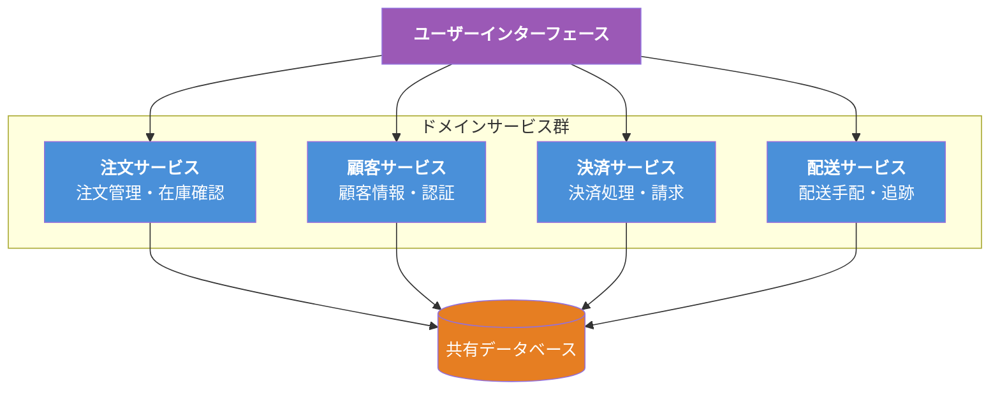
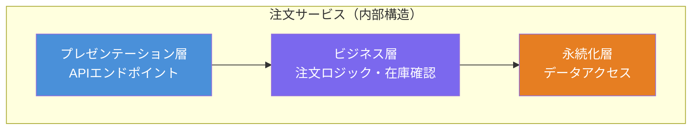
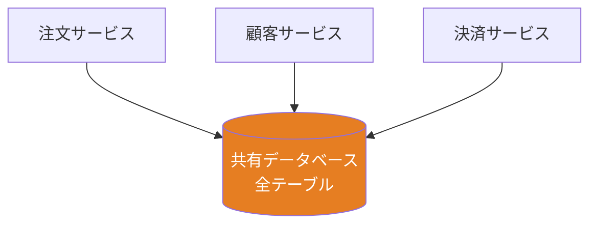
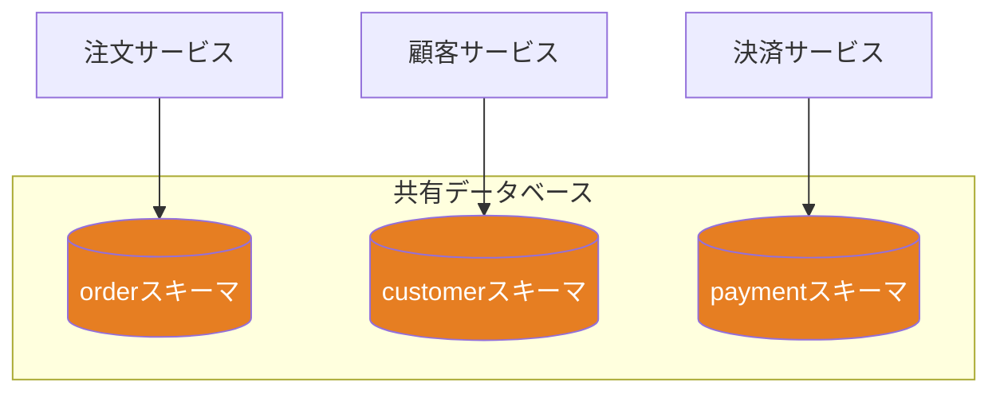
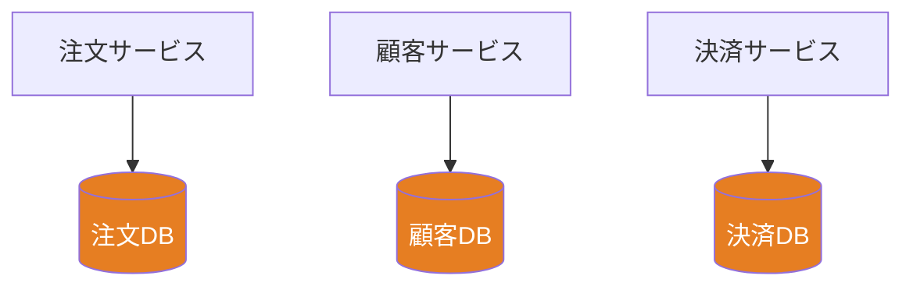
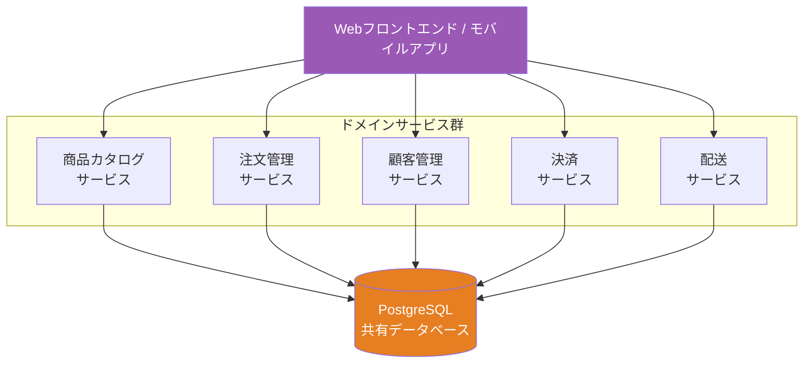

# サービスベースアーキテクチャ（Service-Based Architecture）

## 一言で言うと

**モノリスとマイクロサービスの「いいとこ取り」をした実用的なアーキテクチャ。** アプリケーションを数個〜十数個の粗い粒度のサービスに分割し、それぞれが独立してデプロイできる。

---

## 目次

1. [何を解決するのか](#何を解決するのか)
2. [アーキテクチャの構造](#アーキテクチャの構造)
3. [ドメインサービスの特徴](#ドメインサービスの特徴)
4. [データベースの共有パターン](#データベースの共有パターン)
5. [メリット](#メリット)
6. [デメリット](#デメリット)
7. [実際のシステム例](#実際のシステム例)
8. [マイクロサービスとの違い](#マイクロサービスとの違い)
9. [どういうときに選ぶべきか](#どういうときに選ぶべきか)
10. [まとめ](#まとめ)

---

## 何を解決するのか

### 課題：モノリスの限界、しかしマイクロサービスは複雑すぎる

多くのチームがこのジレンマに直面する:

| モノリスの限界 | マイクロサービスの課題 |
|-------------|-------------------|
| 全体を一括でデプロイしなければならない | サービスが数十〜数百になり運用が複雑 |
| 一部の変更が全体に影響する | サービス間通信の管理が困難 |
| チームが大きくなると開発が渋滞する | 分散トランザクションが必要になる |
| スケーリングが全体単位 | インフラコストが高い |

### 解決方法：「適度な分割」

サービスベースアーキテクチャは、アプリケーションを**4〜12個程度の粗い粒度のドメインサービス**に分割する。マイクロサービスのように細かく分けすぎず、モノリスのように全部まとめることもしない。「ちょうどいい分割」を目指す。

---

## アーキテクチャの構造



### 基本構成要素

| 要素 | 説明 |
|------|------|
| **ユーザーインターフェース** | 共通のフロントエンド。各ドメインサービスを呼び出す |
| **ドメインサービス** | ビジネスドメインごとに分割された粗い粒度のサービス（4〜12個程度） |
| **データベース** | 通常は**共有データベース**を使用（マイクロサービスとの大きな違い） |

---

## ドメインサービスの特徴

### 粗い粒度（Coarse-Grained）

マイクロサービスの「1サービス1機能」とは異なり、1つのドメインサービスが**ビジネスドメイン全体**を担当する。目安として1サービスあたり3〜8個程度のユースケースをカバーする粒度が適切とされる。

```
マイクロサービスの場合（粒度が細かい）:
  注文作成サービス、注文照会サービス、注文キャンセルサービス、在庫確認サービス ...

サービスベースの場合（粒度が粗い）:
  注文サービス（注文に関するすべてを担当）
```

### 各サービスの内部はレイヤード

各ドメインサービスの内部は、レイヤードアーキテクチャで構成されることが多い。



### 独立デプロイ可能

各ドメインサービスは独立したデプロイ単位になる。注文サービスを変更しても、顧客サービスを再デプロイする必要はない。

---

## データベースの共有パターン

サービスベースアーキテクチャのデータベース構成にはいくつかのパターンがある。

### パターン1: 単一共有データベース（最も一般的）



**メリット**: SQLのJOINが使える、トランザクション管理が容易
**デメリット**: テーブル変更が他サービスに影響するリスク

### パターン2: データベースは共有、スキーマは分離



**メリット**: 各サービスのデータ境界が明確、他のスキーマを直接触れないため結合度が下がる
**デメリット**: クロススキーマのクエリが必要な場合がある

### パターン3: サービスごとに個別データベース



**メリット**: サービス間のデータ結合が完全に排除される
**デメリット**: 分散トランザクションが必要、マイクロサービスに近い複雑性

> **実際の現場では**: パターン1（単一共有DB）から始めて、必要に応じてパターン2→3へ段階的に移行するケースが多い。

---

## メリット

| メリット | 説明 |
|---------|------|
| **独立デプロイ** | サービス単位でデプロイ可能。モノリスと比べてリリースサイクルが短縮される |
| **障害の局所化** | あるサービスの障害が他のサービスに波及しにくい |
| **チーム分割が容易** | ドメイン単位でチームを分けて並行開発できる |
| **段階的な移行** | モノリスから少しずつサービスを切り出して移行できる |
| **適度な複雑さ** | マイクロサービスほどのインフラ・運用コストがかからない |
| **ACID トランザクション** | 共有DBを使うため、サービス内のトランザクション管理が容易 |

---

## デメリット

| デメリット | 説明 |
|-----------|------|
| **データベースの結合** | 共有DBを使う場合、テーブル変更が複数サービスに影響する可能性がある |
| **サービス間通信** | サービス間で連携が必要な場合、API呼び出しやメッセージングの仕組みが必要 |
| **サービス粒度の判断** | どの程度の粒度で分割するかの判断が難しい。細かすぎるとマイクロサービスの複雑さに近づく |
| **テストの複雑さ** | サービス間連携のテスト（結合テスト）が必要になる |
| **中途半端になるリスク** | モノリスの問題もマイクロサービスの問題も中途半端に抱えてしまうことがある。サービス間のデータ依存が増えてきた（あるサービスが他サービスのテーブルを直接参照し始めた等）ら、サービス分割の見直しが必要なサイン |

---

## 実際のシステム例

### 1. 中規模ECサイト



**なぜサービスベースが適しているか**:
- 5〜6個のドメインサービスで十分
- チームは5〜15名程度
- マイクロサービスほどの運用体制は不要
- 各サービスを独立してデプロイしたい

### 2. 社内業務システム

```
人事サービス:     従業員管理、組織管理、権限管理
勤怠サービス:     勤怠記録、残業計算、有休管理
給与サービス:     給与計算、賞与計算、税計算
経費サービス:     経費申請、承認ワークフロー、精算
```

各サービスが独立してデプロイ可能。給与計算ロジックを変更しても、勤怠サービスの再デプロイは不要。

### 3. モノリスからの段階的移行

多くの企業がモノリスからサービスベースアーキテクチャへの移行を選択する。マイクロサービスへの一足飛びの移行はリスクが高いため、まずサービスベースに分割し、必要に応じてさらに細分化する。


---

## マイクロサービスとの違い

サービスベースアーキテクチャとマイクロサービスは混同されやすいが、明確な違いがある。

| 観点 | サービスベース | マイクロサービス |
|------|-------------|----------------|
| **サービス数** | 4〜12個程度 | 数十〜数百個 |
| **粒度** | 粗い（ドメイン全体） | 細かい（1機能1サービス） |
| **データベース** | 通常は共有DB | サービスごとに独立DB |
| **通信** | 直接呼び出しが多い | API Gateway、メッセージキュー |
| **チーム規模** | 5〜20名程度 | 数十〜数百名 |
| **運用コスト** | 中程度 | 高い |
| **トランザクション** | ACID（共有DB） | 最終的整合性（Saga等） |
| **デプロイ** | サービス単位 | サービス単位（より細かい） |

---

## どういうときに選ぶべきか

### 向いているケース

- モノリスの限界を感じているが、マイクロサービスは過剰に感じる
- チーム規模が5〜20名程度
- 独立デプロイは必要だが、分散トランザクションは避けたい
- モノリスからの段階的な移行を計画している
- ドメイン境界が比較的明確

### 向いていないケース

- 非常に大規模で数百名のエンジニアが関わるシステム → マイクロサービスを検討
- 極めて高いスケーラビリティが必要 → マイクロサービスアーキテクチャ等を検討
- 小規模で2〜3名のチーム → レイヤードアーキテクチャで十分
- サービス間で頻繁にリアルタイム連携が必要 → イベント駆動アーキテクチャ等を検討

---

## まとめ

以下は『ソフトウェアアーキテクチャの基礎』の評価をもとにした星評価。

```
サービスベースアーキテクチャの特性評価（★5段階）

デプロイ容易性:   ★★★★☆  （サービス単位で独立デプロイ可能）
弾力性:          ★★★★☆  （サービスの独立性が高い）
進化性:          ★★★☆☆  （サービス単位での変更は容易）
障害耐性:        ★★★★☆  （障害がサービス内に局所化される）
モジュール性:     ★★★★☆  （ドメインごとの明確な分離）
全体コスト:       ★★★★☆  （マイクロサービスより低コスト）
パフォーマンス:   ★★★☆☆  （サービス間通信のオーバーヘッド）
信頼性:          ★★★★☆  （適度な分散による安定性）
スケーラビリティ: ★★★☆☆  （サービス単位でのスケーリングが可能）
シンプルさ:       ★★★☆☆  （分散システムの基本的な複雑さはある）
テスタビリティ:   ★★★★☆  （サービス単位のテストが可能）
```

サービスベースアーキテクチャは「最も実用的な分散アーキテクチャ」と言える。モノリスの限界を感じたときの最初の選択肢として優れており、多くの中規模システムにとって「ちょうどいい」バランスを提供する。書籍では「分散アーキテクチャの中で最もプラグマティック」と評価されている。
