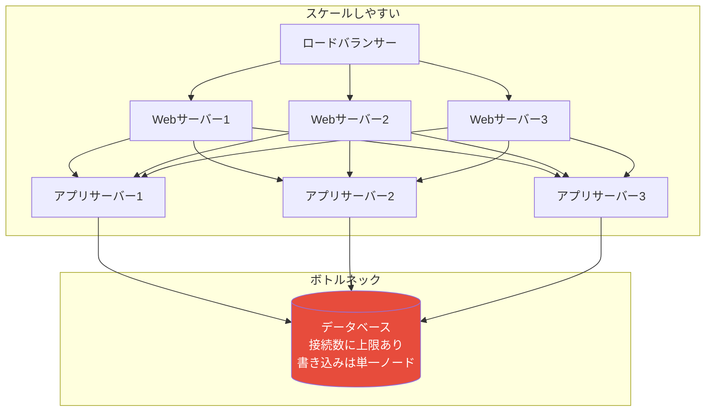
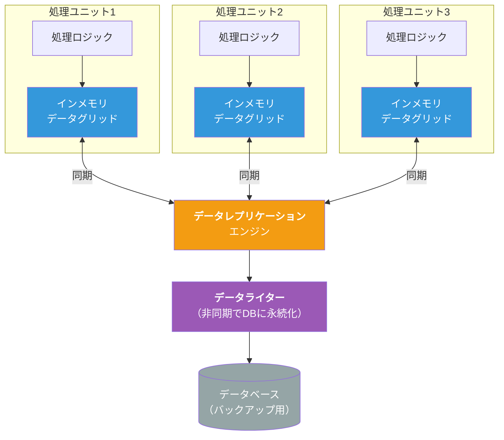
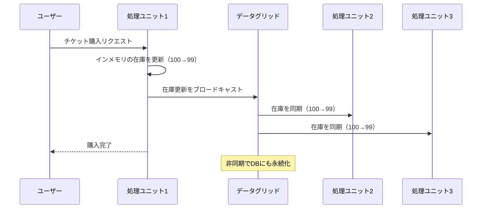
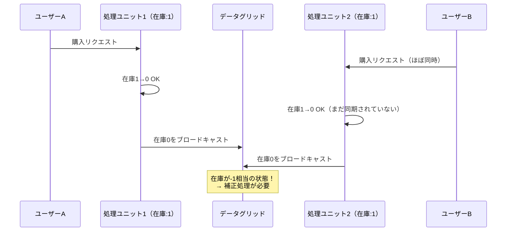
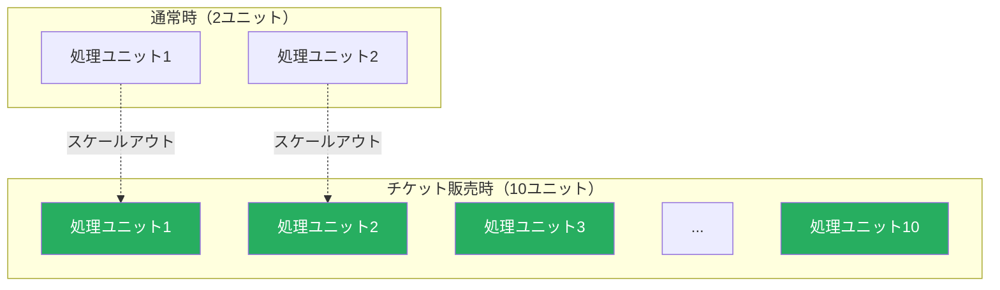
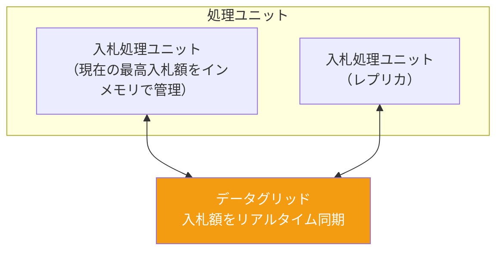

# スペースベースアーキテクチャ（Space-Based Architecture）

## 一言で言うと

**データベースのボトルネックを排除するために、データをインメモリグリッドに分散配置するアーキテクチャ。** 「ユーザー数が10倍になっても、サーバーを追加するだけで対応できる」を実現する。

---

## 目次

1. [何を解決するのか](#何を解決するのか)
2. [従来のスケーリングの限界](#従来のスケーリングの限界)
3. [アーキテクチャの構造](#アーキテクチャの構造)
4. [主要コンポーネント](#主要コンポーネント)
5. [データの同期メカニズム](#データの同期メカニズム)
6. [処理の流れ](#処理の流れ)
7. [メリット](#メリット)
8. [デメリット](#デメリット)
9. [実際のシステム例](#実際のシステム例)
10. [他のアーキテクチャとの比較](#他のアーキテクチャとの比較)
11. [どういうときに選ぶべきか](#どういうときに選ぶべきか)
12. [まとめ](#まとめ)

---

## 何を解決するのか

### 課題：データベースがボトルネックになる

Webアプリケーションのスケーリングでは、典型的に以下の流れで限界に達する。


| スケーリングの段階 | 対応 | 難易度 |
|------------------|------|--------|
| Webサーバーの負荷増大 | ロードバランサーで水平スケール | 容易 |
| アプリサーバーの負荷増大 | インスタンスを追加 | 容易 |
| **データベースの負荷増大** | **リードレプリカ、シャーディング...** | **困難** |
| データベースの接続数限界 | コネクションプール枯渇 | **極めて困難** |

Webサーバーやアプリサーバーは水平スケールが容易だが、**データベースはボトルネックになりやすい**。読み取りはリードレプリカで対応できても、書き込みのスケーリングは本質的に困難である。

### 解決方法：データベースを使わない（メモリに載せる）

スペースベースアーキテクチャは、発想を逆転させる。**データベースへの依存を排除し、データをインメモリに持つ**ことで、データベースのボトルネックを根本的に解決する。

---

## 従来のスケーリングの限界

### なぜデータベースがボトルネックになるか



コンサートのチケット販売やセール開始時などのスパイク時、同時アクセスが通常の100倍になることがある。Webサーバーは増やせても、データベースの接続数には上限がある。

### 従来の対策とその限界

| 対策 | 限界 |
|------|------|
| リードレプリカ | 読み取りはスケールできるが書き込みはスケールしない |
| シャーディング | 運用が複雑、クロスシャードクエリが困難 |
| キャッシュ（Redis等） | キャッシュとDBの整合性管理が必要 |
| コネクションプール | 接続数に物理的な上限がある |

---

## アーキテクチャの構造



**核心的な違い**: 従来のアーキテクチャではデータベースが「真実の情報源（Source of Truth）」だが、スペースベースでは**インメモリデータグリッドが真実の情報源**になる。データベースは非同期でバックアップされる補助的な存在。

---

## 主要コンポーネント

### 処理ユニット（Processing Unit）

アプリケーションロジックとインメモリデータを含む自己完結した単位。

- **Webコンポーネント**: HTTPリクエストの処理
- **ビジネスロジック**: 業務処理
- **インメモリデータグリッド**: データのローカルコピー

```
処理ユニットの内部構造:

┌──────────────────────────┐
│      処理ユニット         │
│  ┌────────────────────┐  │
│  │  Webコンポーネント   │  │
│  │  (HTTPハンドラ)     │  │
│  └────────┬───────────┘  │
│           │              │
│  ┌────────▼───────────┐  │
│  │  ビジネスロジック    │  │
│  └────────┬───────────┘  │
│           │              │
│  ┌────────▼───────────┐  │
│  │  インメモリ         │  │
│  │  データグリッド      │  │
│  │  (セッション,在庫等) │  │
│  └────────────────────┘  │
└──────────────────────────┘
```

### 仮想化ミドルウェア（Virtualized Middleware）

複数の処理ユニットを管理・調整するインフラ層。以下のコンポーネントで構成される。

| コンポーネント | 役割 |
|-------------|------|
| **メッセージンググリッド** | リクエストをどの処理ユニットに振り分けるか管理 |
| **データグリッド** | 処理ユニット間のデータ同期を管理 |
| **処理グリッド** | 複数の処理ユニットにまたがる処理を調整 |
| **デプロイメントマネージャー** | 負荷に応じて処理ユニットを起動・停止 |

### データポンプ（Data Pump）

インメモリデータをデータベースに非同期で永続化する仕組み。

- **データライター**: インメモリデータをDBに書き込む
- **データリーダー**: 起動時にDBからインメモリにデータをロードする

---

## データの同期メカニズム

### 処理ユニット間のデータ同期

各処理ユニットはローカルにデータのコピーを持つため、あるユニットでデータが更新されたら他のユニットにも反映する必要がある。



### データ不整合が発生するケース

同期には僅かなタイムラグがあるため、以下のような重複購入が起こり得る。



このようなケースに対しては、分散ロックや楽観的並行性制御（バージョニング）で対処する。スペースベースアーキテクチャでは**厳密な一貫性より可用性を優先**するため、この種のトレードオフを受け入れる必要がある。

### データベースへの非同期永続化

インメモリのデータは揮発性のため、定期的にデータベースに書き戻す。ただし、これは**非同期**で行われ、リクエスト処理のクリティカルパスには含まれない。

---

## 処理の流れ

### 例：コンサートチケット販売

通常時は処理ユニットが2つで運用し、チケット販売開始の1時間前に処理ユニットを10個に増やす。



**ポイント**: データベースがボトルネックにならないため、処理ユニットを増やすだけでスケールする。各処理ユニットがインメモリにデータを持っているので、データベースへの接続は不要。

---

## メリット

| メリット | 説明 |
|---------|------|
| **極めて高いスケーラビリティ** | 処理ユニットを追加するだけで水平スケールできる |
| **高パフォーマンス** | インメモリ処理のためレイテンシが極めて低い |
| **弾力性（Elasticity）** | 負荷に応じて処理ユニットの数を動的に増減できる |
| **DBボトルネックの排除** | データベースがクリティカルパスに含まれない |
| **スパイク対応** | 突発的な負荷増大に対して迅速にスケールアウト可能 |

---

## デメリット

| デメリット | 説明 |
|-----------|------|
| **データの整合性** | インメモリ間の同期は最終的整合性。厳密なACIDトランザクションは困難 |
| **データ喪失のリスク** | 全処理ユニットが同時にダウンすると、DBに永続化されていないデータが失われる |
| **複雑性** | インメモリグリッド、データ同期、データポンプなど、多くのインフラが必要 |
| **コスト** | インメモリグリッド製品（Hazelcast、Apache Ignite等）のライセンス・運用コスト |
| **テストの困難さ** | 高負荷時のデータ同期やフェイルオーバーのテストが難しい |
| **すべてのデータをメモリに載せられない** | データ量がメモリ容量を超える場合、対象データの選定が必要 |

---

## 実際のシステム例

### 1. チケット販売システム

**課題**: チケット販売開始時に数万〜数十万の同時アクセスが発生する。
**スペースベースでの解決**: 在庫データをインメモリに保持し、販売開始前に処理ユニットをスケールアウト。DBアクセスなしで在庫の確認・更新が可能。

### 2. オンラインオークション



**なぜスペースベースが適しているか**: オークション終了直前に入札が集中する。インメモリで最高入札額を管理することで、ミリ秒単位の応答が可能。

### 3. ソーシャルゲームのバックエンド

- ユーザーのセッション情報をインメモリに保持
- ゲーム内イベント開始時に処理ユニットをスケールアウト
- ランキング計算をインメモリで高速処理

### 4. 株式取引プラットフォーム

- 株価データをインメモリに保持してリアルタイム配信
- 市場開始・終了時のスパイクに対応
- 注文マッチングをインメモリで高速処理

---

## 他のアーキテクチャとの比較

| 観点 | レイヤード | サービスベース | イベント駆動 | スペースベース |
|------|-----------|-------------|------------|-------------|
| **スケーラビリティ** | 低 | 中 | 高 | 極めて高 |
| **パフォーマンス** | 中 | 中 | 高 | 極めて高 |
| **複雑性** | 低 | 中 | 高 | 極めて高 |
| **コスト** | 低 | 中 | 中〜高 | 高 |
| **データの一貫性** | 高（ACID） | 高（ACID） | 最終的整合性 | 最終的整合性 |
| **スパイク対応** | 不可 | 限定的 | 可能 | 極めて得意 |

---

## どういうときに選ぶべきか

### 向いているケース

- 予測不可能な大量の同時アクセスがある（チケット販売、セール、ゲームイベント）
- ミリ秒レベルの低レイテンシが求められる
- 弾力的なスケーリング（負荷に応じた自動スケール）が必要
- データベースがボトルネックになっている現行システムの改善

### 向いていないケース

- データの厳密な一貫性が必須（金融の勘定系など） → サービスベースアーキテクチャ等を検討
- データ量が大きくメモリに載りきらない → 適切なデータ分割の設計が必要
- 同時アクセスが少なく、スパイクもない → レイヤードアーキテクチャで十分
- チームにインメモリグリッドの運用経験がない場合はリスクが高い

---

## まとめ

以下は『ソフトウェアアーキテクチャの基礎』の評価をもとにした星評価。

```
スペースベースアーキテクチャの特性評価（★5段階）

デプロイ容易性:   ★★★☆☆  （処理ユニット単位でデプロイ可能）
弾力性:          ★★★★★  （動的なスケールイン/アウトが得意）
進化性:          ★★★☆☆  （データグリッドへの依存が変更を制約する場合がある）
障害耐性:        ★★★☆☆  （処理ユニットの冗長化は可能だが、データ喪失リスクあり）
モジュール性:     ★★★☆☆  （処理ユニット単位のモジュール化）
全体コスト:       ★☆☆☆☆  （インメモリグリッド製品・インフラのコストが高い）
パフォーマンス:   ★★★★★  （インメモリ処理による極めて高いパフォーマンス）
信頼性:          ★★★☆☆  （データ同期の失敗時のリスクがある）
スケーラビリティ: ★★★★★  （処理ユニット追加による水平スケールが容易）
シンプルさ:       ★☆☆☆☆  （インメモリグリッド・データ同期など構成が複雑）
テスタビリティ:   ★☆☆☆☆  （高負荷・データ同期のテストが困難）
```

スペースベースアーキテクチャは「極端なスケーラビリティとパフォーマンス」が求められる場面で真価を発揮する。チケット販売やオークションのように、スパイク的なアクセスに対応する必要があるシステムに最適。ただし、複雑性とコストが高いため、本当に必要な場面でのみ採用すべきアーキテクチャである。
