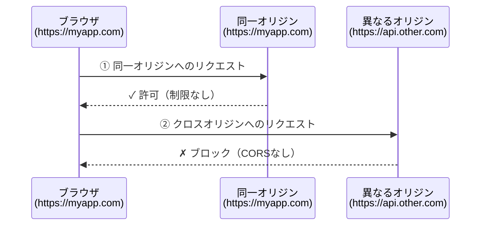
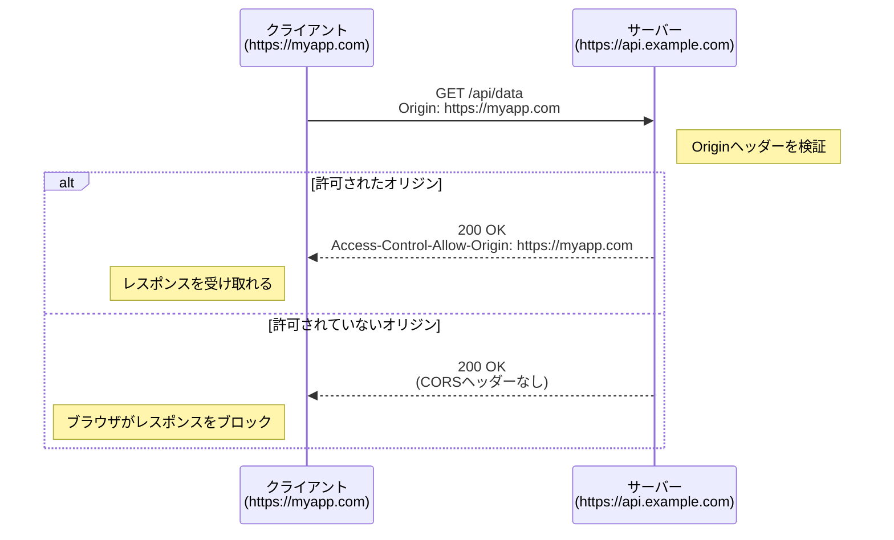
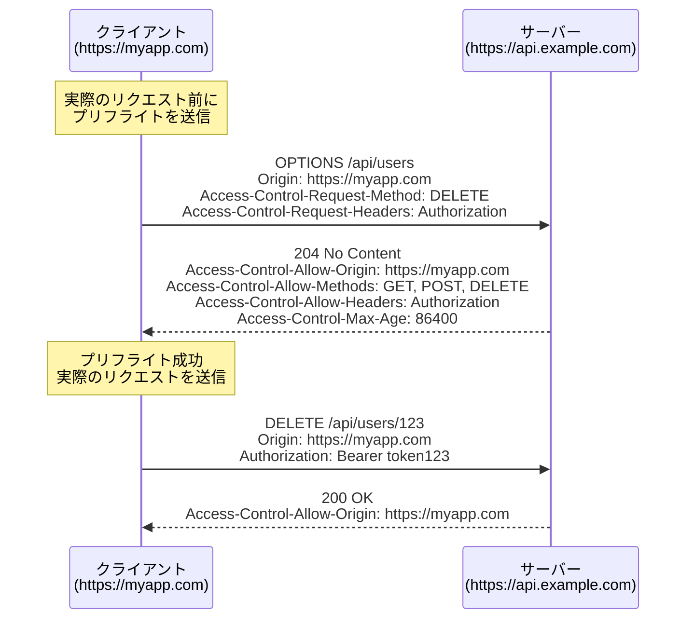
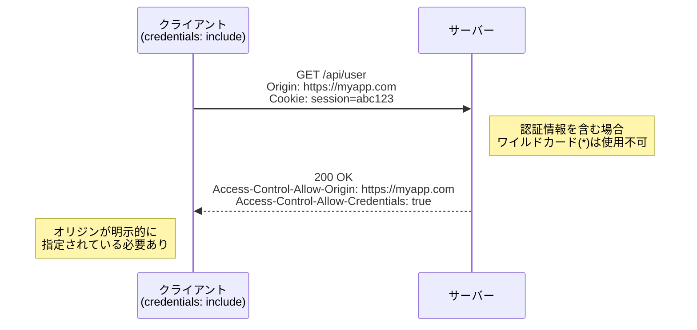
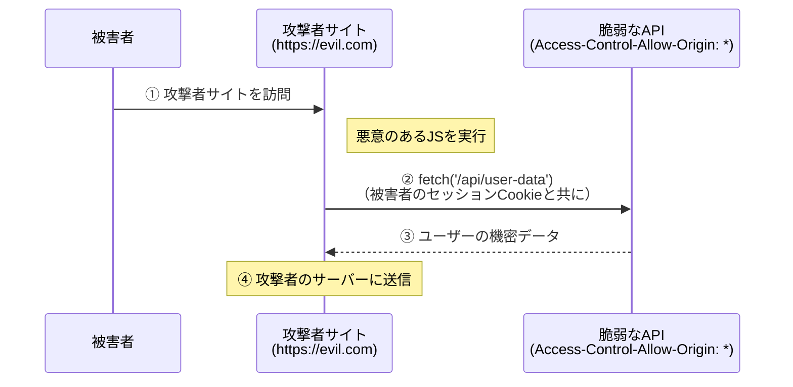
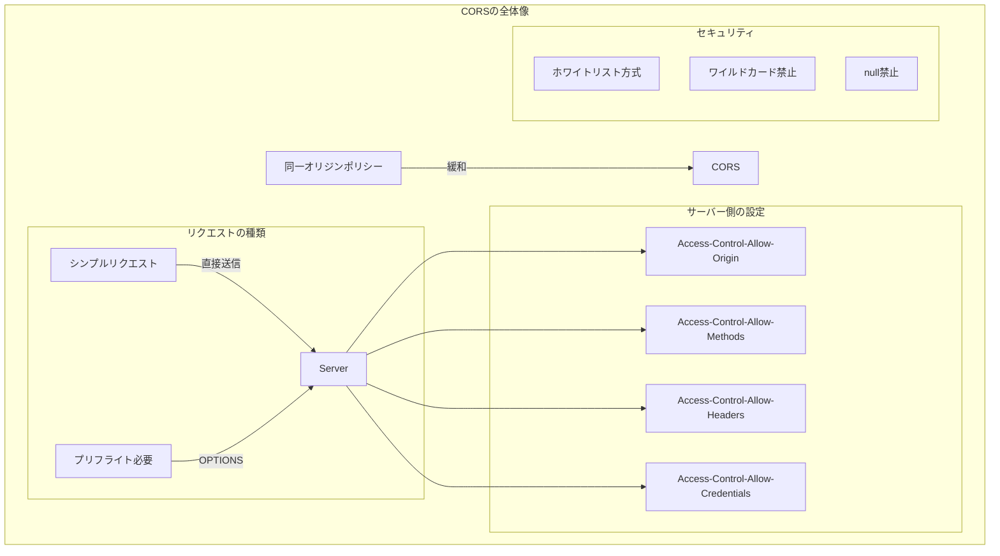

# CORS (Cross-Origin Resource Sharing) 解説ドキュメント

## 概要

CORS（Cross-Origin Resource Sharing）は、異なるオリジン間でのリソース共有を安全に制御するためのHTTPヘッダーベースのメカニズムです。ブラウザの同一オリジンポリシー（Same-Origin Policy）を緩和し、信頼できるオリジンからのクロスオリジンリクエストを許可します。

---

## 1. オリジン（Origin）とは

### オリジンの構成要素

オリジンは以下の3つの要素の組み合わせで定義されます：

```
https://example.com:443
  │         │        │
スキーム  ドメイン   ポート
```

### 同一オリジンと異なるオリジン

| URL | 同一オリジン？ | 理由 |
|-----|--------------|------|
| `https://example.com/page` | ○ | 完全一致 |
| `https://example.com/api/data` | ○ | パスは関係なし |
| `http://example.com` | × | スキームが違う |
| `https://api.example.com` | × | ドメインが違う |
| `https://example.com:8080` | × | ポートが違う |

---

## 2. 同一オリジンポリシー（Same-Origin Policy）

### 概要

同一オリジンポリシーは、ブラウザが異なるオリジンへのリクエストを制限するセキュリティ機能です。



### 保護される対象

| 種類 | 説明 | 制限 |
|------|------|------|
| XMLHttpRequest / Fetch | JavaScriptからのHTTPリクエスト | レスポンスの読み取りが制限 |
| Cookies | クロスオリジンへの自動送信 | SameSite属性で制御 |
| DOM Access | iframeの内容へのアクセス | 異なるオリジンは不可 |
| Web Storage | localStorage / sessionStorage | オリジンごとに分離 |

### 制限されないもの

- `` タグによる画像の読み込み
- `<script>` タグによるスクリプトの読み込み
- `<link>` タグによるCSSの読み込み
- `<form>` タグによるフォーム送信
- `<video>` / `<audio>` タグによるメディア読み込み

---

## 3. CORSの仕組み

### シンプルリクエスト

以下の条件をすべて満たす場合、プリフライトリクエストなしで直接送信されます：

**条件：**
1. メソッドが `GET`、`HEAD`、`POST` のいずれか
2. ヘッダーが以下のみ：`Accept`、`Accept-Language`、`Content-Language`、`Content-Type`
3. `Content-Type` が以下のいずれか：
   - `application/x-www-form-urlencoded`
   - `multipart/form-data`
   - `text/plain`



### プリフライトリクエスト

シンプルリクエストの条件を満たさない場合、ブラウザは事前にOPTIONSリクエストを送信します。

**プリフライトが必要なケース：**
- `PUT`、`DELETE`、`PATCH` などのメソッド
- `Authorization`、`Content-Type: application/json` などのカスタムヘッダー
- 認証情報（Credentials）を含むリクエスト



### 認証情報を含むリクエスト

Cookieや認証ヘッダーを含むクロスオリジンリクエストには追加の設定が必要です。



---

## 4. CORSレスポンスヘッダー

### 主要なヘッダー

| ヘッダー | 説明 | 例 |
|---------|------|-----|
| `Access-Control-Allow-Origin` | 許可するオリジン | `https://myapp.com` または `*` |
| `Access-Control-Allow-Methods` | 許可するHTTPメソッド | `GET, POST, PUT, DELETE` |
| `Access-Control-Allow-Headers` | 許可するリクエストヘッダー | `Content-Type, Authorization` |
| `Access-Control-Allow-Credentials` | 認証情報の許可 | `true` |
| `Access-Control-Expose-Headers` | JSからアクセス可能なレスポンスヘッダー | `X-Custom-Header` |
| `Access-Control-Max-Age` | プリフライト結果のキャッシュ時間（秒） | `86400` |

### Access-Control-Allow-Origin の注意点

```go
// NG: ワイルドカードと認証情報の組み合わせは不可
w.Header().Set("Access-Control-Allow-Origin", "*")
w.Header().Set("Access-Control-Allow-Credentials", "true")
// → ブラウザがエラーを出す

// OK: 認証情報を使う場合は明示的にオリジンを指定
origin := r.Header.Get("Origin")
if isAllowedOrigin(origin) {
    w.Header().Set("Access-Control-Allow-Origin", origin)
    w.Header().Set("Access-Control-Allow-Credentials", "true")
}
```

---

## 5. Goでの実装

### 基本的な実装

```go
// シンプルなCORS設定
func CORSHandler(w http.ResponseWriter, r *http.Request) {
    // 許可するオリジンを設定
    w.Header().Set("Access-Control-Allow-Origin", "https://myapp.com")
    w.Header().Set("Access-Control-Allow-Methods", "GET, POST, OPTIONS")
    w.Header().Set("Access-Control-Allow-Headers", "Content-Type")

    // プリフライトリクエストの処理
    if r.Method == "OPTIONS" {
        w.WriteHeader(http.StatusNoContent)
        return
    }

    // 実際の処理
    w.Header().Set("Content-Type", "application/json")
    json.NewEncoder(w).Encode(map[string]string{"message": "Hello"})
}
```

### ホワイトリスト方式（推奨）

```go
// 複数のオリジンを許可する安全な実装
func CORSMiddleware(allowedOrigins []string) func(http.Handler) http.Handler {
    // 高速な検索のためマップに変換
    allowedMap := make(map[string]bool)
    for _, origin := range allowedOrigins {
        allowedMap[origin] = true
    }

    return func(next http.Handler) http.Handler {
        return http.HandlerFunc(func(w http.ResponseWriter, r *http.Request) {
            origin := r.Header.Get("Origin")

            // 許可されたオリジンかチェック
            if allowedMap[origin] {
                w.Header().Set("Access-Control-Allow-Origin", origin)
                w.Header().Set("Access-Control-Allow-Credentials", "true")
            }

            // 共通のCORSヘッダー
            w.Header().Set("Access-Control-Allow-Methods", "GET, POST, PUT, DELETE, OPTIONS")
            w.Header().Set("Access-Control-Allow-Headers", "Content-Type, Authorization, X-Requested-With")
            w.Header().Set("Access-Control-Max-Age", "86400") // 24時間キャッシュ

            // プリフライトリクエスト
            if r.Method == "OPTIONS" {
                w.WriteHeader(http.StatusNoContent)
                return
            }

            next.ServeHTTP(w, r)
        })
    }
}

// 使用例
func main() {
    mux := http.NewServeMux()
    mux.HandleFunc("/api/data", dataHandler)

    allowedOrigins := []string{
        "https://myapp.com",
        "https://www.myapp.com",
        "http://localhost:3000", // 開発環境
    }

    handler := CORSMiddleware(allowedOrigins)(mux)
    http.ListenAndServe(":8080", handler)
}
```

### サブドメインを許可するパターン

```go
import (
    "net/url"
    "strings"
)

// サブドメインを含むオリジンを許可
func CORSMiddlewareWithSubdomains(baseDomain string) func(http.Handler) http.Handler {
    return func(next http.Handler) http.Handler {
        return http.HandlerFunc(func(w http.ResponseWriter, r *http.Request) {
            origin := r.Header.Get("Origin")

            if isAllowedOrigin(origin, baseDomain) {
                w.Header().Set("Access-Control-Allow-Origin", origin)
                w.Header().Set("Access-Control-Allow-Credentials", "true")
            }

            w.Header().Set("Access-Control-Allow-Methods", "GET, POST, PUT, DELETE, OPTIONS")
            w.Header().Set("Access-Control-Allow-Headers", "Content-Type, Authorization")

            if r.Method == "OPTIONS" {
                w.WriteHeader(http.StatusNoContent)
                return
            }

            next.ServeHTTP(w, r)
        })
    }
}

// オリジンが許可されているか確認
func isAllowedOrigin(origin, baseDomain string) bool {
    if origin == "" {
        return false
    }

    parsedURL, err := url.Parse(origin)
    if err != nil {
        return false
    }

    host := parsedURL.Hostname()

    // 完全一致またはサブドメイン
    return host == baseDomain || strings.HasSuffix(host, "."+baseDomain)
}

// 使用例
// CORSMiddlewareWithSubdomains("example.com")
// → example.com, api.example.com, www.example.com などを許可
```

### 環境別の設定

```go
import "os"

// 環境変数から設定を読み込む
func NewCORSConfig() *CORSConfig {
    env := os.Getenv("APP_ENV")

    config := &CORSConfig{}

    switch env {
    case "production":
        config.AllowedOrigins = []string{
            "https://myapp.com",
            "https://www.myapp.com",
        }
        config.AllowCredentials = true
    case "staging":
        config.AllowedOrigins = []string{
            "https://staging.myapp.com",
        }
        config.AllowCredentials = true
    default: // development
        config.AllowedOrigins = []string{
            "http://localhost:3000",
            "http://localhost:8080",
            "http://127.0.0.1:3000",
        }
        config.AllowCredentials = true
    }

    return config
}

type CORSConfig struct {
    AllowedOrigins   []string
    AllowedMethods   []string
    AllowedHeaders   []string
    AllowCredentials bool
    MaxAge           int
}

func (c *CORSConfig) Middleware(next http.Handler) http.Handler {
    allowedMap := make(map[string]bool)
    for _, origin := range c.AllowedOrigins {
        allowedMap[origin] = true
    }

    return http.HandlerFunc(func(w http.ResponseWriter, r *http.Request) {
        origin := r.Header.Get("Origin")

        if allowedMap[origin] {
            w.Header().Set("Access-Control-Allow-Origin", origin)
            if c.AllowCredentials {
                w.Header().Set("Access-Control-Allow-Credentials", "true")
            }
        }

        w.Header().Set("Access-Control-Allow-Methods", "GET, POST, PUT, DELETE, OPTIONS")
        w.Header().Set("Access-Control-Allow-Headers", "Content-Type, Authorization")
        w.Header().Set("Access-Control-Max-Age", "86400")

        if r.Method == "OPTIONS" {
            w.WriteHeader(http.StatusNoContent)
            return
        }

        next.ServeHTTP(w, r)
    })
}
```

---

## 6. よくある設定ミスと脆弱性

### 脆弱な設定例

```go
// NG例1: すべてのオリジンを許可（公開APIでない場合は危険）
w.Header().Set("Access-Control-Allow-Origin", "*")

// NG例2: Originヘッダーをそのまま反射（Open Redirect的な脆弱性）
origin := r.Header.Get("Origin")
w.Header().Set("Access-Control-Allow-Origin", origin) // 検証なしで設定

// NG例3: nullオリジンの許可（サンドボックス化されたiframeからの攻撃）
if origin == "null" {
    w.Header().Set("Access-Control-Allow-Origin", "null")
}
```

### 攻撃シナリオ



### 安全な設定のポイント

1. **ホワイトリスト方式**: 許可するオリジンを明示的に指定
2. **ワイルドカード禁止**: 認証が必要なAPIでは`*`を使用しない
3. **nullオリジン禁止**: `null`オリジンは許可しない
4. **検証必須**: Originヘッダーをそのまま反射しない

---

## 7. CORSとセキュリティヘッダーの組み合わせ

```go
func SecureMiddleware(next http.Handler) http.Handler {
    return http.HandlerFunc(func(w http.ResponseWriter, r *http.Request) {
        // CORS設定
        origin := r.Header.Get("Origin")
        if isAllowedOrigin(origin) {
            w.Header().Set("Access-Control-Allow-Origin", origin)
            w.Header().Set("Access-Control-Allow-Credentials", "true")
        }
        w.Header().Set("Access-Control-Allow-Methods", "GET, POST, PUT, DELETE, OPTIONS")
        w.Header().Set("Access-Control-Allow-Headers", "Content-Type, Authorization")

        // セキュリティヘッダー
        w.Header().Set("X-Content-Type-Options", "nosniff")
        w.Header().Set("X-Frame-Options", "DENY")
        w.Header().Set("X-XSS-Protection", "1; mode=block")
        w.Header().Set("Referrer-Policy", "strict-origin-when-cross-origin")
        w.Header().Set("Content-Security-Policy", "default-src 'self'")

        // HTTPS強制（本番環境）
        w.Header().Set("Strict-Transport-Security", "max-age=31536000; includeSubDomains")

        if r.Method == "OPTIONS" {
            w.WriteHeader(http.StatusNoContent)
            return
        }

        next.ServeHTTP(w, r)
    })
}
```

---

## 8. デバッグとトラブルシューティング

### よくあるエラーメッセージ

| エラー | 原因 | 解決策 |
|--------|------|--------|
| `No 'Access-Control-Allow-Origin' header` | CORSヘッダーが設定されていない | サーバー側でヘッダーを追加 |
| `The value of 'Access-Control-Allow-Origin' must not be wildcard '*' when credentials mode is 'include'` | ワイルドカードと認証情報の組み合わせ | 明示的なオリジンを指定 |
| `Method PUT is not allowed` | 許可されていないメソッド | `Access-Control-Allow-Methods`に追加 |
| `Request header field X-Custom is not allowed` | 許可されていないヘッダー | `Access-Control-Allow-Headers`に追加 |

### デバッグ用のミドルウェア

```go
func CORSDebugMiddleware(next http.Handler) http.Handler {
    return http.HandlerFunc(func(w http.ResponseWriter, r *http.Request) {
        // リクエスト情報をログ出力
        log.Printf("CORS Debug - Method: %s, Origin: %s, Path: %s",
            r.Method,
            r.Header.Get("Origin"),
            r.URL.Path,
        )

        if r.Method == "OPTIONS" {
            log.Printf("Preflight Request - Requested Method: %s, Requested Headers: %s",
                r.Header.Get("Access-Control-Request-Method"),
                r.Header.Get("Access-Control-Request-Headers"),
            )
        }

        next.ServeHTTP(w, r)
    })
}
```

### ブラウザでの確認方法

1. **Developer Tools** → **Network** タブを開く
2. リクエストを選択
3. **Headers** セクションで以下を確認：
   - Request Headers: `Origin`
   - Response Headers: `Access-Control-Allow-*`
4. プリフライトリクエストは `OPTIONS` メソッドで表示される

---

## 9. ベストプラクティス

### 設定のチェックリスト

- [ ] 許可するオリジンを明示的に指定（ホワイトリスト）
- [ ] 本番環境ではワイルドカード(`*`)を使用しない
- [ ] `null`オリジンを許可しない
- [ ] 認証が必要なAPIでは`Credentials`を適切に設定
- [ ] プリフライトのキャッシュ時間を設定（`Max-Age`）
- [ ] 環境ごとに設定を分離（開発/ステージング/本番）
- [ ] 不要なメソッドやヘッダーを許可しない
- [ ] ログを記録してモニタリング

### パフォーマンス最適化

```go
// プリフライトのキャッシュを有効活用
w.Header().Set("Access-Control-Max-Age", "86400") // 24時間

// Varyヘッダーでキャッシュを適切に制御
w.Header().Set("Vary", "Origin")
```

---

## まとめ



### 重要なポイント

| 項目 | 説明 |
|------|------|
| **目的** | 異なるオリジン間での安全なリソース共有 |
| **仕組み** | HTTPヘッダーによるブラウザ制御 |
| **シンプルリクエスト** | 条件を満たせば直接送信 |
| **プリフライト** | 複雑なリクエストは事前確認 |
| **認証情報** | `Credentials: true`と明示的オリジンが必要 |
| **推奨設定** | ホワイトリスト方式で最小限の許可 |

CORSは、Webアプリケーションのセキュリティとユーザビリティのバランスを取るための重要な仕組みです。適切に設定することで、必要なクロスオリジンリクエストを許可しながら、不正なアクセスを防ぐことができます。
