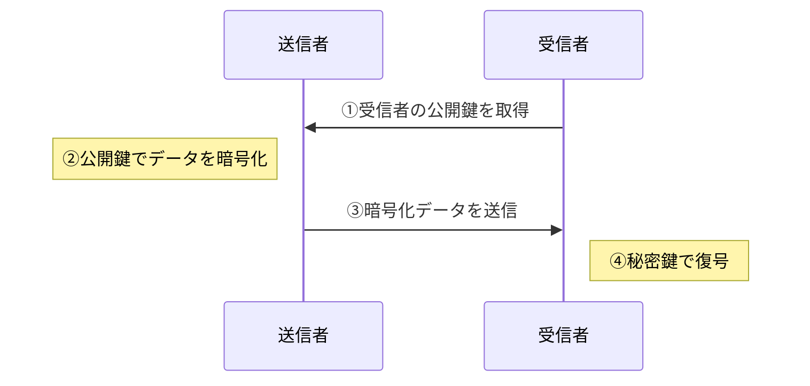
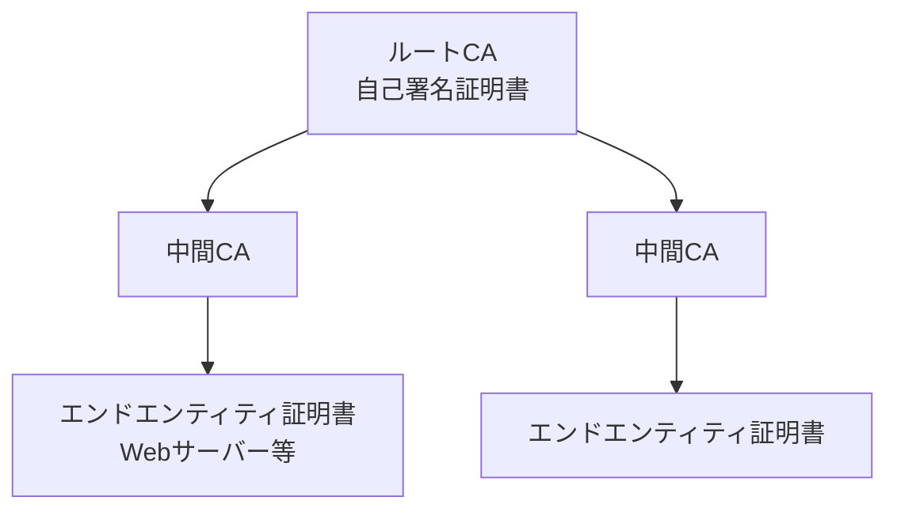
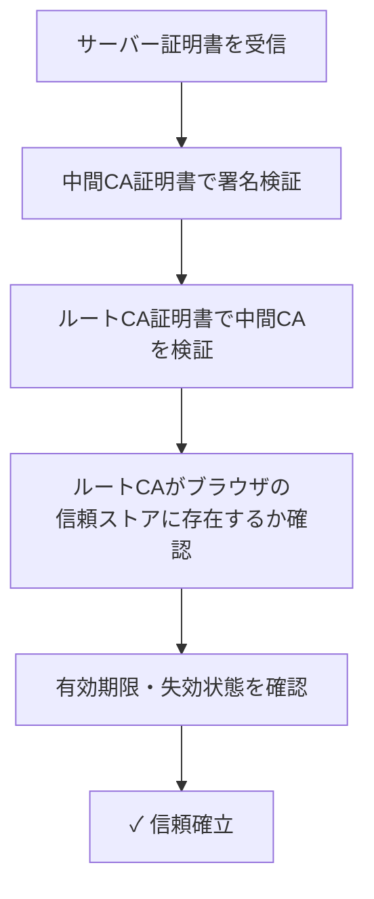
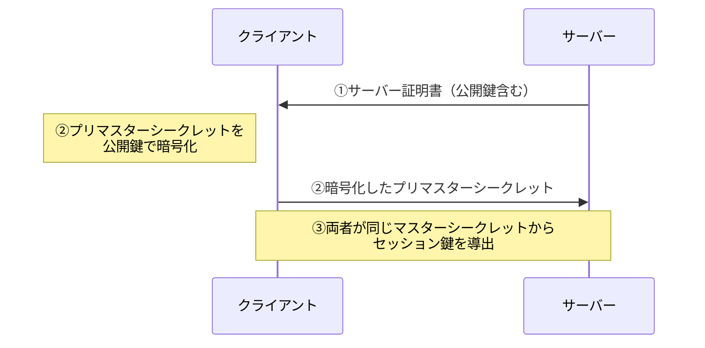
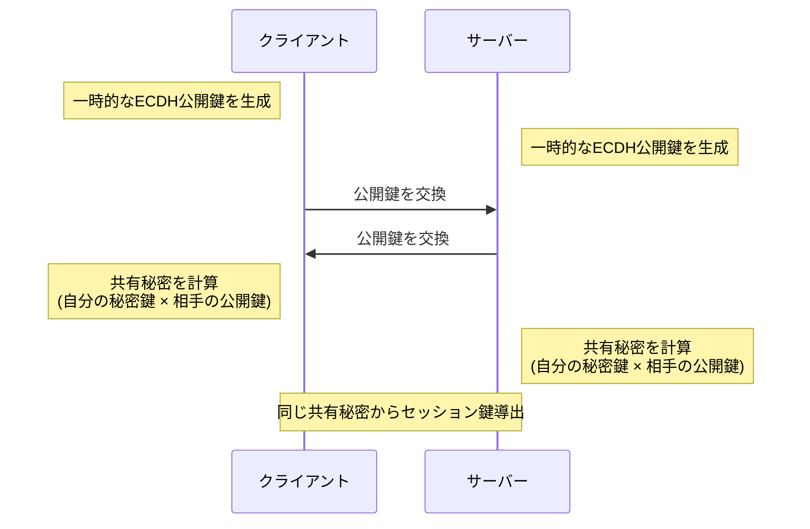
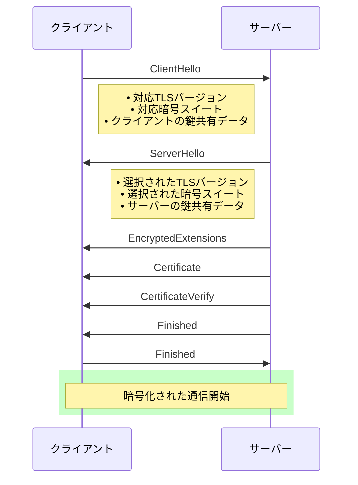
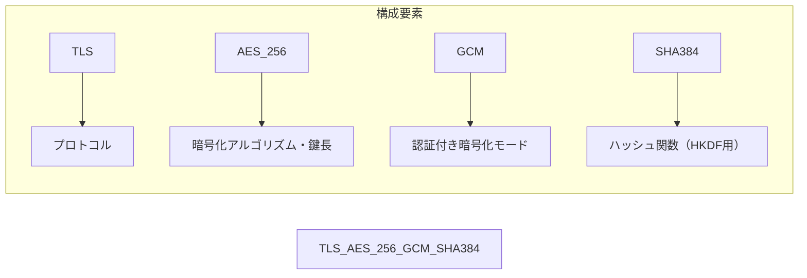
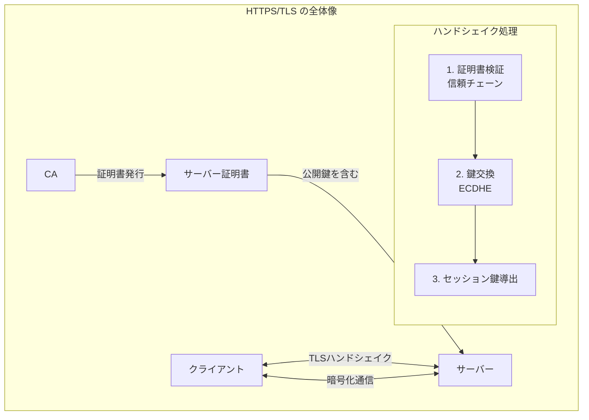

 HTTPS/TLS 解説ドキュメント

## 概要

HTTPS（HyperText Transfer Protocol Secure）は、HTTPにTLS（Transport Layer Security）による暗号化を追加したプロトコルです。Webブラウザとサーバー間の通信を暗号化し、盗聴や改ざんから保護します。

---

## 1. 公開鍵暗号方式

### 公開鍵（Public Key）
- **誰でも入手可能**な鍵
- データの**暗号化**に使用
- 署名の**検証**に使用

### 秘密鍵（Private Key）
- 所有者のみが保持する**厳重に管理される**鍵
- データの**復号**に使用
- 署名の**作成**に使用

### 仕組み

---

## 2. 認証局（CA: Certificate Authority）

### 役割
CAは「信頼の起点」となる第三者機関で、以下を担当します：

1. **身元確認** - 証明書申請者の実在性を確認
2. **証明書発行** - デジタル証明書の発行
3. **証明書失効管理** - 危殆化した証明書の失効（CRL/OCSP）

### 信頼の階層構造

### 主要なCA
- DigiCert
- Let's Encrypt（無料）
- GlobalSign
- Sectigo

---

## 3. デジタル証明書（SSL/TLS証明書）

### 証明書の内容

| フィールド | 説明 |
|-----------|------|
| Subject | 証明書の所有者情報（ドメイン名等） |
| Issuer | 発行したCAの情報 |
| Serial Number | 証明書の一意な識別子 |
| Validity | 有効期間（開始日〜終了日） |
| Public Key | 所有者の公開鍵 |
| Signature | CAによるデジタル署名 |
| Extensions | SAN、鍵用途などの拡張情報 |

### 証明書の種類

| 種類 | 検証レベル | 用途 |
|------|-----------|------|
| DV（Domain Validation） | ドメイン所有権のみ | 個人サイト、ブログ |
| OV（Organization Validation） | 組織の実在性確認 | 企業サイト |
| EV（Extended Validation） | 厳格な組織審査 | 金融機関、EC |

### 証明書チェーンの検証

---

## 4. 鍵交換（Key Exchange）

TLSでは、セッション鍵（共通鍵）を安全に共有するために鍵交換を行います。

### RSA鍵交換（従来方式）

**問題点**: 秘密鍵が漏洩すると過去の通信も復号可能（前方秘匿性なし）

### ECDHE鍵交換（現代の標準）

**ECDHE** = Elliptic Curve Diffie-Hellman Ephemeral

**利点**:
- **前方秘匿性（Forward Secrecy）**: 一時鍵は使い捨てのため、長期秘密鍵が漏洩しても過去の通信は保護される
- 楕円曲線により短い鍵長で高いセキュリティを実現

---

## 5. TLSハンドシェイク（TLS 1.3）

### TLS 1.3の改善点
- ハンドシェイクが1-RTT（従来は2-RTT）
- 0-RTT再接続のサポート
- 脆弱な暗号スイートの廃止
- ハンドシェイク全体の暗号化

---

## 6. 暗号スイート

TLS 1.3で使用される暗号スイートの例：

| 用途 | TLS 1.3での選択肢 |
|------|------------------|
| 鍵交換 | ECDHE（X25519, P-256等） |
| 認証 | RSA, ECDSA, EdDSA |
| 暗号化 | AES-GCM, ChaCha20-Poly1305 |
| ハッシュ | SHA-256, SHA-384 |

---

## 7. セキュリティのベストプラクティス

### サーバー設定
- [ ] TLS 1.2以上のみ有効化（TLS 1.3推奨）
- [ ] 強力な暗号スイートのみ許可
- [ ] HSTS（HTTP Strict Transport Security）の設定
- [ ] 証明書チェーンの正しい設定
- [ ] OCSP Staplingの有効化

### 証明書管理
- [ ] 信頼できるCAから証明書を取得
- [ ] 有効期限の監視と自動更新
- [ ] 秘密鍵の厳重な保護（HSM推奨）
- [ ] 証明書失効時の迅速な対応

---

## まとめ

TLSは**機密性**（暗号化）、**完全性**（改ざん検知）、**認証**（なりすまし防止）を提供し、安全なWeb通信の基盤となっています。