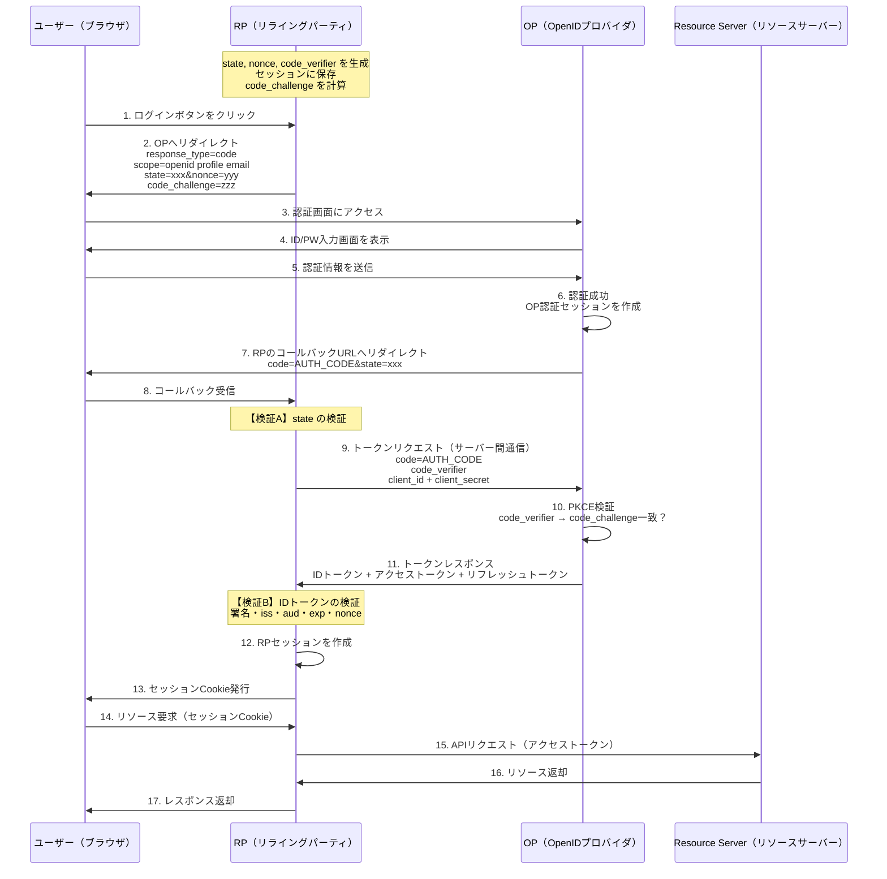
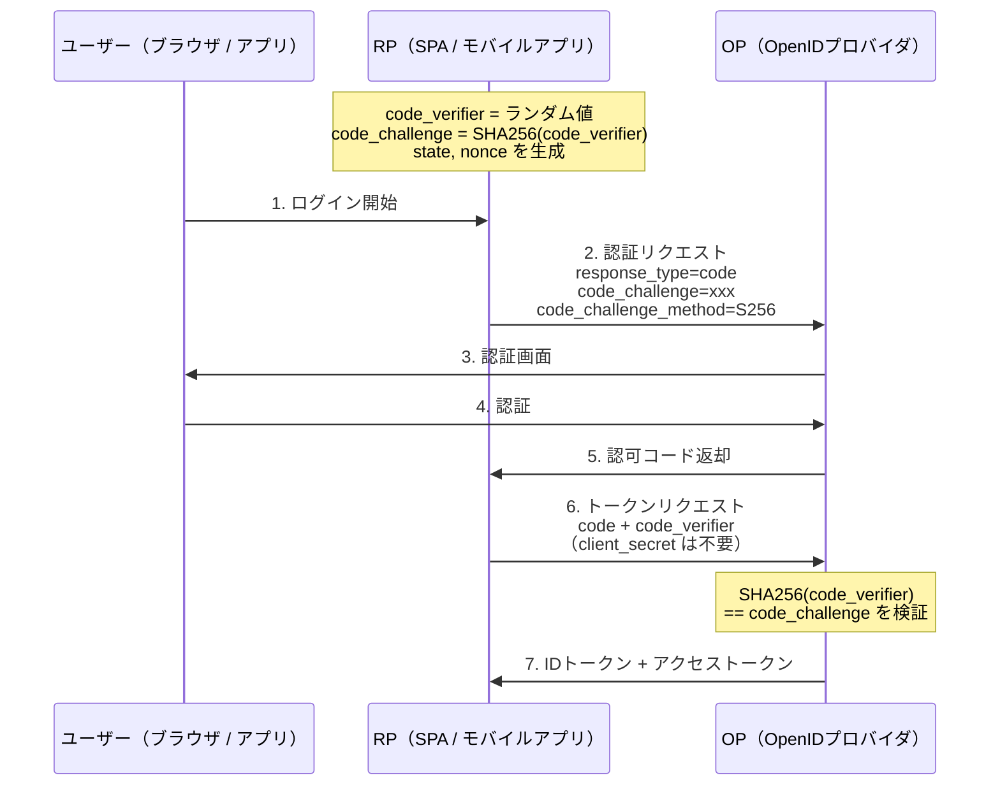
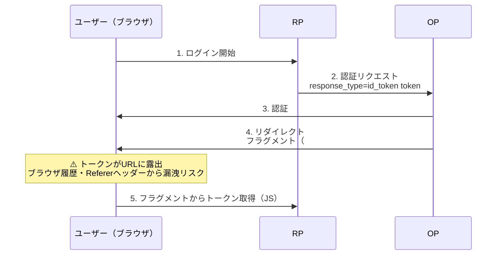
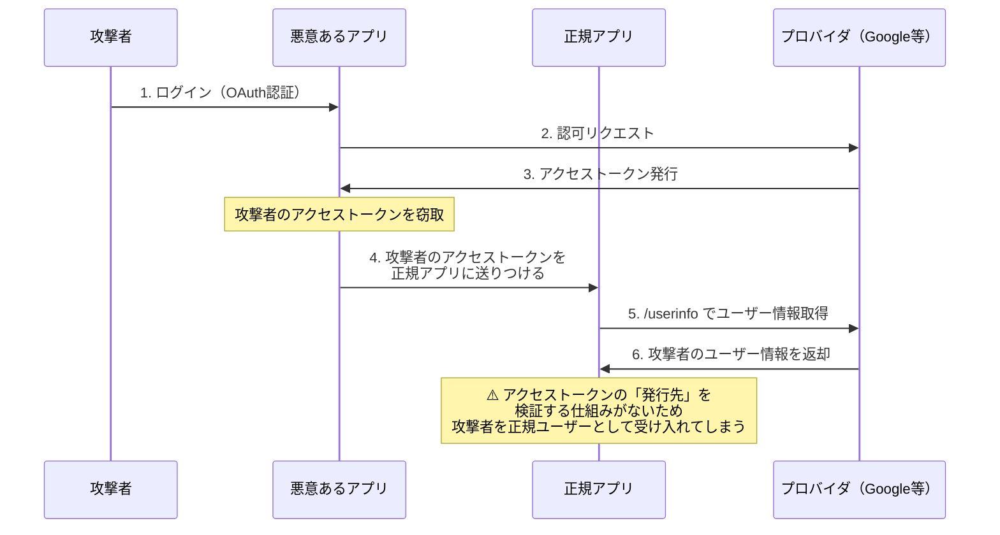
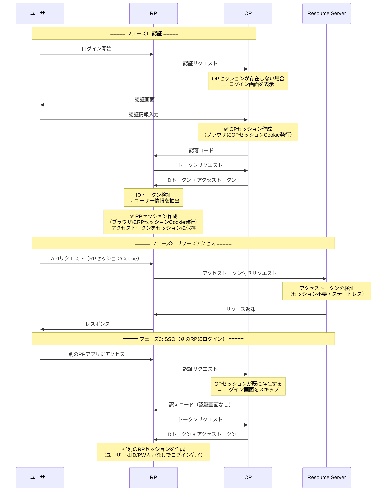

# OIDC アーキテクチャ解説：フロー・OAuth 2.0との違い・登場人物の関係

## 目次

1. [OIDCのフロー図（認可コードフロー）](#1-oidcのフロー図認可コードフロー)
2. [OAuth 2.0との違い](#2-oauth-20との違い)
3. [RP / OP / Resource Server / Session の関係](#3-rp--op--resource-server--session-の関係)

---

## 1. OIDCのフロー図（認可コードフロー）

### 全体フロー

最も一般的な**認可コードフロー（Authorization Code Flow）**の全体像です。



### 認可コードフロー + PKCE（SPA / モバイルアプリ向け）

`client_secret`を安全に保持できないクライアント向けのフローです。



### Implicit フロー（非推奨）



> Implicit フローはセキュリティ上の問題から**非推奨**です。PKCEを使った認可コードフローを使用してください。

---

## 2. OAuth 2.0との違い

### 根本的な違い：「認可」vs「認証 + 認可」

- **OAuth 2.0** = 認可（Authorization）：リソースへのアクセス許可。「何ができるか」
- **OIDC** = 認証（Authentication）+ 認可：ユーザーの身元確認 + アクセス許可。「誰であるか」+「何ができるか」

OIDCはOAuth 2.0を**包含する上位プロトコル**です。OAuth 2.0の仕組みをそのまま使いながら、認証のための標準仕様を追加しています。

### 比較表

| 観点 | OAuth 2.0 | OIDC |
|------|-----------|------|
| **目的** | 認可（リソースアクセスの許可） | 認証（身元確認）+ 認可 |
| **答える問い** | 「このアプリはリソースにアクセスしてよいか？」 | 「このユーザーは誰か？」 |
| **発行されるトークン** | アクセストークン（+ リフレッシュトークン） | アクセストークン + **IDトークン**（+ リフレッシュトークン） |
| **ユーザー情報** | 標準化されていない（各API独自） | **標準化**（IDトークン + UserInfoエンドポイント） |
| **scopeの例** | `read:photos`, `write:calendar` | `openid`, `profile`, `email` |
| **仕様の性質** | フレームワーク（実装の自由度が高い） | プロトコル（厳密な仕様） |
| **メタデータの発見** | なし | **ディスカバリ**（`.well-known/openid-configuration`） |
| **トークン形式** | 未規定（Opaque Token可） | IDトークンは**必ずJWT** |

### OIDCが追加したもの

- **IDトークン（JWT）** — ユーザー認証情報の標準化
- **UserInfoエンドポイント** — 追加のユーザー属性を取得
- **ディスカバリ** — `.well-known/openid-configuration` でOP情報を自動取得
- **scope: openid** — OIDCフローの起動トリガー
- **nonce パラメータ** — リプレイ攻撃対策
- **JWKSエンドポイント** — 署名検証用公開鍵の提供

### OAuth 2.0だけで「認証」すると何が危険か

OAuth 2.0は認可プロトコルであり、認証のための仕組みを持ちません。それを無理に認証に使うと**トークン置換攻撃**が成立します。



**OIDCのIDトークンが解決する理由：**

| 検証項目 | OAuth 2.0のアクセストークン | OIDCのIDトークン |
|---------|--------------------------|-----------------|
| 発行元（iss） | 検証手段なし | `iss` クレームで検証 |
| 発行先（aud） | **検証手段なし** | `aud` クレームで自分のclient_idか検証 |
| 改ざん検知 | 不可（Opaque Tokenの場合） | JWT署名で検証 |
| リプレイ対策 | なし | `nonce` クレームで検証 |

特に**`aud`（audience）の検証**がポイントです。IDトークンには「どのアプリ向けに発行されたか」が明記されているため、他のアプリ向けのトークンを拒否できます。

---

## 3. RP / OP / Resource Server / Session の関係

### 各コンポーネントの責務

```
ユーザー（ブラウザ）
  ├──[セッションCookie]──→ RP（リライングパーティ）= あなたのアプリ
  │                          ├── RPセッション
  │                          └── ビジネスロジック
  │
  └──[認証画面 / OPセッションCookie]──→ OP（OpenIDプロバイダ）= Google / Entra ID 等
                                          ├── OPセッション
                                          ├── 認証エンジン
                                          └── トークン発行

OP ──[IDトークン / アクセストークン]──→ RP ──[アクセストークン]──→ Resource Server（API）
                                                                      ├── 保護されたリソース
                                                                      └── トークン検証
```

### 各コンポーネントの詳細

#### OP（OpenID Provider）

| 項目 | 内容 |
|------|------|
| **何を持つか** | ユーザーの認証情報（ID/PW、MFA設定等）、クライアント登録情報（client_id, client_secret, redirect_uri）、署名鍵（秘密鍵/公開鍵）|
| **何を保証するか** | ユーザーの**身元（Identity）**。「このユーザーは確かに本人である」ことをIDトークンの署名で保証する |
| **セッション** | **OPセッション**を持つ。ユーザーがOPに対して認証済みであることを記憶する。これによりSSO（シングルサインオン）が実現する |

#### RP（Relying Party）

| 項目 | 内容 |
|------|------|
| **何を持つか** | client_id / client_secret、IDトークン（検証後は破棄可）、アクセストークン / リフレッシュトークン、ユーザー情報（IDトークンから抽出） |
| **何を保証するか** | ユーザーとの**アプリケーションセッション**の維持。IDトークンの検証結果に基づいて「このセッションは認証済みユーザーのものである」ことを保証する |
| **セッション** | **RPセッション**を持つ。サーバーサイドセッション + セッションCookieでユーザーを追跡する |

#### Resource Server（リソースサーバー）

| 項目 | 内容 |
|------|------|
| **何を持つか** | 保護されたリソース（APIデータ）、アクセストークンの検証手段（OPの公開鍵 or トークンイントロスペクションエンドポイント） |
| **何を保証するか** | **リソースへのアクセス制御**。アクセストークンのスコープに基づいて、許可された操作のみを実行する |
| **セッション** | **セッションを持たない**（ステートレス）。リクエストごとにアクセストークンを検証する |

### セッションの全体像

認証フロー全体には**3つの独立したセッション**が存在します。

**ユーザーのブラウザが持つもの：**
- RPセッションCookie（例: `session_id=abc123`） → 毎リクエストでRPサーバーに送信
- OPセッションCookie（例: `SSID=xyz789`） → OPアクセス時に送信

**RPサーバーのセッションストア：**
- user_id, user_name, email
- access_token, refresh_token
- ログイン時刻

**OPサーバーのセッションストア：**
- 認証済みユーザーID
- 認証時刻
- 認証方法（MFA等）

#### セッション比較表

| セッション | 管理者 | 存在場所 | ライフサイクル | 目的 |
|-----------|--------|---------|---------------|------|
| **OPセッション** | OP | OPサーバー + ブラウザ（Cookie） | OPでログアウトするまで | ユーザーが認証済みであることを記憶。SSO実現 |
| **RPセッション** | RP | RPサーバー + ブラウザ（Cookie） | RPアプリのセッション有効期限まで | アプリにログイン済みであることを追跡 |
| **（Resource Serverはセッションなし）** | - | - | - | リクエスト単位でアクセストークンを検証 |

### セッションとトークンのライフサイクル



### 各コンポーネントが保持するトークンと情報の整理

| コンポーネント | 保持するもの | 行うこと |
|--------------|------------|---------|
| **OP（OpenIDプロバイダ）** | ユーザー認証情報、署名用秘密鍵、クライアント登録情報 | IDトークン（JWT）・アクセストークン・リフレッシュトークンの発行 |
| **RP（リライングパーティ）** | client_id / client_secret、アクセストークン、リフレッシュトークン、ユーザー情報（セッション内） | IDトークンの検証、セッション管理、RSへのAPIコール |
| **Resource Server** | 保護リソース、OPの公開鍵（JWKS） | アクセストークン検証、スコープに基づくアクセス制御 |

**トークンの流れ：** OP →（IDトークン + アクセストークン）→ RP →（アクセストークン）→ Resource Server

### よくある誤解と注意点

#### 誤解1: 「IDトークンをResource Serverに送る」

```
❌ RP → Resource Server: Authorization: Bearer <IDトークン>
✅ RP → Resource Server: Authorization: Bearer <アクセストークン>
```

IDトークンは**RPがユーザーの身元を確認するため**のトークンです。Resource ServerへのAPIリクエストには**アクセストークン**を使用します。

#### 誤解2: 「IDトークンをそのままセッションとして使い続ける」

```
❌ 毎リクエストでIDトークンの有効期限を確認してセッション管理
✅ IDトークンは認証時に一度検証し、以降はRPセッションで管理
```

IDトークンは短命（数分〜数十分）に設定されるべきです。ログイン後のセッション維持はRPのサーバーサイドセッションが担います。

#### 誤解3: 「OPセッションが切れたらRPセッションも切れる」

OPセッションとRPセッションは**独立**しています。OPでログアウトしてもRPセッションは自動的には切れません（OIDCには[RP-Initiated Logout](https://openid.net/specs/openid-connect-rpinitiated-1_0.html)や[Back-Channel Logout](https://openid.net/specs/openid-connect-backchannel-1_0.html)といったログアウト仕様がありますが、実装は任意です）。

### 関係性のまとめ

```
OP（認証の権威）
├── ユーザーの身元を保証する
├── IDトークンを発行して「誰であるか」を伝える
├── アクセストークンを発行して「何ができるか」を伝える
├── OPセッションを管理してSSOを実現する
└── 署名鍵を管理してトークンの真正性を担保する

RP（アプリケーション）
├── IDトークンを検証して「誰がログインしたか」を確認する
├── RPセッションを作成してアプリ内でのログイン状態を維持する
├── アクセストークンを使ってResource Serverからデータを取得する
└── セッションCookieでユーザーのブラウザを追跡する

Resource Server（APIサーバー）
├── アクセストークンを検証してリクエストの正当性を確認する
├── スコープに基づいてアクセス制御を行う
├── セッションは持たない（ステートレス）
└── ユーザーの認証には関与しない（RPとOPの責務）
```
