# OIDC（OpenID Connect）解説ガイド

## 目次

1. [OIDCとは](#oidcとは)
2. [歴史と背景](#歴史と背景)
3. [OIDCが解決する課題](#oidcが解決する課題)
4. [OIDCの仕組み](#oidcの仕組み)
5. [認証フロー](#認証フロー)
6. [IDトークン](#idトークン)
7. [OAuth 2.0との違い](#oauth-20との違い)
8. [主要なエンドポイント](#主要なエンドポイント)
9. [セキュリティ上の注意点](#セキュリティ上の注意点)

---

## OIDCとは

**OIDC**（OpenID Connect）は、OAuth 2.0の上に構築された**認証**プロトコルです。「このユーザーは誰か（Identity）」を安全に確認するための標準的な仕組みを提供します。

Googleアカウントでログイン、GitHubアカウントでログインといった「ソーシャルログイン」の多くはOIDCに基づいています。

```
OAuth 2.0 = 認可（Authorization）：「何ができるか」
OIDC      = 認証（Authentication）：「誰であるか」+ OAuth 2.0の認可機能
```

---

## 歴史と背景

### 認証技術の変遷


### なぜOIDCが生まれたのか

#### 1. OAuth 2.0の「認証の穴」

OAuth 2.0は**認可（Authorization）**のためのプロトコルであり、**認証（Authentication）**のプロトコルではありません。しかし現実には、多くの開発者がOAuth 2.0を認証に流用していました。


この流用は以下の問題を引き起こしていました：

| 問題 | 説明 |
|------|------|
| **標準化の欠如** | 各プロバイダ（Google, Facebook等）が独自の認証方式を実装 |
| **トークン置換攻撃** | 悪意あるアプリが取得したアクセストークンを別のアプリに流用できる |
| **相互運用性の欠如** | プロバイダごとに異なるAPI、異なるレスポンス形式 |

#### 2. 既存技術の限界

| 技術 | 限界 |
|------|------|
| **SAML** | XMLベースで複雑。モバイル・SPAに不向き。エンタープライズ以外では導入ハードルが高い |
| **OpenID 2.0** | 普及が進まず、ユーザー体験も悪かった。URLベースの識別子が一般ユーザーに馴染まなかった |
| **OAuth 2.0単体** | 認証用に設計されていないため、セキュリティホールが生じやすい |

#### 3. OIDCの設計意図

OIDCは以下の意図で設計されました：

- **OAuth 2.0との親和性**: 既存のOAuth 2.0エコシステムをそのまま活用できる
- **シンプルさ**: SAMLのような複雑さを排除し、JSON/JWTベースで軽量
- **モバイル対応**: SPAやネイティブアプリでも自然に使える
- **標準化された認証**: どのプロバイダでも同じ方法でユーザー情報を取得できる

---

## OIDCが解決する課題

### 課題1: 認証情報の分散管理

**OIDCがない世界**では、ユーザーはサービスごとに個別のアカウントを作成し、パスワードを管理する必要がありました。


**OIDCがある世界**では、信頼できるIDプロバイダに認証を委譲できます。


### 課題2: パスワード漏洩リスク

各サービスがパスワードを保持する場合、1つのサービスが侵害されるだけで認証情報が漏洩します。OIDCでは**サービス側にパスワードが渡らない**ため、このリスクを大幅に軽減できます。

### 課題3: 認証実装の品質

認証は間違えるとセキュリティに直結する重要な機能です。OIDCを利用することで、Google・Microsoft等の専門チームが維持する高品質な認証基盤に認証処理を任せることができます。

| 自前実装で必要なこと | OIDCで不要になるもの |
|---------------------|---------------------|
| パスワードのハッシュ化・ソルト管理 | パスワード保存そのもの |
| ブルートフォース対策 | ログイン試行制限（IdP側で実施） |
| MFA（多要素認証）の実装 | MFA（IdP側で提供） |
| パスワードリセットフロー | パスワード管理全般 |
| アカウントロックアウト | アカウント保護（IdP側） |

### 課題4: 標準化されていない認証連携

OIDCが登場する以前は、各プロバイダが独自のAPIでユーザー情報を提供していました。

```
# OIDCがない場合（各社バラバラ）
GET https://api.google.com/userinfo     → {"id": "123", "name": "..."}
GET https://graph.facebook.com/me       → {"id": "456", "first_name": "..."}
GET https://api.github.com/user         → {"login": "...", "id": 789}

# OIDCがある場合（標準化されたIDトークン）
どのプロバイダでも同じ形式のJWTが返る：
{
  "sub": "ユーザー識別子",
  "name": "ユーザー名",
  "email": "メールアドレス",
  ...
}
```

---

## OIDCの仕組み

### 登場する主要コンポーネント


| コンポーネント | 役割 | 具体例 |
|---------------|------|--------|
| **エンドユーザー（EU）** | サービスを利用する人 | ブラウザを使うユーザー |
| **リライングパーティ（RP）** | OIDCを利用してユーザーを認証するアプリケーション | Webアプリ、モバイルアプリ |
| **OpenIDプロバイダ（OP）** | ユーザーの認証を行い、IDトークンを発行する | Google, Microsoft Entra ID, Auth0, Keycloak |

---

## 認証フロー

OIDCには複数のフローがありますが、最も一般的な**認可コードフロー（Authorization Code Flow）**を解説します。

### 認可コードフロー

Webアプリケーション（サーバーサイド）で推奨されるフローです。


### フローの各ステップ詳細

**ステップ2: 認証リクエスト**

OPの認証エンドポイントに以下のパラメータを送ります。

| パラメータ | 必須 | 説明 |
|-----------|------|------|
| `response_type` | ○ | `code`（認可コードフローの場合） |
| `client_id` | ○ | RPを識別するID（OP登録時に発行） |
| `redirect_uri` | ○ | 認証後のリダイレクト先URL |
| `scope` | ○ | `openid`は必須。`profile`, `email`等を追加可能 |
| `state` | △ | CSRF対策のランダム値（推奨） |
| `nonce` | △ | リプレイ攻撃対策のランダム値（推奨） |

**ステップ7: トークンリクエスト**

サーバー間通信で認可コードをトークンに交換します。`client_secret`はサーバーサイドで安全に保管されます。

**ステップ9: IDトークン検証**

IDトークンを受け取ったら、以下を必ず検証します。

| 検証項目 | 内容 |
|---------|------|
| **署名検証** | OPの公開鍵（JWKSエンドポイントから取得）で署名を検証 |
| **iss（発行者）** | 期待するOPのURLと一致するか |
| **aud（対象者）** | 自分の`client_id`と一致するか |
| **exp（有効期限）** | トークンが期限切れでないか |
| **nonce** | 認証リクエストで送った値と一致するか |

### フローの選択指針

| フロー | ユースケース | 特徴 |
|--------|-------------|------|
| **認可コードフロー** | Webアプリ（サーバーサイド） | 最も安全。client_secretをサーバーで保持 |
| **認可コードフロー + PKCE** | SPA・モバイルアプリ | client_secretを持てない環境向け。code_verifierで保護 |
| **Implicit フロー** | ※非推奨 | トークンがURLフラグメントに露出する。PKCEの登場で不要に |

### 認可コードフロー + PKCE

SPA（Single Page Application）やモバイルアプリでは`client_secret`を安全に保持できないため、**PKCE（Proof Key for Code Exchange）**を併用します。

```mermaid
sequenceDiagram
    participant User as ユーザー（ブラウザ）
    participant RP as SPA / モバイルアプリ
    participant OP as OpenIDプロバイダ

    Note over RP: code_verifier（ランダム値）を生成<br/>code_challenge = SHA256(code_verifier)

    RP->>OP: 1. 認証リクエスト<br/>+ code_challenge
    OP->>User: 2. 認証画面表示
    User->>OP: 3. 認証
    OP->>RP: 4. 認可コード返却
    RP->>OP: 5. トークンリクエスト<br/>+ code_verifier（原文）
    Note over OP: SHA256(code_verifier) == code_challenge<br/>を検証
    OP->>RP: 6. IDトークン + アクセストークン
```



PKCEにより、認可コードが傍受されても`code_verifier`を知らない攻撃者はトークンを取得できません。

---

## IDトークン

OIDCの核となるのが**IDトークン**です。IDトークンはJWT（JSON Web Token）形式で発行されます。

### JWTの構造

IDトークンは3つのパートで構成されます：

```
ヘッダー.ペイロード.署名
eyJhbGciOiJSUzI1NiJ9.eyJpc3MiOiJodHRwczovL2...fQ.SflKxwRJSM...
```

### ペイロード（Claims）の例

```json
{
  "iss": "https://accounts.google.com",
  "sub": "110169484474386276334",
  "aud": "your-client-id.apps.googleusercontent.com",
  "exp": 1707580800,
  "iat": 1707577200,
  "nonce": "abc123",
  "name": "田中太郎",
  "email": "tanaka@example.com",
  "email_verified": true,
  "picture": "https://lh3.googleusercontent.com/..."
}
```

### 主要なクレーム

| クレーム | 必須 | 説明 |
|---------|------|------|
| `iss` | ○ | 発行者（OPのURL） |
| `sub` | ○ | ユーザーの一意識別子（OPごとに一意） |
| `aud` | ○ | 対象者（RPの`client_id`） |
| `exp` | ○ | 有効期限（UNIXタイムスタンプ） |
| `iat` | ○ | 発行日時（UNIXタイムスタンプ） |
| `nonce` | △ | リプレイ攻撃対策の値 |
| `name` | × | ユーザーの表示名（`profile` scopeで取得） |
| `email` | × | メールアドレス（`email` scopeで取得） |
| `email_verified` | × | メールアドレスが検証済みか |

### IDトークン vs アクセストークン

| 項目 | IDトークン | アクセストークン |
|------|-----------|-----------------|
| **目的** | ユーザーの**認証**情報を伝達 | リソースへの**認可**（アクセス許可） |
| **送り先** | リライングパーティ（RP）が検証 | リソースサーバーに提示 |
| **内容** | ユーザー情報（who） | 権限情報（what） |
| **形式** | 必ずJWT | JWT・Opaque Token等（実装依存） |
| **APIリクエストに使う** | ❌ 使わない | ✅ Authorizationヘッダーに付与 |

---

## OAuth 2.0との違い

OIDCはOAuth 2.0の**拡張**です。OAuth 2.0の認可フローにIDトークンによる認証レイヤーを追加しています。


| 観点 | OAuth 2.0 | OIDC |
|------|----------|------|
| **目的** | 認可（リソースへのアクセス許可） | 認証（ユーザーの身元確認）+ 認可 |
| **答える問い** | 「このアプリはユーザーのリソースにアクセスしてよいか？」 | 「このユーザーは誰か？」 |
| **発行されるトークン** | アクセストークン | アクセストークン + **IDトークン** |
| **scopeの例** | `read:photos`, `write:calendar` | `openid`, `profile`, `email` |
| **ユーザー情報の取得** | 標準化されていない（各APIに依存） | 標準化（IDトークン + UserInfo） |
| **仕様の性質** | フレームワーク（実装の自由度が高い） | プロトコル（厳密な仕様） |

### OAuth 2.0だけで認証すると何が危険か


**OIDCのIDトークンではこれを防げる理由：**
- IDトークンの`aud`クレームに対象の`client_id`が含まれる
- 正規アプリは自分の`client_id`と`aud`を照合し、他のアプリ向けトークンを拒否できる
- `nonce`によるリプレイ攻撃対策も可能

---

## 主要なエンドポイント

### ディスカバリエンドポイント

OIDCプロバイダは `/.well-known/openid-configuration` に設定情報を公開しています。これにより、RPは自動的にプロバイダの各エンドポイントを発見できます。

```
GET https://accounts.google.com/.well-known/openid-configuration
```

レスポンス例（抜粋）：

```json
{
  "issuer": "https://accounts.google.com",
  "authorization_endpoint": "https://accounts.google.com/o/oauth2/v2/auth",
  "token_endpoint": "https://oauth2.googleapis.com/token",
  "userinfo_endpoint": "https://openidconnect.googleapis.com/v1/userinfo",
  "jwks_uri": "https://www.googleapis.com/oauth2/v3/certs",
  "scopes_supported": ["openid", "email", "profile"],
  "response_types_supported": ["code", "token", "id_token"],
  "subject_types_supported": ["public"]
}
```

### 各エンドポイントの役割

| エンドポイント | 役割 |
|---------------|------|
| **Authorization Endpoint** | ユーザー認証・認可を行う（ブラウザリダイレクト） |
| **Token Endpoint** | 認可コードをトークンに交換する（サーバー間通信） |
| **UserInfo Endpoint** | アクセストークンでユーザー情報を取得する |
| **JWKS Endpoint** | IDトークンの署名検証に使う公開鍵を提供する |


---

## セキュリティ上の注意点

### 必ず実施すべきこと

| 項目 | 説明 |
|------|------|
| **IDトークンの署名検証** | OPの公開鍵でJWTの署名を検証する。検証しないと改ざんされたトークンを受け入れてしまう |
| **issの検証** | 信頼するOPから発行されたトークンかを確認する |
| **audの検証** | 自分のアプリ向けのトークンかを確認する。他のアプリ向けトークンを受け入れないため |
| **expの検証** | 有効期限が切れていないかを確認する |
| **nonceの検証** | リプレイ攻撃を防ぐため、送信したnonceと一致するかを確認する |
| **stateの検証** | CSRF攻撃を防ぐため、送信したstateと一致するかを確認する |
| **HTTPSの使用** | すべての通信をHTTPSで行う。トークンが平文で流れることを防ぐ |
| **PKCEの使用** | SPAやモバイルアプリでは必須。認可コード傍受攻撃を防ぐ |

### やってはいけないこと

| アンチパターン | 問題点 |
|---------------|--------|
| **IDトークンをAPIの認可に使う** | IDトークンは認証情報であり、リソースサーバーへの認可にはアクセストークンを使う |
| **IDトークンをそのままセッションに使い続ける** | IDトークンは短命であるべき。セッション管理はサーバーサイドのセッションで行う |
| **client_secretをフロントエンドに埋め込む** | 攻撃者に露出する。SPAではPKCEを使う |
| **redirect_uriの検証を緩くする** | オープンリダイレクト攻撃につながる。完全一致で検証する |
| **署名検証をスキップする** | 攻撃者が偽のIDトークンを作成できてしまう |

### 攻撃と対策の対応表

| 攻撃 | 対策パラメータ |
|------|---------------|
| CSRF攻撃 | `state` |
| リプレイ攻撃 | `nonce` |
| 認可コード傍受 | PKCE（`code_challenge` / `code_verifier`） |
| トークン置換攻撃 | `aud`（audience）検証 |
| トークン改ざん | JWT署名検証（JWKSエンドポイント） |

---

## まとめ

OIDCは「**OAuth 2.0に標準化された認証レイヤーを追加したプロトコル**」です。


自前で認証を実装する前に、まずOIDCの採用を検討することを推奨します。認証は「正しく実装することが非常に難しい」分野であり、実績のあるプロトコルとIdPに任せることがセキュリティの向上につながります。
