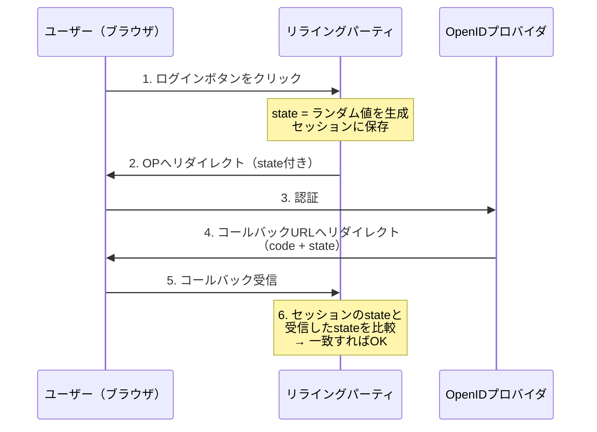
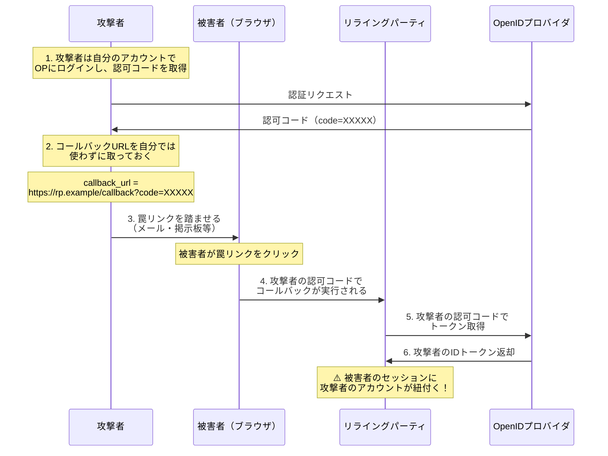
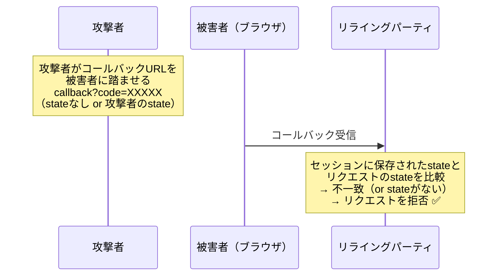
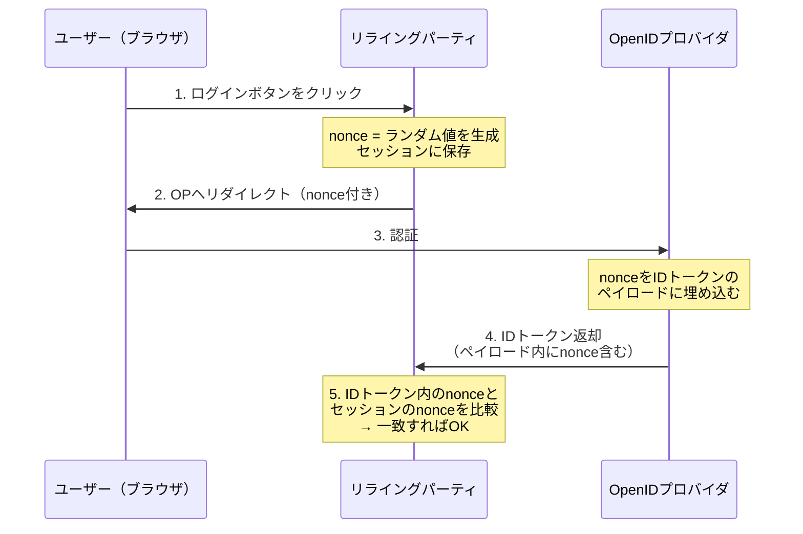
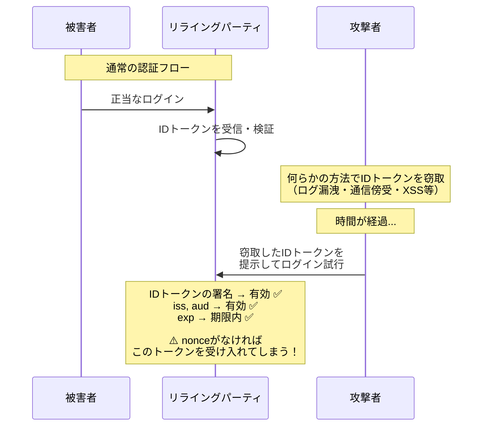
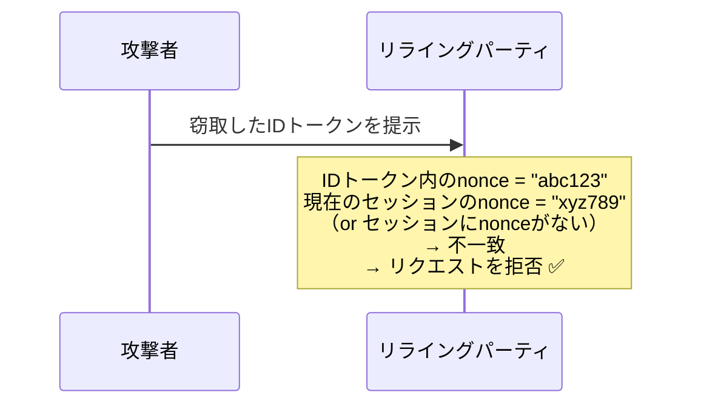
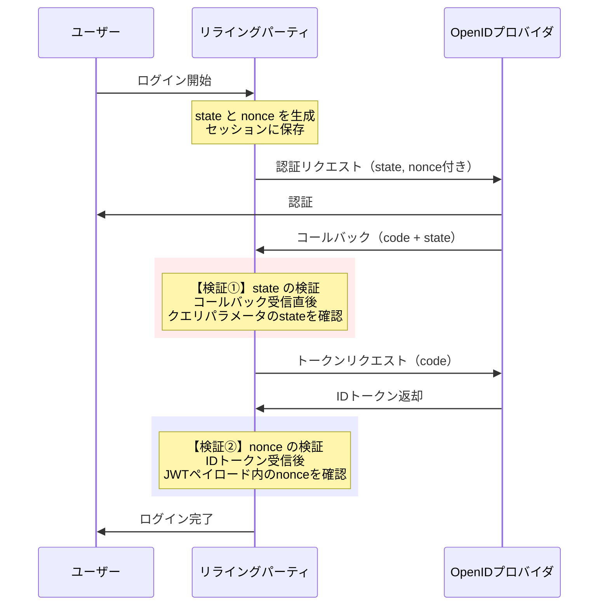

# OIDCにおける `state` と `nonce` の違い

## はじめに

OIDCの認証フローを実装する際、`state` と `nonce` という2つのパラメータが登場します。どちらも「ランダムな値を生成して送り、返ってきた値と照合する」という使い方をするため、混同されがちです。

しかし、この2つは**まったく異なる攻撃**に対する防御策であり、**検証するタイミングも場所も異なります**。

本記事では、それぞれが「何の課題を解決するのか」を攻撃シナリオと共に解説します。

---

## 結論（早見表）

| 項目 | `state` | `nonce` |
|------|---------|---------|
| **防ぐ攻撃** | CSRF（クロスサイトリクエストフォージェリ） | IDトークンリプレイ攻撃 |
| **送るタイミング** | 認証リクエスト時（ブラウザリダイレクト） | 認証リクエスト時（ブラウザリダイレクト） |
| **返ってくる場所** | コールバックURLのクエリパラメータ | IDトークンのペイロード（`nonce`クレーム） |
| **検証する場所** | RP（コールバック受信時） | RP（IDトークン検証時） |
| **保存先** | セッションまたはCookie | セッションまたはCookie |
| **仕様上の扱い** | 推奨（REQUIRED レベル） | Implicit Flowでは必須、それ以外は推奨 |

---

## `state`：CSRF攻撃を防ぐ

### stateの仕組み



ポイントは、`state` は**OPを経由してコールバックURLのクエリパラメータとして返ってくる**という点です。IDトークンの中身には含まれません。

### stateがない場合に起きる攻撃（CSRF）

CSRF攻撃とは、**攻撃者が被害者のブラウザを利用して、意図しないリクエストを送信させる攻撃**です。

OIDCのコンテキストでは、「攻撃者のアカウントで被害者を勝手にログインさせる」という形で悪用されます。

#### 攻撃シナリオ：アカウント紐付けの乗っ取り



**何が問題か：**

被害者は自分のセッションで操作しているつもりですが、実際には攻撃者のアカウントでログインしてしまっています。例えば：

- 被害者がクレジットカード情報を登録 → 攻撃者のアカウントに紐付く
- 被害者が個人情報を入力 → 攻撃者がその情報を閲覧できる
- ファイルストレージ連携 → 被害者のファイルが攻撃者のアカウントにアップロードされる

#### stateによる防御



`state` はRPが生成し、ユーザーのセッションに紐付けて保存します。攻撃者は被害者のセッションにアクセスできないため、正しい `state` 値を知ることができません。結果として、攻撃者が仕込んだコールバックURLは検証に失敗し、拒否されます。

---

## `nonce`：IDトークンリプレイ攻撃を防ぐ

### nonceの仕組み



ポイントは、`nonce` は**IDトークンのJWTペイロード内に含まれて返ってくる**という点です。コールバックURLのクエリパラメータではありません。

### nonceがない場合に起きる攻撃（IDトークンリプレイ）

リプレイ攻撃とは、**過去に正当に発行されたトークンを攻撃者が再利用する攻撃**です。

#### 攻撃シナリオ：盗んだIDトークンの再利用



**何が問題か：**

IDトークンは署名されているため改ざんはできませんが、**そのまま再利用されること**は署名検証だけでは防げません。有効期限内であれば、盗まれたIDトークンは何度でも使い回せてしまいます。

#### nonceによる防御



`nonce` はRPが認証リクエストごとに生成する一回限りの値です。IDトークンの中にこの値が埋め込まれるため、**そのIDトークンが「今回のリクエストに対して発行されたもの」であることを証明**できます。

過去のIDトークンを再利用しようとしても、現在のセッションに保存された `nonce` と一致しないため、拒否されます。

---

## 2つの違いを整理する

### 防御の対象が異なる

```
state → 認可レスポンス全体の正当性を保証
         「このコールバックは、今ログインしようとしているユーザー自身が開始したフローの結果か？」

nonce → IDトークン単体の正当性を保証
         「このIDトークンは、今回のリクエストに対して発行されたものか？」
```

### 検証のタイミングと場所が異なる



| 比較軸 | `state` | `nonce` |
|--------|---------|---------|
| **何を検証するか** | コールバックリクエスト自体 | IDトークンの内容 |
| **いつ検証するか** | コールバック受信直後（トークン取得前） | IDトークン受信・検証時 |
| **値の伝達経路** | URL クエリパラメータ（`?state=xxx`） | IDトークンのJWTペイロード（`"nonce": "xxx"`） |
| **OPの関与** | そのまま中継するだけ | IDトークン生成時にペイロードに埋め込む |

### なぜ両方必要なのか

「stateだけでCSRFを防げるなら、nonceは不要では？」と思うかもしれません。しかし、2つは**防御するレイヤーが異なります**。

```
認証フロー全体
├── コールバックの正当性 ← state が守る
│   「このコールバックはユーザー自身が開始したフローか？」
│
└── IDトークンの正当性 ← nonce が守る
    「このIDトークンは今回のフロー用に発行されたものか？」
```

stateは「フローの入口」を守り、nonceは「フローの出口（結果として受け取るトークン）」を守ります。

**stateだけでは防げないケース：**
- IDトークンがログやキャッシュから漏洩した場合、state検証は既に通過済みのためリプレイを防げない
- Implicit Flowでは認可コードを経由せずIDトークンが直接返却されるため、stateだけではトークン自体の再利用を検知できない

**nonceだけでは防げないケース：**
- nonce はIDトークン内にあるため、トークン取得前の段階（コールバック受信時）ではCSRFを検知できない
- 攻撃者の認可コードでコールバックが実行された時点で、トークン交換のサーバー間通信が走ってしまう

---

## 実装のポイント

### 値の生成

どちらも**暗号論的に安全な乱数**を使用してください。予測可能な値（タイムスタンプ、連番など）は攻撃者に推測される恐れがあります。

```
// 悪い例
state = "12345"
state = timestamp()

// 良い例
state = crypto/rand で生成した十分な長さのランダム文字列
```

### 値の保存と比較

| 保存先 | 注意点 |
|--------|--------|
| サーバーサイドセッション | 最も安全。セッションIDでstateとnonceを管理 |
| HttpOnly + Secure Cookie | セッションが使えない場合の代替。暗号化やHMAC署名推奨 |
| localStorage / sessionStorage | **非推奨**。XSSで漏洩するリスクがある |

### 一回限りの使用

- `state` と `nonce` はどちらも**使い捨て**にする
- 検証が完了したら即座にセッションから削除する
- 同じ値を再利用しない

---

## よくある疑問

### Q: PKCEがあればstateは不要？

PKCEは認可コードの傍受攻撃を防ぐものであり、CSRFを防ぐものではありません。PKCEの `code_verifier` は「認可コードを横取りした第三者がトークン交換できないようにする」仕組みです。一方、stateは「そもそも攻撃者が仕込んだ認可コードでコールバックが処理されること自体を防ぐ」仕組みです。防御の対象が異なるため、**PKCEを使っていてもstateは必要**です。

ただし、OAuth 2.1のドラフト仕様ではPKCEの必須化に伴い、stateの要件が緩和される議論もあります。

### Q: 認可コードフローでもnonceは必要？

認可コードフローではIDトークンはサーバー間通信で取得されるため、Implicit Flowほどリプレイのリスクは高くありません。しかし、ログ漏洩・内部犯行・デバッグ時の露出など、IDトークンが意図せず流出する経路はゼロではありません。**防御の層を厚くする（Defense in Depth）**観点で、認可コードフローでもnonceの使用が推奨されます。

### Q: stateに情報を埋め込んでもよい？

はい、ログイン後のリダイレクト先URLなどの情報をstateに含めることがあります。ただし、その場合はHMAC署名やサーバーサイドでのマッピングを行い、改ざんされないようにしてください。

---

## まとめ

```
state = 「このコールバックは正当か？」を確認する（CSRF対策）
         → コールバックのクエリパラメータで返ってくる
         → コールバック受信直後に検証する

nonce = 「このIDトークンは今回のリクエスト用か？」を確認する（リプレイ対策）
         → IDトークンのJWTペイロード内に含まれて返ってくる
         → IDトークン検証時に確認する
```

どちらも「ランダム値を送って照合する」という共通の仕組みですが、**守る対象・伝達経路・検証タイミング**がそれぞれ異なります。両方を正しく実装することで、OIDCの認証フローのセキュリティを多層的に確保できます。
